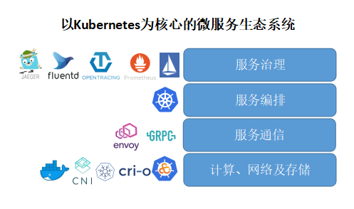

# 8.4 服务网格与 Kubernetes

以 Kubernetes 为基础构建起的云原生世界里，Sidecar 模式无疑是最经典的设计。当需要为应用提供与自身逻辑无关的辅助功能时，在应用 Pod 内注入对应功能的 Sidecar 显然是最 Kubernetes Native 的方式。

服务网格通过在 Pod 内的 Sidecar Proxy 实现透明代理，通过更接近微服务应用层的抽象，实现服务间的流量、安全性和可观察性细粒度管理。如下图所示，服务网格（Istio）最大化地利用 Kubernetes 这个基础设施，两者叠加在一起形成一套从底层的负载部署运行到上层服务运行和治理的完整基础设施。

	
	
图片来源于《云原生服务网格Istio》

从 Google 与 IBM 联合推出 Istio 开始，我们也看到了 Google 的企业战略布局意图：从底层逐步靠近应用。在“容器编排之战”大获全胜的 Kubernetes 成为通用、跨厂商和平台的架构底座，Istio 则补充了 Kubernetes 生态圈的重要一环，是 Google 的微服务版图里一个里程碑式的扩张。

	
	
图片来源于 zhaohuabing.com

可以预见不久的将来，对于云原生应用而言，采用 Kubernetes 进行服务部署和集群管理，采用 Istio 处理服务通讯和治理，将成为微服务应用的标准配置。

