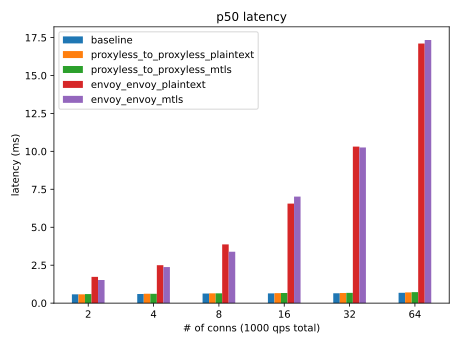
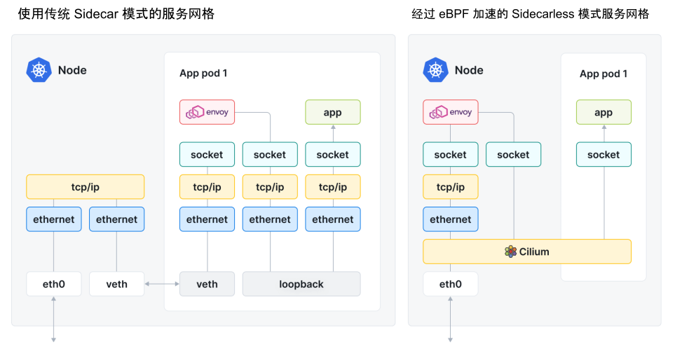
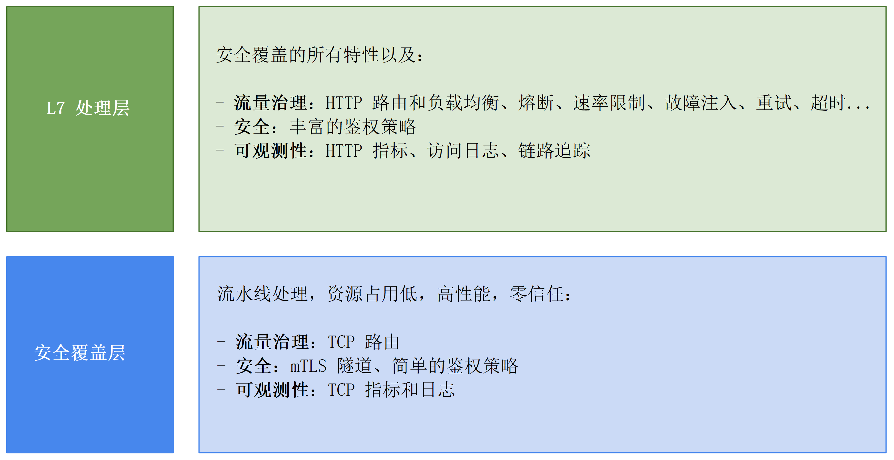

# 8.5 服务网格的未来

随着服务网格落地实践，Sidecar 模式的缺点也逐渐被暴露：

- **网络延迟问题**：服务网格使用 iptables 拦截服务间的请求，服务之间的通信原本是 A->B，现在变成 A->iptables+Sidecar->iptables+Sidecar->B，调用链的增加也带来了额外的性能损耗。虽然 Sidecar 的引入只会增加毫秒级（个位数）延迟，但对性能有极高要求的业务来说，延迟损耗成为了放弃服务网格最主要的原因。
- **资源占用问题**：Sidecar 作为一个独立的容器必然会占用一定的系统资源，对于超大规模集群（例如有数万个 Pod）来说，巨大的基数使得 Sidecar 占用资源总量变成了不小的数目。

考虑解决以上的问题，开发者们开始思考：“是否应该将服务网格和 Sidecar 划上等号？”，同时也开始探索服务网格形态上的其他可能性。

## 8.5.1 Proxyless 模式

既然问题是代理，那就把代理去掉，这就是 Proxyless（无代理）模式。

Proxyless 模式的设计理念是，服务间通信总是要选择一种协议进行，那么将协议的类库（SDK）扩展，使其具有流量控制的能力，不就能代替 Sidecar 代理了吗？且 SDK 和应用同属于一个进程，必然有更优秀的性能表现，Sidecar 为人诟病的延迟问题将迎刃而解。

2021 年 Istio 官方博客发表了一篇文章 《基于 gRPC 的无代理服务网格》[^1]，文中介绍了一种基于 gRPC 框架实现的 Proxyless 模式的服务网格。Proxyless 模式的工作原理如图 8-18 所示，服务之间的流控能力不再依赖 Sidecar，而是被集成在 gRPC 库中。但这种方案额外需要一个代理（图中的 Istio Agent）通过 xDS 协议与控制平面交互，负责告知 gRPC 库如何连接到 istiod、如何获取证书、如何配置规则等。

:::center
   
 图 8-18 Proxyless 模式
:::

相比 Sidecar 实现的服务间通信治理，Proxyless 模式实现的服务间通信治理具有性能、稳定性、资源消耗低等明显的优势。根据官方博客的性能测试报告来看：gRPC Proxyless 模式下的延迟情况接近基准测试，资源消耗也相对较低。

:::center
   
 图 8-18 Proxyless 性能测试报告
:::

不过，回过头再看，所谓 Proxyless 其实和传统的 SDK 并无二致，只是将流控能力内嵌到负责通信协议的类库中，因此它具有和传统 SDK 服务框架相同的缺点。

所以，业内很多人认为 Proxyless 模式本质上是一种倒退，是回归到传统的方式去解决服务间通信的问题。

## 8.5.2 Sidecarless 模式

有了 Proxyless，也不妨再多个 Sidecarless。2022 年 7 月，专注于容器网络领域的开源软件 Cilium 发布了 v1.12 版本。该版本最大的一个亮点是实现了一种 Sidecarless（无 Sidecar）模式的服务网格。

Cilium Sidecarless 模式的服务网格工作原理如图 8-20 所示。Cilium 通过在节点中运行一个 Enovy 实例，作为所有容器的共享代理，这样不需要在每个 Pod 内放置一个 Sidecar 了。然后，再借助 Cilium CNI 底层网络能力，当业务容器的数据包经过内核时，与节点中的共享代理打通，从而构建出一种新形态的服务网格。

:::center
   
 图 8-20 经过 eBPF 加速的服务网格和传统服务网格的区别
:::

传统的服务网格 Linkerd、Istio 几乎都是借助 Linux 内核网络协议栈处理请求，而 Cilium Sidecarless 模式基于 eBPF 技术在内核层面扩展，因此有着天生的网络加速效果。根据图 8-22 所示的性能测试来看，基于 eBPF 加速的 Envoy，比默认没有任何加速 Istio 要好很多。

:::center
   
 图 8-22 Cilium Sidecarless 模式与 Istio Sidecar 模式的性能测试 [图片来源](https://isovalent.com/blog/post/2022-05-03-servicemesh-security/)
:::

Cilium Sidecarless 模式设计思路上其实和 Proxyless 如出一辙，即用一种非 Sidecar 的方式实现流量控制能力，区别是一个基于通信协议类库，另外一个基于共享代理，通过 eBPF 对内核扩展实现。

但同样，软件领域没有银弹，eBPF 并不是万能钥匙，它存在内核版本要求高、编写难度大和容易造成系统安全隐患等问题。

## 8.5.3 Ambient Mesh 模式

2022 年 9 月，服务网格 Istio 发布了一种全新的数据平面模式 “Ambient Mesh”[^2]。Ambient Mesh 让用户无需使用 Sidecar 代理，就能将网格数据平面集成到其基础设施中，同时还能保持 Istio 的零信任安全、可观测和流量治理等核心特性。

以往 Istio 的设计中，Sidecar 实现了从基本加密到高级 L7 策略所有数据平面功能。在实践中，这使得 Sidecar 成为一个 0 和 1 的命题（要么全有，要么全无），即使服务对传输安全性要求不高，工程师们仍然需要付出部署和维护 Sidecar 的额外成本。

如下图所示，Ambient mesh，将 Istio 的功能分成两个不同的层次：安全覆盖层和 L7 处理层。实现安全覆盖层是 Ambient 新引入的 ztunnel组件 ，它在 Kubernetes 集群中以 DaemonSet 的方式部署在每个节点上，ztunnel 为网格中的应用通信提供 mTLS、TCP 路由等 L4 层的处理。

当需要更多高级功能时，可按需启用 Waypoint 组件，Waypoint 组件以 Namespace 为影响范围提供限速、故障注入、负载均衡、熔断等 L7 层高级功能。Waypoint 组件在 Kubernetes 集群中以 Deployment 的形式部署，从 Kubernetes 的角度来看，Waypoint 只是个普通的 Pod，因此可以根据负载动态伸缩。

:::center
   
 图 8-19 ambient-layers
:::

根据官方的博客信息，Istio 一直在推进 Ambient Mesh 的开发，并在 2023 年 2 月将其合并到了 Istio 的主代码分支。这也从一定程度上说明 Ambient Mesh 不是什么实验性质的“玩具”，而是 Istio 的未来发展方向之一。

最后，无论是 Sidecarless 还是 Ambient Mesh，它们的设计思路本质是用中心化的代理，替代位于应用容器旁边的 Sidecar 代理。这在一定程度上解决了传统 Sidecar 模式带来的资源消耗、网络延迟问题。但反面是，服务网格的设计理念本来就很抽象，引入 Proxyless、Sidecarless、Ambient Mesh 模式，让服务网格愈加抽象。笔者相信，大部分业务工程师直面这些抽象概念时，一定感觉头皮阵阵发麻。

[^1]: 参见 https://istio.io/latest/zh/blog/2021/proxyless-grpc/
[^2]: 参见 https://istio.io/latest/zh/blog/2023/ambient-merged-istio-main/
