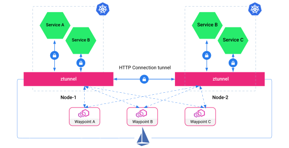

# 8.6 服务网格的未来

随着服务网格的逐步落地，边车代理的缺点也逐渐显现：

- **网络延迟问题**：服务网格通过 iptables 拦截服务间的请求，将原本的 A->B 通信改为 A->（iptables+Sidecar）-> （iptables+Sidecar）->B，调用链的增加导致了额外的性能损耗。尽管边车代理通常只会增加毫秒级（个位数）的延迟，但对性能要求极高的业务来说，额外的延迟是放弃服务网格的主要原因；
- **资源占用问题**：边车代理作为一个独立的容器必然占用一定的系统资源，对于超大规模集群（如有数万个 Pod）来说，巨大的基数使边车代理占用资源总量变得相当可观。

为了解决上述问题，开发者们开始思考：“是否应该将服务网格与边车代理划等号？”，并开始探索服务网格形态上的其他可能性。

## 8.7.1 Proxyless 模式

既然问题出自代理，那就把代理去掉，这就是 Proxyless（无代理）模式。

Proxyless 模式的思想是，**服务间通信总依赖某种协议，那么将协议的实现（SDK）扩展，增加通信治理能力，不就能代替边车代理了吗**？且 SDK 和应用封装在一起，不仅有更优异的性能，还能彻底解决边车代理引发的延迟问题。

2021 年，Istio 发表文章《基于 gRPC 的无代理服务网格》[^1]，介绍了一种基于 gRPC 实现的 Proxyless 模式的服务网格。它的工作原理如图 8-19 所示，服务间通信治理不再依赖边车代理，而是采用原始的方式在 gRPC SDK 中实现。此外，该模式额外需要一个代理（Istio Agent）与控制平面（Control Plane）交互，告知 gRPC SDK 如何连接到 istiod、如何获取证书、处理流量的策略等。

:::center
   
 图 8-19 Proxyless 模式的工作原理
:::

相比边车代理模式，Proxyless 模式在性能、稳定性、资源消耗低等方面具有明显的优势。根据官方公布的性能测试报告来看，该模式的延迟接近“基准”（baseline）、资源消耗也相对较低。

:::center
   
 图 8-20 Proxyless 性能测试报告（结果越低越好）
:::

回过头来看，所谓的 Proxyless 模式与传统 SDK 并无本质区别，只是在库中内嵌了通信治理逻辑，也继承了传统 SDK 服务框架的固有缺陷。因此，许多人认为 Proxyless 模式实际上是一种倒退，是以传统方式重新解决服务间通信的问题。

## 8.7.2 Sidecarless 模式

既然有了 Proxyless 模式，也不妨再多个 Sidecarless 模式（无边车模式）。

2022 年 7 月，专注于容器网络领域的开源软件 Cilium 发布了 v1.12 版本。该版本最大的亮点是实现了一种无边车模式的服务网格。

Cilium 无边车模式的服务网格工作原理如图 8-21 所示。在这种模式下，Cilium 在节点中运行一个共享的 Envoy 实例，作为所有容器的代理，从而避免了每个 Pod 配置独立边车代理的需求。通过 Cilium CNI 提供的底层网络能力，当业务容器的数据包经过内核时，它们与节点中的共享代理进行连接，进而构建出一种全新的服务网格形态。

:::center
   
 图 8-21 经过 eBPF 加速的服务网格和传统服务网格的区别
:::

传统的服务网格，如 Linkerd 和 Istio，通常依赖 Linux 内核网络协议栈来处理请求，而 **Cilium 的无边车模式则基于 eBPF 技术在内核层面进行扩展，从而实现了天然的网络加速效果**。根据图 8-22 所示的性能测试结果，基于 eBPF 加速的 Envoy 在性能上显著优于默认未加速的 Istio。

:::center
   
 图 8-22 Cilium Sidecarless 模式与 Istio Sidecar 模式的性能测试（结果越低越好） [图片来源](https://isovalent.com/blog/post/2022-05-03-servicemesh-security/)
:::

回过头来看，Cilium Sidecarless 模式的设计思路与 Proxyless 模式非常相似，都是通过非边车代理的方式实现流量控制。两者的区别在于：

- Proxyless 基于通信协议库；
- Cilium Sidecarless 则通过共享代理，利用 eBPF 技术在 Linux 内核层面实现。

但同样，软件领域没有银弹，eBPF 不是万能钥匙，它存在 Linux 内核版本要求高、代码编写难度大和容易造成系统安全隐患等问题。

## 8.7.3 Ambient Mesh 模式

2022 年 9 月，服务网格 Istio 发布了一种全新的数据平面模式 “Ambient Mesh”[^2]。

在以往的 Istio 设计中，边车代理实现了从基本加密到高级 L7 策略的所有数据平面功能。这种设计使得边车代理成为一个“全有或全无”的方案，即使服务对传输安全性要求较低，工程师仍需承担部署和维护完整边车代理的额外成本。

Ambient Mesh 的设计理念是，将数据平面分为“安全覆盖层”（ztunnel）和七层处理层（waypoint 代理）。安全覆盖层用于基础通信处理，特点是低资源、高效率。它的功能包括：

- 通信管理：TCP 路由；
- 安全：面向四层的简单授权策略、双向 TLS（即 mTLS）；
- 观测：TCP 监控指标及日志。

七层处理层用于高级通信处理，特点是功能丰富（当然也需要更多的资源），它的功能包括：
- 通信管理： HTTP 路由、负载均衡、熔断、限流、故障容错、重试、超时等；
- 安全：面向七层的精细化授权策略；
- 观测：HTTP 监控指标、访问日志、链路追踪；

在数据平面分层解耦的模式下，安全覆盖层的功能被转移至 ztunnel 组件，它以 DaemonSet 形式运行在 Kubernetes 集群的每个节点上。这意味着，ztunnel 是为节点内所有 Pod 提供服务的基础共享组件。另一方面，七层处理层不再以边车模式存在，而是按需为命名空间创建的 Waypoint 组件。Waypoint 组件以 Deployment 形式部署在 Kubernetes 集群中，从 Kubernetes 的角度来看，Waypoint 只是一个普通的 Pod，可以根据负载动态伸缩。业务 Pod 不再需要额外的边车代理即可参与网格，因此 Ambient 模式也被称为“无边车网格”。

:::center
   
  图 8-23 Ambient-Mesh 的工作原理
:::

Ambient 分层模式允许你以逐步递进的方式采用 Istio，你可以按需从无网格平滑过渡到安全的 L4 覆盖，再到完整的 L7 处理和策略。根据 Istio 公开的信息，Istio 一直在推进 Ambient Mesh 的开发，并在 2023 年 2 月将其合并到了 Istio 的主分支。这个举措在一定程度上表明，**Ambient Mesh 并非实验性质的“玩具”，而是 Istio 未来发展的重要方向之一**。

最后，无论是 Sidecarless 还是 Ambient Mesh，它们本质上都是通过中心化代理替代位于业务容器旁边的代理容器。这在一定程度上解决了传统边车代理模式带来的资源消耗、网络延迟问题。但它们的缺陷也无法回避，服务网格的设计理念本来就很抽象，引入 Proxyless、Sidecarless、Ambient Mesh 等模式，进一步加剧了服务网格的复杂性和理解难度。

[^1]: 参见 https://istio.io/latest/zh/blog/2021/proxyless-grpc/
[^2]: 参见 https://istio.io/latest/zh/blog/2023/ambient-merged-istio-main/
