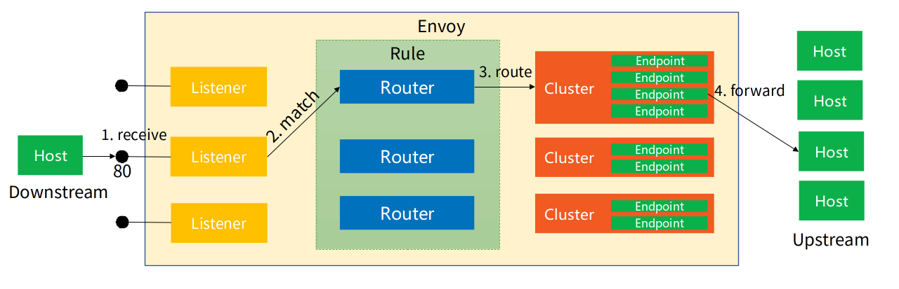

# 8.3 数据平面的设计

服务间通信治理并非复杂的技术，服务网格之所以备受追捧，正是因为它能够自动化实现这一过程，且对应用完全透明。接下来，笔者将从边车代理（Sidecar）自动注入、请求透明劫持和可靠通信实现三个方面，探讨数据平面的设计原理。

## 8.3.1 Sidecar 自动注入

使用过 Istio 的读者一定知道，在带有 istio-injection: enabled 标签的命名空间中创建 Pod 时，Kubernetes 会自动为其注入一个名为 istio-proxy 的边车容器。这套机制的核心在于 Kubernetes 的准入控制器。

:::tip Kubernetes 准入控制器
Kubernetes 准入控制器会拦截 Kubernetes API Server 接收到的请求，在资源对象被持久化到 etcd 之前，对其进行校验和修改。准入控制器分为两类：
- **Validating** 类型准入控制器：用于校验请求，无法修改对象，但可以拒绝不符合特定策略的请求；
- **Mutating** 类型准入控制器：在对象创建或更新时，可以修改资源对象。
:::

Istio 预先在 Kubernetes 集群中注册了一个类型为 Mutating 类型的准入控制器，它包含以下内容：

- Webhook 服务地址：指向运行注入逻辑的 Webhook 服务，例如 Istio 的 istio-sidecar-injector；
- 匹配规则：定义哪些资源和操作会触发该 Webhook，比如针对 Pod 创建请求（operations: ["CREATE"]）；
- 注入条件：通过 Label（istio-injection: enabled） 或 Annotation 决定是否注入某些 Pod。

```yaml
apiVersion: admissionregistration.k8s.io/v1
kind: MutatingWebhookConfiguration
metadata:
  name: sidecar-injector
webhooks:
  - name: sidecar-injector.example.com
    admissionReviewVersions: ["v1"]
    clientConfig:
      service:
        name: sidecar-injector-service
        namespace: istio-system
        path: "/inject"
    rules:
      - apiGroups: [""]
        apiVersions: ["v1"]
        resources: ["pods"]
        operations: ["CREATE"]
    namespaceSelector:
      matchLabels:
        istio-injection: enabled
```

## 8.3.2 流量透明劫持

Isito 通过准入控制器，还会注入一个初始化容器 istio-init，该容器的配置如下：

```yaml
initContainers:
  - name: istio-init
    image: docker.io/istio/proxyv2:1.13.1
    args: ["istio-iptables", "-p", "15001", "-z", "15006", "-u", "1337", "-m", "REDIRECT", "-i", "*", "-x", "", "-b", "*", "-d", "15090,15021,15020"]
```
在上述配置中，istio-init 容器的入口命令为 istio-iptables，该命令配置了一系列 iptables 规则，用于拦截并重定向除特定端口（如 15090、15021、15020）外的流量到 Istio 的边车代理（Envoy）：
- 对于入站（Inbound）流量，会被重定向到边车代理监听的端口（通常为 15006）。
- 对于出站（Outbound）流量，则会被重定向到边车代理监听的另一个端口（通常为 15001）。

通过 iptables -t nat -L -v 命令查看 istio-iptables 添加的 iptables 规则。

```
# 查看 NAT 表中规则配置的详细信息
$ iptables -t nat -L -v
# PREROUTING 链：用于目标地址转换（DNAT），将所有入站 TCP 流量跳转到 ISTIO_INBOUND 链上
Chain PREROUTING (policy ACCEPT 0 packets, 0 bytes)
 pkts bytes target     prot opt in     out     source               destination
    2   120 ISTIO_INBOUND  tcp  --  any    any     anywhere             anywhere

# INPUT 链：处理输入数据包，非 TCP 流量将继续 OUTPUT 链
Chain INPUT (policy ACCEPT 2 packets, 120 bytes)
 pkts bytes target     prot opt in     out     source               destination

# OUTPUT 链：将所有出站数据包跳转到 ISTIO_OUTPUT 链上
Chain OUTPUT (policy ACCEPT 41146 packets, 3845K bytes)
 pkts bytes target     prot opt in     out     source               destination
   93  5580 ISTIO_OUTPUT  tcp  --  any    any     anywhere             anywhere

# POSTROUTING 链：所有数据包流出网卡时都要先进入POSTROUTING 链，内核根据数据包目的地判断是否需要转发出去，我们看到此处未做任何处理
Chain POSTROUTING (policy ACCEPT 41199 packets, 3848K bytes)
 pkts bytes target     prot opt in     out     source               destination

# ISTIO_INBOUND 链：将所有目的地为 9080 端口的入站流量重定向到 ISTIO_IN_REDIRECT 链上
Chain ISTIO_INBOUND (1 references)
 pkts bytes target     prot opt in     out     source               destination
    2   120 ISTIO_IN_REDIRECT  tcp  --  any    any     anywhere             anywhere             tcp dpt:9080

# ISTIO_IN_REDIRECT 链：将所有的入站流量跳转到本地的 15006 端口，至此成功的拦截了流量到 Envoy 
Chain ISTIO_IN_REDIRECT (1 references)
 pkts bytes target     prot opt in     out     source               destination
    2   120 REDIRECT   tcp  --  any    any     anywhere             anywhere             redir ports 15006

# ISTIO_OUTPUT 链：选择需要重定向到 Envoy（即本地） 的出站流量，所有非 localhost 的流量全部转发到 ISTIO_REDIRECT。为了避免流量在该 Pod 中无限循环，所有到 istio-proxy 用户空间的流量都返回到它的调用点中的下一条规则，本例中即 OUTPUT 链，因为跳出 ISTIO_OUTPUT 规则之后就进入下一条链 POSTROUTING。如果目的地非 localhost 就跳转到 ISTIO_REDIRECT；如果流量是来自 istio-proxy 用户空间的，那么就跳出该链，返回它的调用链继续执行下一条规则（OUPT 的下一条规则，无需对流量进行处理）；所有的非 istio-proxy 用户空间的目的地是 localhost 的流量就跳转到 ISTIO_REDIRECT
Chain ISTIO_OUTPUT (1 references)
 pkts bytes target     prot opt in     out     source               destination
    0     0 ISTIO_REDIRECT  all  --  any    lo      anywhere            !localhost
   40  2400 RETURN     all  --  any    any     anywhere             anywhere             owner UID match istio-proxy
    0     0 RETURN     all  --  any    any     anywhere             anywhere             owner GID match istio-proxy	
    0     0 RETURN     all  --  any    any     anywhere             localhost
   53  3180 ISTIO_REDIRECT  all  --  any    any     anywhere             anywhere

# ISTIO_REDIRECT 链：将所有流量重定向到 Envoy（即本地） 的 15001 端口
Chain ISTIO_REDIRECT (2 references)
 pkts bytes target     prot opt in     out     source               destination
   53  3180 REDIRECT   tcp  --  any    any     anywhere             anywhere             redir ports 15001
```

根据图 8-10 进一步理解上述 iptables 自定义链（以 ISTIO_开头）处理流量的逻辑。

:::center
  <br/> 
  图 8-10 Istio 透明流量劫持示意图
:::

使用 iptables 实现流量劫持是最经典的方式。不过，客户端 Pod 和服务端 Pod 之间的网络数据路径需要至少经过三次 TCP/IP 堆栈（出站、客户端边车代理到服务端的边车代理、入站）。如何降低流量劫持的延迟和资源消耗，是服务网格未来的主要研究方向，笔者将在 8.5 节探讨这一问题。

## 8.3.3 实现可靠通信

通过 iptables 劫持流量，转发至边车代理后，边车代理根据配置接管应用程序之间的通信。

传统的代理（如 HAProxy 或 Nginx）依赖静态配置文件来定义资源和数据转发规则，而 Envoy 则几乎所有配置都可以动态获取。Envoy 将代理转发行为的配置抽象为三类资源：Listener、Cluster 和 Router，并基于这些资源定义了一系列标准数据面 API，用于发现和操作这些资源，这套标准数据面 API 被称为 xDS。

xDS 的全称是“x Discovery Service”，“x” 指的是表 8-1 中的协议族。

:::center
表 8-1 xDS v3.0 协议族
:::
| 简写 |                全称                |        描述        |
| :--: | :--------------------------------: | :----------------: |
| LDS  |     Listener Discovery Service     |   监听器发现服务   |
| RDS  |      Route Discovery Service       |    路由发现服务    |
| CDS  |     Cluster Discovery Service      |    集群发现服务    |
| EDS  |     Endpoint Discovery Service     |  集群成员发现服务  |
| ADS  |    Aggregated Discovery Service    |    聚合发现服务    |
| HDS  |      Health Discovery Service      |   健康度发现服务   |
| SDS  |      Secret Discovery Service      |    密钥发现服务    |
|  MS  |           Metric Service           |      指标服务      |
| RLS  |         Rate Limit Service         |    限流发现服务    |
| LRS  |       Load Reporting service       |    负载报告服务    |
| RTDS |     Runtime Discovery Service      |   运行时发现服务   |
| CSDS |  Client Status Discovery Service   | 客户端状态发现服务 |
| ECDS | Extension Config Discovery Service |  扩展配置发现服务  |
| xDS  |        X Discovery Service         | 以上诸多API的统称  |

具体到每个 xDS 协议都包含大量的内容，笔者无法一一详述。但通过这些协议操作的资源，再结合图 8-11 理解，可大致说清楚它们的工作原理。


- **Listener**：Listener 可以理解为 Envoy 打开的一个监听端口，用于接收来自 Downstream（下游服务，即客户端）连接。每个 Listener 配置中核心包括监听地址、插件（Filter）等。Envoy 支持多个 Listener，不同 Listener 之间几乎所有的配置都是隔离的。
  
  Listener 对应发现服务称之为 LDS。LDS 是 Envoy 正常工作的基础，没有 LDS，Envoy 就不能实现端口监听，其他所有 xDS 服务也失去了作用。
- **Cluster**：在 Envoy 中，每个 Upstream（上游服务，即业务后端，具体到 Kubernetes，则对应某个 Service）被抽象成一个 Cluster。Cluster 包含该服务的连接池、超时时间端口、类型等等。

	Cluster 对应的发现服务称之为 CDS。一般情况下，CDS 服务会将其发现的所有可访问服务全量推送给 Envoy。与 CDS 紧密相关的另一种服务称之为 EDS。CDS 服务负责 Cluster 资源的推送。当该 Cluster 类型为 EDS 时，说明该 Cluster 的所有 endpoints 需要由 xDS 服务下发，而不使用 DNS 等去解析。下发 endpoints 的服务就称之为 EDS；
- **Router**：Listener 接收来自下游的连接，Cluster 将流量发送给具体的上游服务，而 Router 定义了数据分发的规则，决定 Listener 在接收到下游连接和数据之后，应该将数据交给哪一个 Cluster 处理。虽然说 Router 大部分时候都可以默认理解为 HTTP 路由，但是 Envoy 支持多种协议，如 Dubbo、Redis 等，所以此处 Router 泛指所有用于桥接 Listener 和后端服务（不限定 HTTP）的规则与资源集合。
	
  Route 对应的发现服务称之为 RDS。Router 中最核心配置包含匹配规则和目标 Cluster。此外，也可能包含重试、分流、限流等等。
:::center
  <br/>
  图 8-11 Envoy 的工作原理
:::

Envoy 的另一项重要设计是其可扩展的 Filter 机制，通俗地讲就是 Envoy 的插件系统。

Envoy 的插件机制允许开发者通过基于 xDS 的数据流管道，插入自定义逻辑，从而扩展和定制 Envoy 的功能。Envoy 的很多核心功能是通过 Filter 实现的。例如，HTTP 流量的处理和服务治理依赖于两个关键插件 HttpConnectionManager（网络 Filter，负责协议解析）和 Router（负责流量分发）。通过 Filter 机制，Envoy 理论上能够支持任意协议，并对请求流量进行全面的修改和定制。