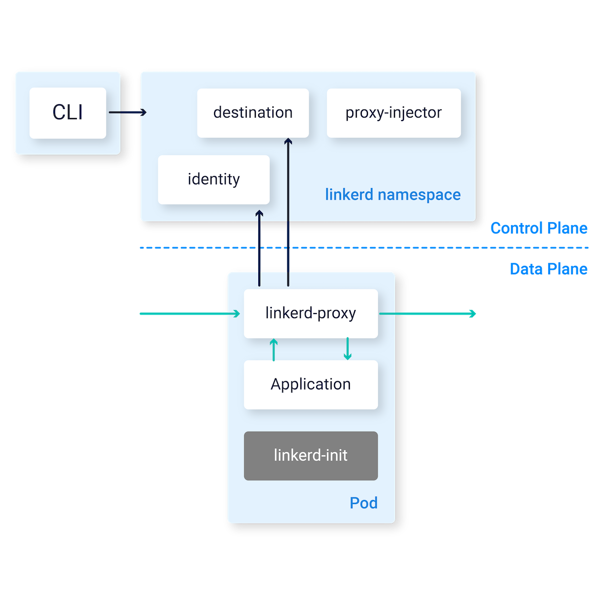
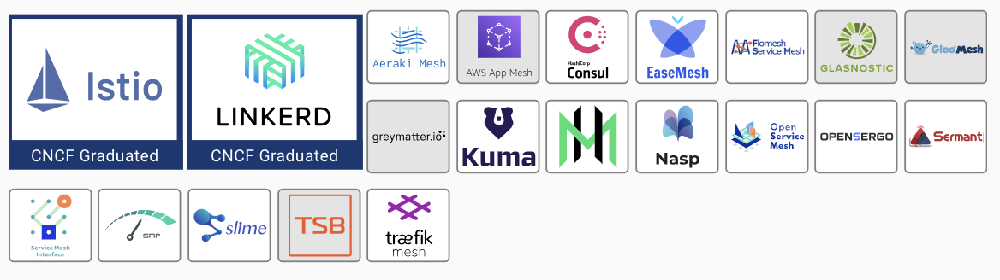
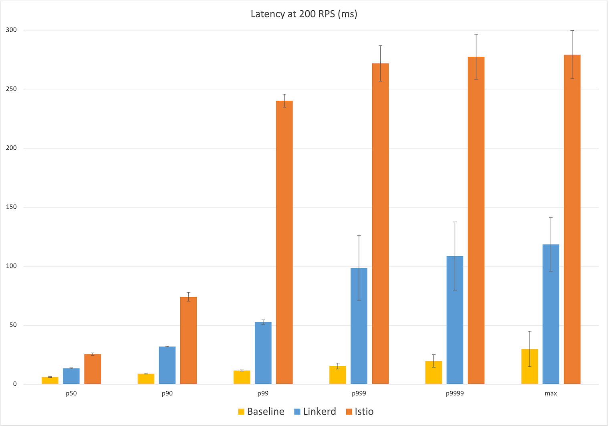
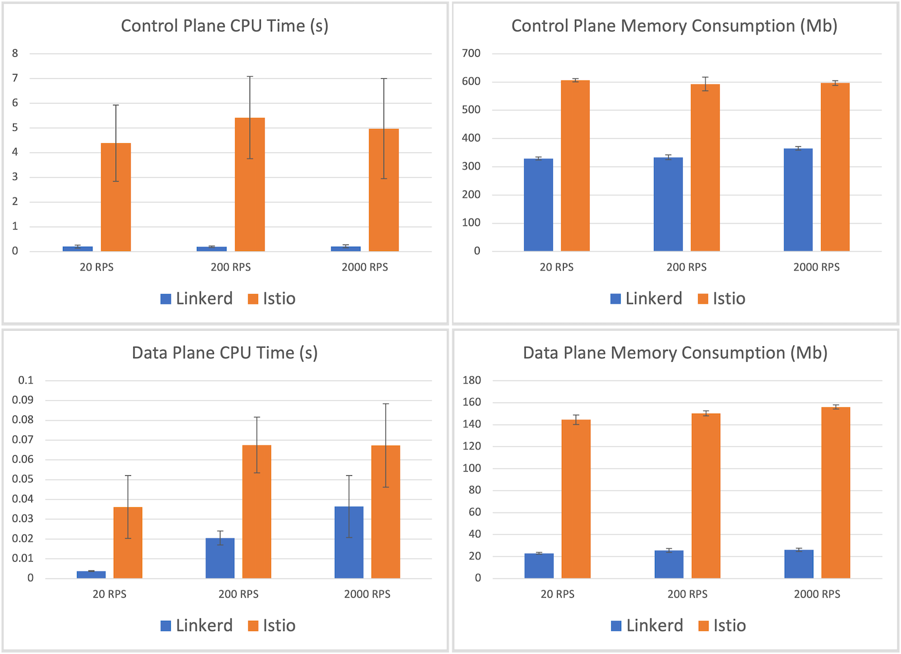

# 8.2 服务网格的产品与生态

2016年1月，Buoyant 公司发布了第一代 ServiceMesh 产品 Linkerd。初次发布的 Linkerd 以 Scala 编写，绝大部分关注点都是如何做好 proxy（代理） 并完成一些通用控制面的功能。同期专注于 proxy 领域的还有一个重量级选手 Envoy，Envoy 由 Lyft 公司基于 C++ 开发，特点为性能出色、功能丰富、生态成熟，是 CNCF 内继 Kubernetes、Prometheus 第三个孵化成熟的项目。初代的 ServiceMesh 虽然理念美好，但以 Sidecar 为核心存在不少缺陷，特别是 Linkerd，其明显的资源消耗、性能影响广受诟病，其二仅限于数据层面的代理功能时，当大量部署 Sidecar 以后，并没有充分考虑如何管理和控制这些 Sidecar。

于是，第二代 Service Mesh 应运而生。2017年5月，Google、IBM、Lyft 宣布新一代的服务网格 Istio 开源，有巨头背书以及**新增控制平面的设计理念**让 Istio 得到极大关注和发展，并迅速成为 ServiceMesh 的代表产品。

Istio 最大的创新在于它为 ServiceMesh 带来前所未有的控制力：以Sidercar 方式部署的 ServiceMesh 控制服务间所有的流量，Istio 增加控制面板来控制系统中所有的 Sidecar。以此，Istio 便控制系统中所有请求的发送，也即控制了所有的流量。

	
	
Linkerd 架构

	
	
Linkerd 架构

## xDS

暂且不论 istio 和 linkerd 到底是谁 ServiceMesh 的赢家。

Envoy 倒成了偷偷领先的玩家，成为了云原生时代数据平面的事实标准。新兴API网关如Gloo，Ambassador都基于Envoy进行扩展开发；而在服务网格中，Istio、Kong社区Kuma、亚马逊AWS App Mesh都使用Envoy作为默认数据面。

与HAProxy以及Nginx等传统Proxy依赖静态配置文件来定义各种资源以及数据转发规则不同，Envoy几乎所有配置都可以通过订阅来动态获取，如监控指定路径下的文件、启动gRPC流或轮询REST接口，对应的发现服务以及各种各样的API统称为xDS。

以Istio中Pilot为例，当Pilot发现新的服务或路由规则被创建（通过监控K8S集群中特定CRD资源变化、或者发现Consul服务注册和配置变化），Pilot会通过已经和Envoy之间建立好的gRPC流将相关的配置推送到Envoy。Envoy接收到相关配置并校验无误之后，就会动态的更新运行时配置，使用新的配置更新相关资源。Pilot工作原理如图1所示。

利用xDS协议，Envoy可以实现配置的完全动态化，配置实时更新而无需重启Envoy或者影响业务。

- 控制面：主要用于更新，下发配置。
- 数据面：主要用于使用控制面的配置进行流量代理。

主打世界上最轻、最简单、最安全的Kubernetes服务网格

Istio 被争相追捧的同时，作为 Service Mesh 概念的缔造者 Buoyant 公司自然不甘心出局，公司生死存亡之际，痛定思痛之后使用 Rust 构建数据平面 linkerd2-proxy ，使用 Go 开发了控制平面 Conduit，主打轻量化，Buoyant 的第二代ServiceMesh 产品最初是以 Conduit 命名，在 Conduit 加入 CNCF 后不久，宣布与原有的 Linkerd 项目合并，被重新命名为Linkerd 2[^1]。

	
	
ServiceMesh 生态

除了头部的 Linkrd，Istio 玩家外，又怎少得了传统的 Proxy 玩家，Kong 推出了 ServiceMesh kuma，有意思的是 Kong 选择了 Envoy 作为数据平面，而非 Kong 网关核心内核 nginx+openresty。远古玩家 Nginx 也祭出自己新一代的产品 Nginx Service Mesh，主打简化 Service Mesh，并顺势推出商业产品 Aspen Mesh。APISIX 推出了 Amesh，与 William Morgan 的死磕 Istio 策略不同，绝大部分在 Proxy 领域根基深厚玩家，从一开始就没有想过要做一套完整的第二代 Service Mesh 开源方案，而是实现支持 xDS协议，宣布兼容 Istio, 作为 Istio 的数据面。

| 特点 | Istio | Linkerd |
|:--|:--|:--|
| 易用性 | 由于各种配置选项和灵活性 ，上手复杂| 有内置和开箱即用的配置，适配起来是相对容易|
|平台| Kubernetes、虚拟机 | Kubernetes |
| 支持的协议 | gRPC、HTTP/2、HTTP/1.x、Websocket 和所有 TCP 流量 | 和 Istio 一致|

## 性能对比

2019年，Kinvolk（2021年被微软收购）发布了 Linkerd 与Istio 的公开基准数据，数据表明 Linkerd 比Istio 明显更快、更轻。这项测试工作还诞生了一个 开源的服务网格基准测试工具 service-mesh-benchmark[^2]，以便任何人都可以复制结果[^3]。

两年之后，Linkerd 以及 Istio 都发布了多个更成熟的版本，两者的表现如何？这里，我们引用 Linkerd 基于 Kinvolk 模仿现实场景（延迟数据从客户端的角度测量，而不是内部的代理时间）。使用 Linkerd v2.11.1、Istio v1.12.0 从延迟、资源消耗的表现上来看这两款 ServiceMesh 产品的差异。

首先是延迟数据的表现，中位数（P50）延迟的表现 Linkerd 在 6ms 的基准延迟上增加了额外的 6ms 延迟，而 Istio的额外延迟为 15ms。值得注意的是在 P90 以上两者开始出现显著差异，最极端的 Max 数据表现上 Linkerd 在 25ms 的基准延迟上增加了额外的 25 ms 延迟，而 Istio 则额外增大了 5倍，高达 253 ms 的延迟。

	
	
Linkerd 与 Istio 的延迟对比

比控制平面更重要的是数据平面，我们继续看 Istio 与 Linkerd 在数据平面的性能对比。Linkerd 代理消耗的内存最大 26 Mb，Istio 的 Envoy 代理消耗的内存最大在156.2 Mb，是 Linkerd 的 6倍。同样，Linkerd 的最大代理 CPU 时间记录为36ms，而 Istio 的代理 CPU 时间记录为 67ms，比前者多出 85%。

	
	
Istio 与 Linkerd 资源消耗对比

总结 Linkerd 和 Istio 在性能和资源成本上的巨大差异主要归结于 Linkerd2-proxy，这个微代理为 Linkerd 的整个数据平面提供动力，所以这个基准在很大程度上反映了 Linkerd2-proxy 和 Envoy 的性能和资源消耗对比。Linkerd2-proxy 虽然性能卓越，但语言过于小众，开源社区的 contributor 数量稀少，未选择实现 xDS 那么它的未来的发展也取决于 Linkerd 发展如何

Service Mesh 属于锦上添花的一种方案，而不是雪中送炭，所以在惰性的情况下大家没什么动力。

iptables带来的性能损耗，原来本来是A->B，现在变成A->iptables+sidecar->iptables+sidecar->B，如果不用iptables而采用手动接入又会对业务方产生工作量。感觉只能等ebpf的普及可能会绕过iptables实现流量的高效代理。但是目前ebpf需要的内核还比较新，所以也需要一段时间的等待。

[^1]: 参见 https://github.com/linkerd/linkerd2
[^2]: 参见 https://github.com/kinvolk/service-mesh-benchmark
[^3]: 参见 https://github.com/linkerd/linkerd2/wiki/Linkerd-Benchmark-Setup
[^4]: 参见 https://linkerd.io/2021/05/27/linkerd-vs-istio-benchmarks/