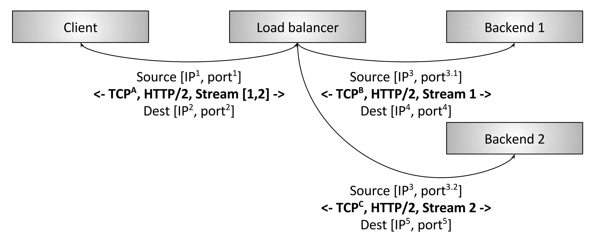

# 4.1 负载均衡概述

广义的负载均衡包括操作系统使用负载均衡来跨物理处理器调度任务、容器编排器使用负载均衡来跨集群调度任务、网络负载中跨可用后端调度网络任务等等。本章我们讨论的内容主要为网络负载均衡。

如图 4-2 所示的负载均衡高层架构图，若干客户端正在访问若干后端服务，中间的负载均衡器完成以下功能：

- 服务发现：系统中哪些后端可用、它们的地址是什么（负载均衡器如何能够联系上它们）。
- 健康检查：哪些后端是健康的，可以正常接收请求。
- 负载均衡：用哪种算法来均衡请求至健康的后端。

	
	
图4-2 负载均衡架构

在分布式系统中正确地使用负载均衡可以带来这些好处：

- 命名抽象化：客户端无需知道每个后端（服务发现），只要能找到负载均衡器就行了，名称解析委托给负载均衡器。
- 容错：通过健康检查和各种算法，负载均衡器可以有效地绕开不良或超载的后端。
- 开销和性能优势：分布式系统的网络很少是同构的，系统很可能跨多个网络 zone 和 region。负载均衡可以最大限度地将请求流量保持在 zone 内部，即提高性能（更低的延迟）又降低整体系统成本（减少跨 zone 带宽）。

业内讨论网络负载均衡器的时候，负载均衡器（load balancer）和代理（proxy） 两个术语经常无差别混用。本文也将沿用这种惯例，认为二者整体上是对等的，严格地讲，并非所有代理都是负载均衡器，但绝大多数代理都有负载均衡功能。

现在，当讨论网络类型的负载均衡的时，所有解决方案通常分为两类：四层负载均衡和七层负载均衡。这两者分别对应 OSI 模型的 4 层和 7 层。

我们先来看一看四层负载均衡。

## 4.1.2 L4（连接/会话层）负载均衡

	
	
图4-3 TCP L4负载均衡

如图 4-3 所示，为一个传统的四层 TCP 负载均衡器。这种情况下，客户端建立一个 TCP 连接到 LB。LB 终止这个连接（例如 ，立即应答 SYN 包），选择一个后端，然后建立一个新的 TCP 连接到后端（例如，发送一 个新的 SYN 包）。典型情况下，L4 负载均衡器只工作在 L4 TCP/UDP connection/session 中。因此，LB 在双向来回转发字节，保证属于同一 session 的字节永远落到同一后端。L4 LB 不感知其转发字节所属应用的任何细节，所以 L4 应用范围很广。

L4 LB 的特点也是其缺点，设想如下 L4 特殊场景：

1. 两个 gRPC/HTTP2 客户端们通过 L4LB 建立连接到后端。
2. L4LB 为每个（从客户端）进来的连接建立一个出去的（到后端）的连接，因此 最终有两个进来的连接和两个出去的连接。
3. 客户端 A 的连接每分钟发送 1 个请求，而客户端 B 的连接每秒发送 50 个请求。

以上场景中，由于 L4 同一个 session 的字节永远落到同一后端，选中的处理客户端 A 请求的后端比选中的处理客户端 B 请求的后端，负载要相差很多倍，这就与负载均衡的目的背道而驰。

由于性能考虑（创建 TCP 连接的开销是非常大，尤其是连接是使用 TLS 加密的时候），所有现代协议都在演进以支持 multiplexing（多路复用） 和 kept-alive（连接保活），因此 L4LB 的阻抗不匹配问题随时间越来越彰显。

而这个问题，可以通过 L7LB 解决。

## 4.1.3 L7 负载均衡

	
	
图4-4 L7负载均衡

如图 4-4 所示，为一个 L7 HTTP/2 负载均衡器。这种情况下，客户端与 LB 只建立一个 HTTP /2 TCP 连接。LB 接下来和两个后端建立连接。当客户端向 LB 发送两个 HTTP/2 流（streams ）时，stream 1 会被发送到后端 1，而 stream 2 会被发送到后端 2。因此，即使不同客户 端的请求数量差异巨大，这些请求也可以被高效地、平衡地分发到后端。L7 负载均衡具备检测应用层流量的能力，这就是 L7LB 对现代协议如此重要的原因。

## 4.1.4  是否还需要 L4 负载均衡

我们前面解释了 L7 负载均衡器对现代协议的重要性，那么是否意味着 L4LB 已经没有用了？肯定不！虽然在 service-to-service 通信中 L7 负载均衡最终会完全取代 L4 负载均衡，但 L4 负载均衡在边缘仍然是非常有用的，因为几乎所有的现代大型分布式架构都是在公网流量入口使用 L4/L7 两级负载均衡架构。在边缘 L7 负载均衡器之前部署 L4 负载均衡器的原因：

- L7LB 承担的更多工作是复杂的分析、变换、以及应用流量路由，他们处理原始流量的能 力（按每秒处理的包数和字节数衡量）比经过优化的 L4 负载均衡器要差。这使得 L4LB 更适合处理特定类型的攻击，例如 SYN 泛洪、通用包（generic packet）泛洪攻击等
- L7LB 部署的更多更频繁，bug 也比 L4LB 多。在 L7 之前加一层 L4LB，可以在调整 L7 部署的时候，对其做健康检查和流量排除（drain），这比（单纯使用）现代 L4LB 要简单的多，后者通常使用 BGP 和 ECMP（后面会介绍）。
- 最后，因为 L7 功能更复杂， 它们的 bug 也会比 L4 多，在前面有一层 L4LB 能及时将有问题的 L7LB 拉出。

## 4.1.4 负载均衡的特性

本节将简要总结负载均衡器提供的高层特性。但并不是所有负载均衡器都提供这里的所有特性。

### 1. 服务发现

服务发现是负载均衡器判断它有哪些可用后端的过程。用到的方式差异很大，这里给出几个例子：

- 静态配置文件
- DNS
- Zookeeper, Etcd, Consul 等待
- Envoy 的通用数据平面 API

### 2. 健康检查

健康检查是负载均衡器判断它的后端是否可以接收请求的过程。大致分为两类：

- 主动：LB 定时向后端发送 ping 消息（例如，向 /healthcheck 发送 HTTP 请求）， 以此测量后端健康状态
- 被动：LB 从数据流中检测健康状态。例如，L4LB 可能会认为如果一个后端有三次连接错误， 它就是不健康的；L7LB 可能会认为如果后端有 503 错误码就是不健康的

### 3. 负载均衡

LB 必须保证负载是均衡的。给定一组健康的后端，如何选择哪个后端来处理一个连接或一 个请求呢？负载均衡算法是一个相对活跃的研究领域，从简单的随机选择、Round Robin， 到更复杂的考虑各种延迟和后端负载状态的算法。

### 4. 黏性会话

对于一些特定应用，保证属于同一 session 的请求落到同一后端非常重要。这可能需要考 虑缓存、结构复杂的临时状态等问题。session 的定义也并不相同，可能会包括 HTTP cookies、客户端连接特性（properties），或者其他一些属性。

### 5. 可观测性

网络在本质上是不可靠的，LB 通常需要导出统计、跟踪和日志信息，以帮助运维判断出了什么问题并修复它。负载均衡器输出的可观测性数据差异很大。高级的负载均衡器提供丰富的输出，包括数值统计、分布 式跟踪以及自定义日志。需要指出的是，丰富的可观测数据并不是没有代价的，负载均衡器需要做一些额外的工作才能产生这些数据。但是，这些数据带来的收益要远远大于为产生它们而增加的那点性能损失。 

### 6. 安全和 DoS 防御

尤其在边缘部署拓扑情况下，负载均衡器通常需要实现很多安全特性，包括限速、鉴权和 DoS 防御（例如，给 IP 地址打标签及分配标识符、tarpitting 等等）
