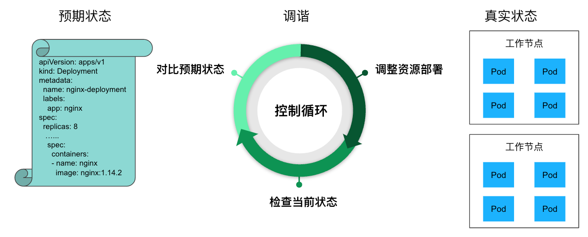

# 10.2 声明式应用管理的本质

Kubernetes 与其他技术项目最大的不同是“声明式应用管理”。

分析 Kubernetes 的工作原理，不难发现，无论是 kube-scheduler 调度 Pod、还是 Deployment 管理 Pod 的部署、还是 HPA 执行弹性伸缩，它们整体的设计上都遵循“控制器模式”。

## 10.1.1 控制器模式

在 Kubernetes 中，用户通过 YAML 文件表达资源的“预期状态”，“控制器”（Controller）负责监视资源的实际状态，当资源的实际状态和“预期状态”不一致时，控制器对系统进行必要的更改，以至两者最终一致。实际状态向预期状态逼近的过程被称之为“调谐”（Reconcile）。

举一个例子，用户定义了一个 Deployment 资源，指定运行的容器镜像、副本数量。Deployment 控制器根据该定义在 Kubernetes 节点上创建相应的 Pod，并持续监控运行状态。如果某个副本 Pod 异常退出，控制器会自动创建新的 Pod，确保系统的“实际状态”始终与用户定义的“预期状态”（8 个副本）保持一致。

:::center
  <br/>
  图 7-1Kubernetes 的控制器模式
:::

有了控制器模式，那么整个底层的基础设施能力，无论是扩缩容、负载均衡、服务发现还是状态一致性，只要描述好状态，通过声明式 API 的方式去暴露给用户。那么，背后的控制器，执行“调谐”来逼近预期状态与实际状态一致。这正是 Kubernetes 声明式应用管理最直观的体现。


## 10.1.2 基础设施即数据思想

“控制器模式”体系的理论基础，是一种叫做 IaD（Infrastructure as Data，基础设施即数据）的思想。

IaD 思想主张，基础设施的管理应该脱离特定的编程语言或配置方式，而采用纯粹、格式化、系统可读的数据，描述用户期望的系统状态。这种思想的优势在于，对基础设施的所有操作本质上等同于对数据的“增、删、改、查”。更重要的是，这些操作的实现方式与基础设施本身无关，不依赖于特定编程语言、协议或 SDK，只要生成符合格式要求的“数据”，便可以“随心所欲”地采用任何你偏好的方式管理基础设施。

IaD 思想在 Kubernetes 上的体现，就是执行任何操作，只需要提交一个 YAML 文件，然后对 YAML 文件增、删、查、改即可，而不是必须使用 Kubernetes SDK 或者 Restful API。这个 YAML 文件其实就对应了 IaD 中的 Data。从这个角度来看，Kubernetes 暴露出来的各种 API 对象，本质是一张张预先定义好 Schema 的“表”（table）。唯一跟传统数据库不太一样的是，Kubernetes 并不以持久化这些数据为目标，而是监控数据变化驱动“控制器”执行相应操作。

|关系型数据库|Kubernetes (as a database)|说明|
|:--|:--|:--|
|DATABASE|cluster|一套 K8s 集群就是一个 database |
|TABLE| Kind |每种资源类型对应一个表|
|COLUMN|property|表里面的列，有 string、boolean 等多种类型|
|rows|resources|表中的一个具体记录|

所以说，Kubernetes v1.7 版本引入了 CRD（自定义资源定义）功能，实质上赋予用户管理自定义“数据”、将特定业务需求抽象为 Kubernetes 原生对象的能力。

例如，定义持续交付领域中，描述任务的 Task、描述流水线的 Pipeline 的 CRD。也就是说，完全可以在 Kuberntes 之上，利用它的内置能力扩展出一套全新的 CI/CD 系统。

```yaml
apiVersion: tekton.dev/v1beta1
kind: Task
metadata:
  name: example-task
spec:
  steps:
    - name: echo-hello
      image: alpine:3.14
      script: |
        #!/bin/sh
        echo "Hello, Tekton!"
```

借助 CRD（自定义资源定义），工程师便可突破 Kubernetes 内置资源的限制，根据需求创建自定义资源类型，例如数据库、CI/CD 流程、消息队列或数字证书等。配合自定义的控制器，便能将特定的业务逻辑、特定的基础设施能力无缝集成到 Kubernetes 中。

最终，所有让人兴奋的技术演进，无论是插件、接口、容器设计模式，还是 Mesh 形式，它们都以“声明式基础设施”为基础下沉至 Kubernetes 中，并通过声明式 API 暴露出来。“下沉”虽然让 Kubernetes 变得越来越复杂，但声明式 API 的好处就在于，它能够在基础设施的复杂度呈指数级增长的同时，保证使用者的交互界面复杂度仅以线性增长。


