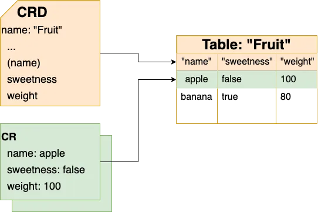

# 10.2 声明式应用管理的本质

Kubernetes 与其他技术项目最大的不同是“声明式应用管理”。

分析 Kubernetes 的工作原理，不难发现，无论是 kube-scheduler 调度 Pod、还是 Deployment 管理 Pod 的部署、还是 HPA 执行弹性伸缩，它们整体的设计上都遵循“控制器模式”。

## 10.1.1 控制器模式

在 Kubernetes 中，用户通过 YAML 文件表达资源的“预期状态”，“控制器”（Controller）负责监视资源的实际状态，当资源的实际状态和“预期状态”不一致时，控制器对系统进行必要的更改，以至两者最终一致。实际状态向预期状态逼近的过程被称之为“调谐”（Reconcile）。

举一个例子，用户定义了一个 Deployment 资源，指定运行的容器镜像、副本数量。Deployment 控制器根据该定义在 Kubernetes 节点上创建相应的 Pod，并持续监控运行状态。如果某个副本 Pod 异常退出，控制器会自动创建新的 Pod，确保系统的“实际状态”始终与用户定义的“预期状态”（8 个副本）保持一致。

:::center
  <br/>
  图 7-1Kubernetes 的控制器模式
:::

Kubernetes 中有多种类型的控制器，例如 Deployment Controller、ReplicaSet Controller 和 StatefulSet Controller 等等，每个控制器有着不同工作原理和适用场景，但它们的基本原理都是相同的。

通过声明式描述文件，以驱动控制器执行“调谐”来逼近预期状态与实际状态一致，正是声明式应用管理最直观的体现。

## 10.1.2 基础设施即数据思想

“控制器模式”体系的理论基础，是一种叫做 IaD（Infrastructure as Data，基础设施即数据）的思想。

IaD 思想主张，基础设施的管理应脱离特定的编程语言或配置方式，而采用纯粹、格式化、系统可读的数据形式。这些数据能够完整地描述用户期望的系统状态。这种思想的优势在于，对基础设施的所有操作本质上等同于对数据的“增、删、改、查”。更重要的是，这些操作的实现方式与基础设施本身无关，不受限于特定的编程语言、远程调用协议或 SDK。只要生成符合格式要求的“数据”，便可以“随心所欲”地采用任何你偏好的方式管理基础设施。

IaD 思想在 Kubernetes 上的体现，就是执行任何操作，只需要提交一个 YAML 文件，然后对 YAML 文件增、删、查、改即可，而不是必须使用 Kubernetes SDK 或者 Restful API。这个 YAML 文件其实就对应了 IaD 中的 Data。 

Kubernetes 把所有的功能都定义为“API 对象”，其实就是一个 Data。既然 Kubernetes 要处理这些数据，那么 Data 本身也应该有一个固定的“格式”，这样 Kubernetes 才能解析。这里的格式在 Kubernetes 中就叫做 API 对象的 Schema。

```YAML
apiVersion: v1
kind: Pod
metadata:
  name: nginx-pod
  labels:
    app: nginx
spec:
  containers:
  - name: nginx
    image: nginx:1.25.3
    ports:
    - containerPort: 80
```

从这个角度来讲，Kubernetes 暴露出来的各种 API 对象，实际上就是一张张预先定义好 Schema 的表（Table）。唯一跟传统数据库不太一样的是，Kubernetes 在拿到这些数据之后，并不以把这些数据持久化起来为目的，而是监控数据变化来驱动“控制器”执行某些操作。

|关系型数据库|Kubernetes (as a database)|说明|
|:--|:--|:--|
|DATABASE|cluster|一套 K8s 集群就是一个 database |
|TABLE| Kind |每种资源类型对应一个表|
|COLUMN|property|表里面的列，有 string、boolean 等多种类型|
|rows|resources|表中的一个具体记录|


所以说，Kubernetes v1.7 版本支持 CRD（Custom Resource Definitions，自定义资源定义），实质上是允许用户定义自己的资源类型，，扩展 Kubernetes API，将复杂的业务需求抽象为 Kubernetes 的原生对象。

有了 CRD，用户便不再受制于 Kubernetes 内置资源的表达能力，自定义出数据库、Task Runner、消息总线、数字证书...。加上自定义的“控制器”，便可把“能力”移植到 Kubernetes 中，并以 Kubernetes 统一的方式暴漏给上层用户。

:::center
  <br/>
  图 10-10 CRD
:::

至此，相信读者已经理解了：IaD 思想中的 Data 具体表现其实就是声明式的 Kubernetes API 对象，而 Kubernetes 中的控制循环确保系统状态始终跟这些 Data 所描述的状态保持一致。从这一点讲，Kubernetes 的本质是一个以“数据”（Data）表达系统的设定值，通过“控制器”（Controller）的动作来让系统维持在设定值的“调谐”系统。

