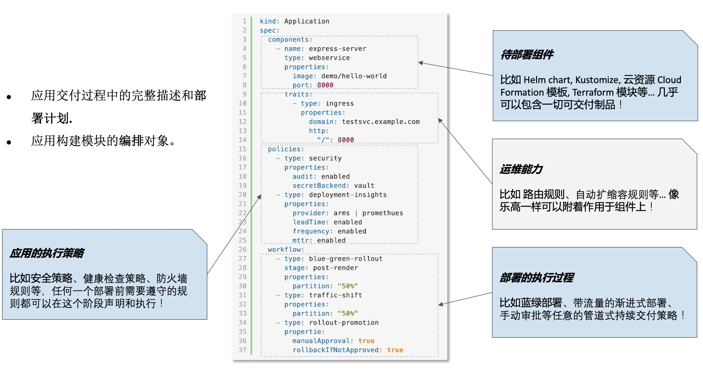

# 10.3.4 OAM 与 KubeVela

2019 年 10 月，阿里云与微软在上海 QCon 大会上联合发布了全球首个开放应用模型（OAM，Open Application Model）。OAM 的核心理念是通过模块化设计，将应用拆解为多个功能单元，从而实现开发、运维和平台人员之间的关注点分离。开发人员专注于业务逻辑的实现，运维人员关注程序的稳定性，而平台人员则致力于提升基础设施的能力与可靠性。

OAM 规范下的应用由不同的组件构成，这些组件并非纯粹的抽象概念，是可以被实际使用的自定义资源。（v0.3.0）这些概念的具体含义如下：

- **应用组件（Component）**：无论是前端还是后端，组件化构建应用的思想屡见不鲜。平台架构师将应用分解成成一个个可被复用的模块、每个组件都具有明确的功能和接口，开发人员通过配置文件填写组件参数、与其他服务的关系，就能描绘出一个完整的应用。
- **运维特征（Trait）**：运维特征是可以随时绑定给待部署组件的模块化、可拔插的运维能力，比如：副本数调整、数据持久化、设置网关策略、自动设置 DNS 解析等。用户可以从社区获取成熟的能力，也可以自行定义。
- **应用边界（Application Scope）**：描述集群范围内或应用范围内的行为控制，它定义了与运行时状态、资源利用或安全等相关的约束条件。例如，Policy 可以用来控制副本数量、资源限制、访问控制等。
- **工作流步骤（Workflow）**：定义组件如何运行，包含了组件的资源配额和相关的配置。这通常会被映射到 Kubernetes 中的资源对象（如 Pod、Deployment、StatefulSet）上。

将组件和运维动作组合，就构成描述统一的、与基础设施无关的“部署计划”。
对于一个应用而言，大家只需要一份 OAM 的这种自包含的应用描述文件，完整地跟踪到一个软件运行所需要的所有资源和依赖。

:::center
   
  图 4-0 OAM 应用部署计划
:::

KubeVela 是将 OAM“模型”化虚为实，也是第一个将“以应用为中心”的设计理念落地的项目。它起源于 OAM 社区，于 2021 年加入 CNCF，2023 年 2 月晋升为“孵化”（Incubating，意味着）级别，“孵化”意味着项目达到一定的成熟度，具备了可用性、活跃社区和稳定的技术路线。

KubeVela 基于 OAM 模型的关注点分离理念，将平台用户分为平台工程师（Platform Builder）和最终用户（End User）两类：
- 平台工程师准备应用部署环境、维护稳定可靠的基础设施功能（如 MySQL Operator），并将这些基础设施能力作为 KubeVela 模块注册到集群中；
- 最终用户聚焦业务实现，对 Kubernetes 的细节并不关心，他们选择部署环境、挑选能力模块并填写业务参数。最后再 KubeVela 进行组装渲染，变成 Kubernetes 的实际资源，即可在不同运行环境上把应用随时运行起来！

KubeVela 工作流程如下图。
:::center
   
  图 4-0 KubeVela 工作流程
:::

KubeVela 的价值在于，将云原生丰富的技术快速落地。做一个类比，KubeVela 有点像云原生生态的 “Spring 框架”。在 Java 生态中，Spring 框架帮助开发者快速构建业务应用，通过统一的编程模型，避免深入了解各类技术细节，从而大大降低了技术门槛。相对应的，KubeVela 通过将云原生技术组件与企业应用连接起来，建立统一的管理与运维交付标准，使开发者将关注点从底层的 “Pod”、“Statefulset”、“deployment”转向更高层次“代码”、“应用”。

目前来看，KubeVela 背后的理论过于抽象，落地有一定的技术门槛！但 KubeVela 项目核心目标“让研发专注于代码”，“让技术无缝落地” ，无疑代表着未开云原生技术发展的趋向！

[^1]: https://zh.wikipedia.org/wiki/%E4%BF%A1%E6%81%AF%E7%83%9F%E5%9B%B1