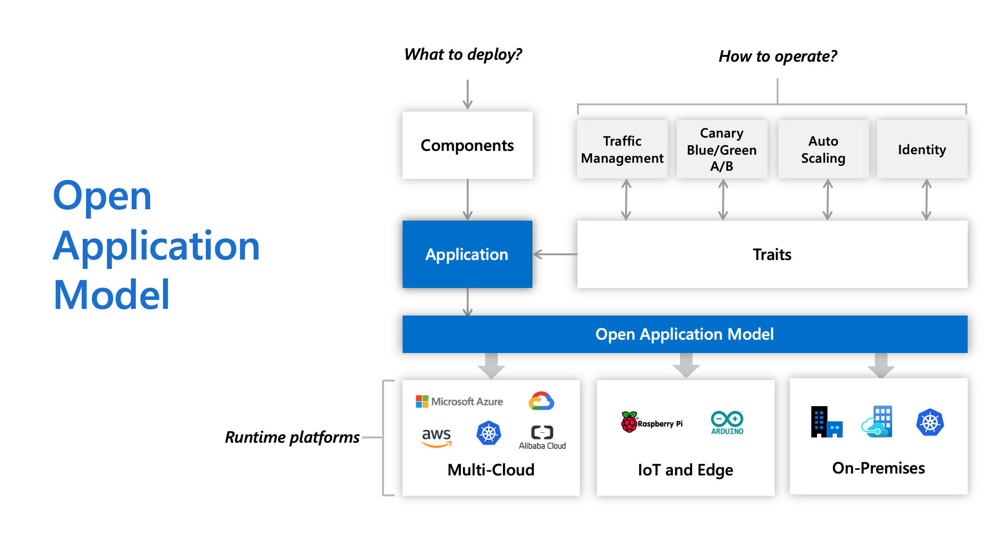
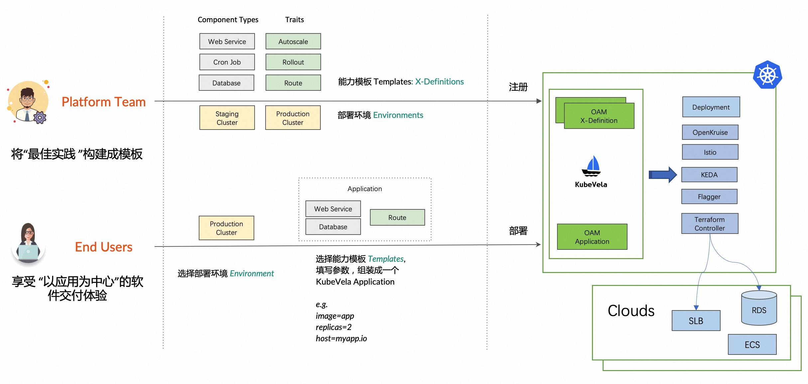

# 10.3.4 OAM 与 KubeVela

2019 年 10 月，阿里云与微软在上海 QCon 大会上联合发布了全球首个开放应用模型（OAM，Open Application Model）。该项目有两个部分：OAM 规范以及 OAM 规范的 Kubernetes 实现。

在 OAM 的规范中，应用由一组具有运维特征（Trait）的组件（Component）组成，并且限定在一个或多个应用边界（Application Scope）内。上述并非是完全抽象的概念，而是可实际使用的自定义资源（CRD）。这些概念的具体含义如下：

- **组件**（Component）：无论是前端还是后端，组件化构建应用的思想屡见不鲜。平台架构师将应用分解成成一个个可被复用的模块、每个组件都具有明确的功能和接口，开发人员通过配置文件填写组件参数、与其他服务的关系。
- **运维特征**（Trait）：与组件绑定的运维行为，比如服务发布、访问、治理、弹性、可观测性、灰度发布等。一个组件可以绑定任意个运维特征。
- **应用边界**（Application Scopes）:定义应用级别的部署特征，比如健康检查规则、安全组、防火墙、SLO、检验等模块。相对于运维特征而言，应用边界作用于一个应用的整体，而运维特征作用于应用中的某个组件。
- **应用**（Application）：将 Component（必需）、Trait（必需）和 Scope（可选）组合并实例化，形成了一个完整的应用描述。

OAM 使用上述自定义资源将原先 Kubernetes All-in-one 的复杂配置做了一定层次的解耦，应用研发人员负责管理 Component，运维人员 Component 组合并绑定 Trait 变成 Application，平台或基础设施提供方提供 OAM 的解释能力，将这些自定义资源映射到实际的基础设施。

整个过程如图所示。
:::center
   
  图 4-0 OAM 应用部署计划
:::

KubeVela 是 OAM 规范在 Kubernetes 上的完整实现，它起源于 OAM 社区，由阿里巴巴、微软等技术专家共同维护。

对于平台工程师（latform Builder）来说，KubeVela 像一个可以无限扩展、Kubernetes 原生的应用构建引擎，他们准备应用部署环境、维护稳定可靠的基础设施功能，并将这些基础设施能力作为 KubeVela 模块注册到集群中；而对于最终用户（End User，研发人员或者运维人员）来说，他们选择部署环境、挑选能力模块并填写业务参数，就可以在不同运行环境上把应用随时运行起来！

KubeVela 工作流程如下图。
:::center
   
  图 4-0 KubeVela 工作流程
:::

:::tip 落地 Kubernetes 的难题

很多公司落地 Kubernetes 的时候采用了 “PaaS” 化的思路，即在 Kubernetes 之上，开发一个类 PaaS 平台。但这个设计，跟 Kubernetes “以应用为中心”的设计不一致，Kubernetes 一旦退化成“类IaaS 基础设施”，它的声明式 API、容器设计模式、控制器模式根本无法发挥原本的实力，也很难与广泛的生态对接。

上述问题在 PaaS 系统上的体现就是不具备扩展性，假设我们要满足以下诉求：

- 能不能帮我运行一个定时任务
- 能不能帮我运运行一个 MySQL Operator
- 能不能根据自定义 metrics 定义水平扩容策略
- 能不能基于 Istio 来帮我做渐进式灰度发布

这里的关键点在于，上述能力在 Kubernetes 生态中都是非常常见的的能力，有的甚至是 Kubernetes 内置就可以支持。但是到了 PaaS 这里，要支持上述任何一个能力，必须进行一轮开发。而且由于先前的一些假设和设计，甚至很可能需要大规模的重构。
:::

KubeVela 本质上其实就是在 Kuberntes 上安装了一个 OAM 插件，从而使得平台工程师能够按照 OAM 规范，把 Kubernetes 生态中的各种能力或插件“攒”成一个应用交付平台。所以说，KubeVela 对最终用户提供媲美 PaaS 的使用体验，又为平台工程师带来 Kubernees 原生的高可扩展性和平台构建规范！

不过，目前来看，KubeVela 背后的理论还是过于抽象，落地有一定的技术门槛！但 KubeVela 这种构建以”应用为中心“的上层平台的思想，无疑代表着云原生技术未来发展的趋向！

[^1]: https://zh.wikipedia.org/wiki/%E4%BF%A1%E6%81%AF%E7%83%9F%E5%9B%B1