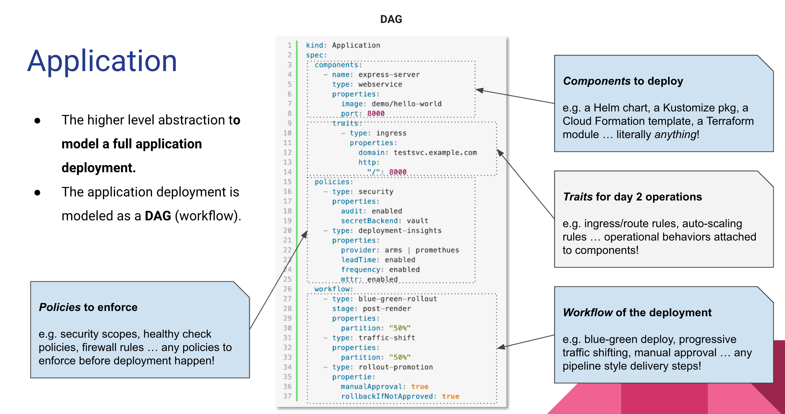

# 10.3.4 OAM

2019 年 10 月，阿里云与微软在上海 QCon 大会上联合发布了开源项目 Open Application Model（OAM）。该项目以“关注点分离”（Separation of Concerns）为核心理念，对云原生应用的整个 DevOps 流程提供了高度抽象和封装。

OAM 项目有两个部分，OAM 规范（spec）和 OAM 规范的 Kubernetes 实现。

详细的说，OAM 规范是基于自定义资源讲原先 All-in-One 的复杂配置做了一定层次的解耦，应用开发者、运维人员和基础设施运维人员以一种标准化的方式连接起来。一言以蔽之：OAM 是一个高度可扩展的应用定义与能力装配模型。

- 应用组件（Component）:
- 运维特征（Trait）：
- 

它强调一个现代应用是多个“组件”（Component）的集合，而非一个简单的工作负载或者 K8s Operator。更进一步的，OAM 把这个应用所需的“运维策略”（Trait）也认为是一个应用的一部分，在 OAM 中，一个应用程序包含三个核心理念：
- 第一个核心理念是组成应用程序的组件（Component），它可能包含微服务集合、数据库和云负载均衡器；
- 第二个核心理念是描述应用程序运维特征（Trait）的集合，例如，弹性伸缩和 Ingress 等功能。它们对应用程序的运行至关重要，但在不同环境中其实现方式各不相同；
- 最后，为了将这些描述转化为具体的应用程序，运维人员使用应用配置（Application Configuration）来组合组件和相应的特征，以构建应部署的应用程序的具体实例。

不同角色分工协作，整体上简化单个角色关注的内容，使得不同角色可以更聚焦更专业的做好本角色的工作。

:::center
   
  图 4-0 OAM 应用开放模型
:::

OAM 在社区的众多用户呼声下诞生。KubeVela 在“关注点分离”的核心思想之上，把平台的用户分成两种角色：
- **平台构建者**：准备应用部署环境，维护稳定可靠的基础设施功能（如 MySQL Operator），并将基础设施能力作为“KubeVela 模块定义“注册到集群中。
- **最终用户**：即业务应用的开发者，他们选择部署环境、挑选能力模块、填写业务参数组装成 KubeVela 应用。使用平台的过程中，无需关心基础设施细节。

整个工作流程如下图。

:::center
   
  图 4-0 OAM
:::

相比于传统的 “PaaS” 项目，KubeVela 这种基于 OAM 和 Kubernetes 构建的云原生应用平台，本质是“应用为中心的” Kubernetes，保证端到端接入整个云原生生态能力。同时，还为最终用户降低心智负担，带来媲美 PaaS 应用管理与交付体验。

[^1]: https://zh.wikipedia.org/wiki/%E4%BF%A1%E6%81%AF%E7%83%9F%E5%9B%B1