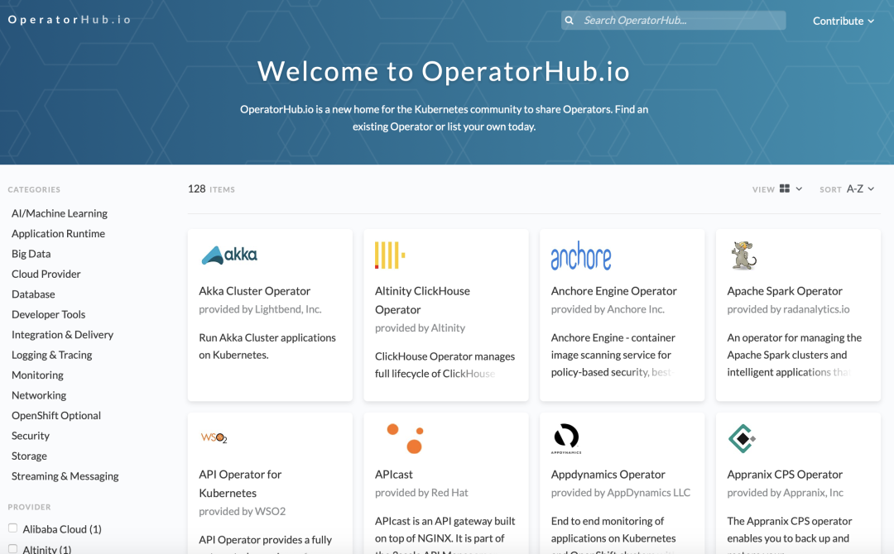

# 10.3.3 Operator

Operator 的概念由 CoreOS 于 2016 年提出，它并非一个具体的工具或系统，而是一种封装、部署和管理 Kubernetes 应用的方法，尤其适合需要特定领域知识的复杂有状态应用，如数据库、分布式缓存和消息队列等。


容器化应用程序最困难的任务之一，就是设计有状态分布式组件的部署体系结构。

理解 Operator 所做的工作，需要先弄清楚“无状态应用”和“有状态应用”的含义。


如果使用 Operator，情况就简单得多。Etcd 的 Operator 提供了 EtcdCluster 自定义资源，在它的帮助下，仅用几十行代码，安装、启动、停止等基础的运维操作。但对于其他高级运维操作，例如升级、扩容、备份、恢复、监控和故障转移，如下面代码所示。

```yaml
apiVersion: operator.etcd.database.coreos.com/v1beta2
kind: EtcdCluster
metadata:
  name: my-etcd-cluster
  namespace: default
spec:
  size: 3
  version: "3.4.15"
  storage:
    volumeClaimTemplate:
      spec:
        accessModes:
          - ReadWriteOnce
        resources:
          requests:
            storage: 8Gi
```

Operator 的实现上，其实是 Kubernetes 声明式 API 基础上的一种“微创新”。它利用了 CRD 构建“高层抽象”，又通过 Kubernetes 原生的“控制器模式”，将复杂应用的运维逻辑代码化

使用 CRD 构建“高层抽象”、使用配套的控制器来维护期望状态，带来的好处远不止使用简单。以往的高可用、扩展收缩、以及故障恢复等等运维经验沉淀为代码，通过 Operator 继承。只要几行代码，就可以复用最专业的运维能力。


不过，开发 Operator 的门槛相对较高，需要既了解 Kubernetes、又了解开发、又了解运维，通常又专业的组件公司开发。


2019 年，Red Hat、AWS、Google Cloud 和 Microsoft 联合推出了 OperatorHub.io，为 Kubernetes 社区提供一个官方的、经过验证的 Operator 集中目录。用户搜索所需的 Operator，查看说明文档和安装指南，通过几行命令即可在目标集群上完成 Operator 的安装。

:::center
  <br/>
 图 3-14 operatorhub.io
:::


无论是 Helm、Kustomize 或者是 CRD + Operator ，它们在各自领域承载的是一个“组件”的概念，对于一个完整的“应用”，即面向具体业务场景的定义、部署和运行需求，仍旧缺乏思想指导和有效的解决手段。