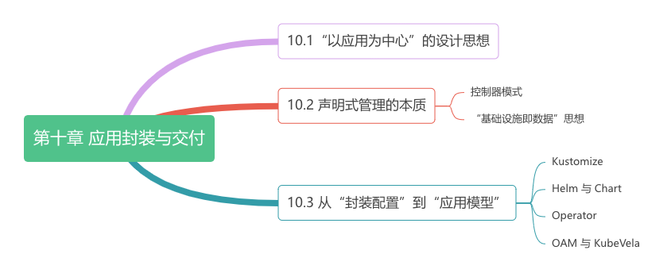

# 第十章 应用封装与交付

:::tip <a/>
没有银弹，但有时会有很好用的弓箭。
:::right
—— 改自于著作《没有银弹》[^1]
:::

很多企业开始落地 Kubernetes，很多业务工程师也开始“被迫”学习各种“抽象”的概念（如 Pod、YAML 文件、声明式 API、Operator）。落地前充满期待，结果却适得其反。

导致上面问题的根源在于，Kubernetes 的定位是基础设施项目、是“平台的平台”（The Platform for Platform）。它的声明式 API 设计、CRD Operator 体系，是为了接入和构建新基础设施能力而设计的。这就导致作为这些能力的最终用户 —— 业务工程师，跟 Kubernetes 核心定位之间存在明显的错位。

大家抱怨 Kubernetes 过于复杂，但“复杂”是任何基础设施项目的天生特质，而非缺点。不过，基础设施“复杂”不意味着应该由使用者承受。这就好比，Linux 内核是世界上最复杂的软件之一，但我们使用 Linux 系统却没有太多心智负担，这是因为 Linux 系统通过高度抽象屏蔽了底层的复杂性。既然 Kubernetes 被称为“云原生时代的操作系统”，现在也该考虑学习 Linux 抽象方式，寻找一种应用层的软件交付模型和抽象，以更友好的方式服务最终用户了。

:::center
   
 图 10-0 本章内容导读
:::

[^1]:《没有银弹：软件工程的本质性与附属性工作》是 IBM 大型机之父 Frederick P. Brooks, Jr. 的著作。书中通过引述《伦敦狼人》等电影的剧照，探讨了“银弹”在软件工程中的传说。Brooks 强调，由于软件本质上的复杂性，使真正的“银弹”（即完美解决所有问题的技术或方法）并不存在。