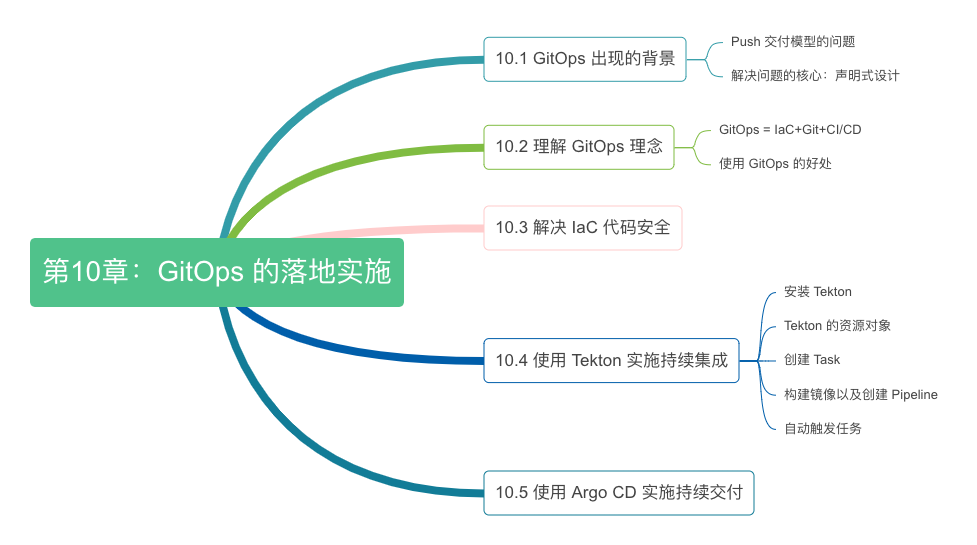

# 第十章 应用封装与交付

:::tip <a/>
没有银弹，但有时会有很好用的弓箭。
:::right
—— 改自于著作《没有银弹》[^1]
:::

Docker 的核心价值在于设计了镜像，统一封装应用的部署与依赖，解决了单个应用实例在运行环境中的一致性问题。将应用的部署方式从手工作坊的部署方式带入了标准化的工业时代。Kubernetes 的出现，则对底层计算、网络、存储等资源进行了统一的抽象，这些抽象就是我们所熟知的 Pod、Service、NetworkPolicy，让多个容器共同协作，构建出健壮的分布式系统。

在 Kubernetes 的背景下，“软件”不再是一个由应用开发者掌控的单一交付物，而是多个 Kubernetes 对象的集合，使用 Kubernetes 原生语义构建一套现代微服务应用，是一件高度碎片化且充满挑战的事情。举个例子，如果你要在 Kubernetes 中部署一套微服务系统，那你需要为每个子服务配置 Service（提供服务发现和负载均衡）、Deployment（管理无状态服务）、HPA（提供自动扩缩容）、StatefulSet（管理有状态服务）、PersistentVolume（提持久化存储）、NetworkPolicy（提微网络访问控制规则）等等。上述工作“繁琐”还在其次，关键难点是写出合适 YAML 元数据描述，这要求操作人员既要懂研发（理解服务运行、镜像版本、依赖关系等需求），又要懂运维（理解扩缩容、负载均衡、安全、监控等策略），一般的开发人员根本无从下手。

以上复杂并不是 Kubernetes 导致，而是分布式应用天生的特质导致。对于大规模的分布式集群，无论是最终用户部署应用，还是软件公司管理应用，都存在诸多痛点。这些困难的本质是，Docker 以镜像封装了单体应用，Kubernetes 通过资源封装了服务集群，但却缺乏一种应用层的软件交付模型和抽象，将研发工程师、运维工程师角色的关注点进行恰达的分离。

是时候考虑，该如何把系统性的技术工作，以更加友好的方式透给最终用户。

GitOps 起源于 Weaveworks[^2] 公司在 2017 年发表的一篇博客《GitOps - Operations by Pull Request》[^3]，文中介绍了一种以 Git 为唯一事实来源的软件部署方式。

这种方式下，我们需要将软件设施定义在 Git 仓库中进行管理，这里的软件设施不限于应用本身，也包括 IaaS、Kubernetes 这样的基础设置。每个工程师提交 Pull Request 修改软件设施，项目管理人员 Merge Request 合并修改，然后通过自动化程序（如 Flux CD、Argo CD 等）的方式在线上执行这些修改。

本章我们了解 GitOps 出现的背景以及设计理念，讨论 CI/CD 工具如何选型，然后基于 GitOps 设计理念实施一套包含代码测试、镜像构建、交付运行的 CI/CD 系统。

:::center
   
  图 10-0 本章内容导读
:::

[^1]:《没有银弹：软件工程的本质性与附属性工作》是 IBM 大型机之父 Frederick P. Brooks, Jr. 的著作。书中通过引述《伦敦狼人》等电影的剧照，探讨了“银弹”在软件工程中的传说。Brooks 强调，由于软件本质上的复杂性，使真正的“银弹”（即完美解决所有问题的技术或方法）并不存在。
[^2]: 云原生明星创业公司 Weaveworks 在 2024年2月5日宣布倒闭了，但幸运的是其开源的关于 GitOps 的项目 Flux 未来将持续健康发展（因为捐赠给了 CNCF）。
[^3]: 参见 https://www.weave.works/blog/gitops-operations-by-pull-request