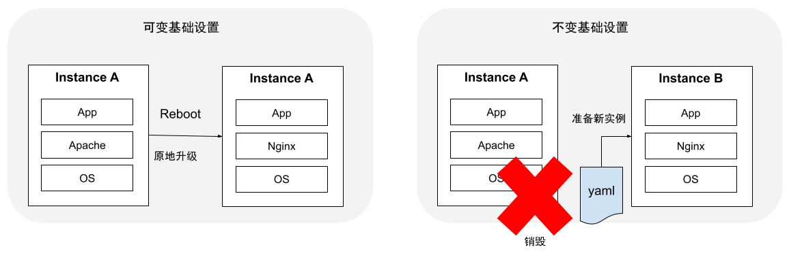

# 1.5.4 不可变基础设施

解决生产环境中的故障场景下，经常会先出现这么几个画面：开发工程师 “我本地跑好好的，怎么到你那就不行？”；运维工程师 “谁又改了配置文件...”。本节，我们聊聊此类问题的本源 -- 基础设施。

2013 年 6 月，Chad Fowler 在自己的博客中撰写一篇 《Trash Your Servers and Burn Your Code: Immutable Infrastructure and Disposable Components》 的文章，提出了 Immutable Infrastructure（不可变基础设施） 的概念[^1]。这一前瞻性的构想，伴随着 Docker 容器技术的兴起、微服务架构的流行，得到了事实上的检验。

不过谈论不可变基础设施之前，我们先了解不可变（Immutable）和可变（Mutable）的区别。

## 1.可变的基础设施

从基础设施的角度来看，“不可变”更倾向于传统的运维视角。例如，主机部署的是 Apache，现在想换成 Nginx，则需要先卸载掉 Apache，然后再重新安装一个 Nginx，然后重启让系统对这次变更生效。在这个过程中，基础设施为了满足业务需求，进行了一次或多次变更，装有 Apache 的 Linux 系统这就是一个可变的基础设施。

可变的基础设施通常会导致以下问题：

- **重大故障时，难以快速重新构建服务**：持续过多的手动操作，并且缺乏记录，会导致很难由标准初始化的服务器来重新构建起等效的服务。
- **不一致风险**：在服务运行过程中，持续地修改基础设施配置，会像程序变量因并发修改引起的状态不一致风险。这对服务器修改而言，同样会引入中间状态，导致出现不可预知的问题。

可变的基础设施带来的运维之痛，引得 Chad Fowler 的文章中第一句就开始吐槽。
::: tip <i></i>
要把一个不知道打过多少个升级补丁，不知道经历了多少任管理员的系统迁移到其他机器上，毫无疑问会是一场灾难。
:::

## 2.不可变基础设施

不可变基础设施的核心思想是任何基础设施的实例一旦创建之后就变成只读状态。如需修改或升级，应该先修改基础设施的配置模版（例如 yaml 配置），修改配置模版之后使用新的实例进行替换。

不可变基础设施的系统中如果有新的变更需求，如上面的 Nginx 升级案例，就应该准备一个新的 Nginx 基础设施，而不是在原有的基础上做原地更新，如图 1-30 所示。

	
	
图1-30 基础设施可变与不可变对比

此刻，读者是否灵光一现想起前面介绍的容器技术“构建镜像运行容器之后，如果出现问题，我们不会在容器内修改解决，而是在容器构建阶段去解决”。从容器的角度看，镜像就是一个不可变基础设施，正是容器技术的出现使不同环境的标准化配置成为可能，我们可以快速拉起成千上万一模一样的服务，服务的版本升级、回滚也成为常态，进而不可变基础设施也逐步变成可能。

对比可变基础设施，不可变基础设施的最大的优势是**一致性**，在不可变基础设施下，所有的配置都通过标准化描述文件（例如 yaml、dockerfile 等）进行统一定义，不同的 Pod、Service 都按照同样的定义创建，不同实例配置不一致的情况不会再出现。在一致性的前提下，当线上突发故障或者遇到异常流量时，不可变基础设施才可以快速进行弹性扩缩容、升级、回滚等操作，应对问题时也更加快速和自动化。

[^1]: 参见 http://chadfowler.com/2013/06/23/immutable-deployments.html