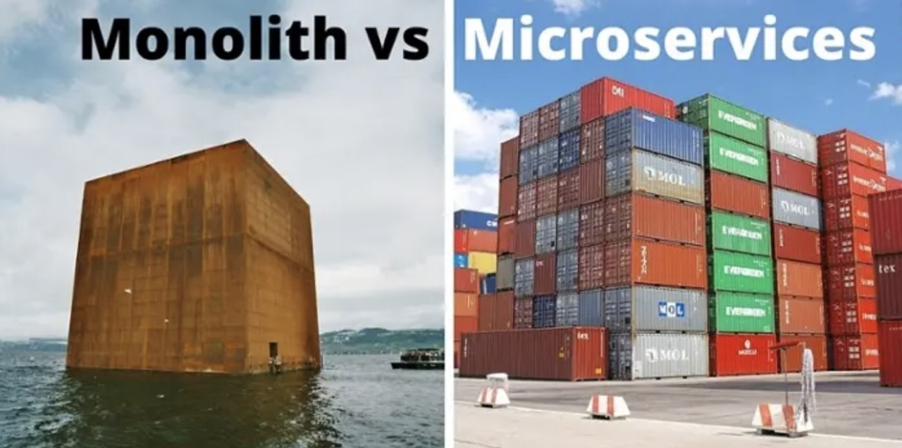
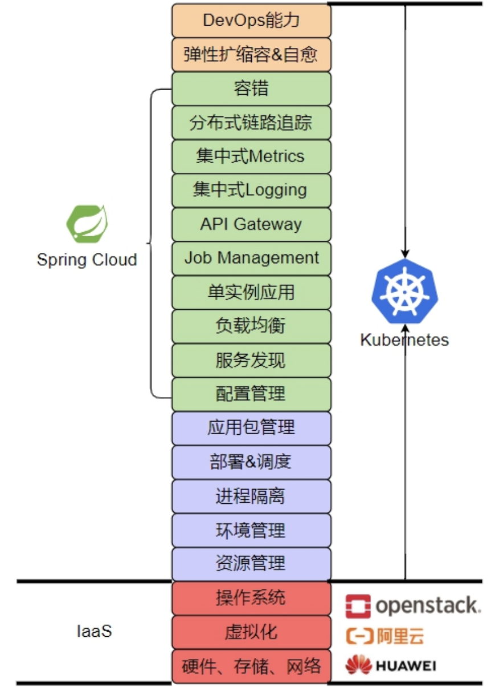

# 1.6.1 微服务

## 1.微服务出现的背景

在过去很长一段时间内，传统软件大部分是各种独立单体应用，单体应用的问题总结来说扩展性差、可靠性不高、维护成本高。随着软件开发技术的发展，以及面向服务体系架构（SOA）的引入，上述问题在一定程度上得到了缓解，但由于SOA早期使用的是总线模式，与技术栈有一定的强绑关系，导致很多企业遗留系统很难对接，且切换时间长、成本高，新系统稳定性的收敛也需要一定时间。

为了摆脱这一困境，微服务被提出。

## 2.微服务的定义

微服务的概念被提出之后，在很长的一段时间内并没有被普及，直到2014年，微服务架构由Martin Fowler（《MicroServices》作者）、Adrian Cockcroft（Netflix架构师）、Neal ford（《卓有成效的程序员》作者） 等人持续介绍、完善、演进、实践之后，微服务的概念才算是一种真正丰满、独立的架构风格。

对于微服务的定义，我们援引 Netflix 云架构师 Adrian Cockcroft 的观点。
:::tip <i></i>
A microservices architecture as a service‑oriented architecture composed of loosely coupled elements that have bounded contexts.

**作者注** Netflix 是业界微服务和DevOps组织的先驱，有大规模生产级微服务的成功实践，并为Spring Cloud Netflix 社区贡献了大量优秀的开源软件，例如Eureka（服务注册与发现）、Zuul（服务网关）、Ribbon（负载均衡）、Hystrix（熔断限流）等等。

:::

Adrian Cockcroft 的观点中有两个核心概念：Loosely Coupled（松耦合）和Bounded Context（限界上下文）。
1. Loosely Coupled 意味着每个服务可以独立的更新，更新一个服务无需要求改变其他服务。
2. Bounded Contexts 意味着每个服务要有明确的边界性，你可以只关注自身软件的发布，而无需考虑谁在依赖你的发布版本。微服务和它的消费者严格通过 API 进行交互，不共享数据结构、数据库、POJO 等等。

综合上述，也就说微服务要实现独立部署，拥有独立的技术栈、界定上下文，明确所有权等。

如下图，巨石应用（Monolith Application）与微服务（MicroServices）的形象对比。

	
	
图 1-6 巨石应用和微服务的对比

巨石应用就是把所有的东西放在一个大盒子里，这个大盒子里面什么都有。微服务更像是集装箱，每个箱子里面包含特定的功能模块，所有的东西可以很灵活的拆分和组装。

上图可以看出每个服务都可拆分，自有数据源。

## 3.微服务带来的技术挑战

分布式第一定律:尽量不要使用分布式。

分布式意味着复杂性的挑战，
软件架构从单体服务向微服务转型的过程中带来很大的技术挑战，下面选取比较关键的内容。

但是，微服务带来了一系列的非功能性需求，比如说:

1. 事务   幂等性+消息是很好的解决办法
2. 服务治理    注册，发现，负载，路由，认证授权，隔离
3. 监控    日志，性能监控，告警，调用链路
4. 部署，测试  划分得粒度太细，部署成本会上升。测试中的服务依赖会让测试体验非常痛苦

如果没有基础设施，实现微服务会很痛苦，应用越多越悲剧。别为了“微”而把应用做小，微服务里，更重要的是服务两个字。

## 4.后微服务时代

:::tip 后微服务时代（Cloud Native）
从软件层面独力应对微服务架构问题，发展到软、硬一体，合力应对架构问题的时代，此即为“后微服务时代”。
by 周志明
:::

在微服务架构中，有一些必须解决的问题，比如注册发现、跟踪治理、负载均衡、传输通讯等。这些问题可以说只要是分布式架构的系统，就无法完全避免。我们先不考虑 Apache Dubbo、SpringCloud 或者别的解决方案，换个思路来想一下：这些问题一定要由分布式系统自己来解决吗？

直接来看待这些问题与它们最常见的解决方法。

- 如果某个系统需要伸缩扩容，通常会购买新的服务器，多部署几套副本实例。
- 如果某个系统需要解决负载均衡问题，通常会布置负载均衡器，选择恰当的均衡算法来分流...。

计算机科学经过多年的发展，这些问题大多都有了专职化的基础设施去解决各类问题。而之所以微服务时代，在应用服务层面而不是基础设施层面去解决这些分布式问题，完全是因为由硬件构成的基础设施，跟不上由软件构成的应用服务的灵活性的无奈之举。

软件可以只使用键盘命令就能拆分出不同的服务，只通过拷贝、启动就能够伸缩扩容服务，硬件难道就不可以通过敲键盘就变出相应的应用服务器、负载均衡器、DNS 服务器、网络链路这些设施吗？

行文至此，估计大家已经听出下面要说的是虚拟化技术和容器化技术了。不过，早期的容器只被简单地视为一种可快速启动的服务运行环境，目的是方便程序的分发部署，这个阶段针对单个应用进行封装的容器并未真正参与到分布式问题的解决之中。尽管 2014 年微服务开始崛起的时候，Docker Swarm（2013 年）和 Apache Mesos（2012 年）就已经存在，但是，被业界广泛认可、普遍采用的通过虚拟化基础设施去解决分布式架构问题的开端，应该要从 2017 年 Kubernetes 赢得容器战争的胜利开始算起。

Kubernetes的崛起预示着软件架构进程中新的历史阶段的启幕。

。笔者在表 1-1 列出了在同一个分布式服务的问题在传统 Spring Cloud 中提供的应用层面的解决方案与在 Kubernetes 中提供的基础设施层面的解决方案，尽管因为各自出发点不同，解决问题的方法和效果都有所差异，但这无疑是提供了一条全新的、前途更加广阔的解题思路。

	
	
图 1-5 Kubernetes能力 

表1-1，列出了传统Spring Cloud应用层面对比Kubernetes基础设施层面在处理同一分布式服务问题上的不同解决方案。虽然由于出发点不同，他们解决问题的方式和效果存在差异，但无疑，这为我们提供了一种全新且更具前景的解决问题的思路。

|| Kubernetes | Spring Cloud |
|:--|:--|:--|
|弹性伸缩	| Autoscaling	| N/A|
|服务发现	|KubeDNS / CoreDNS |	Spring Cloud Eureka|
|配置中心	|ConfigMap / Secret |	Spring Cloud Config|
|服务网关|	Ingress Controller	| Spring Cloud Zuul|
|负载均衡|	Load Balancer	| Spring Cloud Ribbon|
|跟踪监控|	Metrics API / Dashboard | Spring Cloud Turbine|
|降级熔断 |	N/A |	Spring Cloud Hystrix|

当虚拟化的基础设施从单个服务的容器扩展至由多个容器构成的服务集群、通信网络和存储设施时，软件与硬件的界限便已经模糊。一旦虚拟化的硬件能够跟上软件的灵活性，那些与业务无关的技术性问题便有可能从软件层面剥离，悄无声息地解决于硬件基础设施之内。

此即为“后微服务时代“。

## 5.后微服务时代的二次进化

但Kubernetes并没有能够完美解决全部的分布式问题。“不完美”的意思是，仅从功能灵活强大这点而言，Kubernetes一般还不如之前的Spring Cloud方案。这是因为有一些问题处于应用系统与基础设施的边缘，使得完全在基础设施层面中确实很难精细化地解决。

为了解决这一类问题，微服务基础设施很快进行了第二次进化，引入了今天被称为“服务网格“（Service Mesh）的模式。

