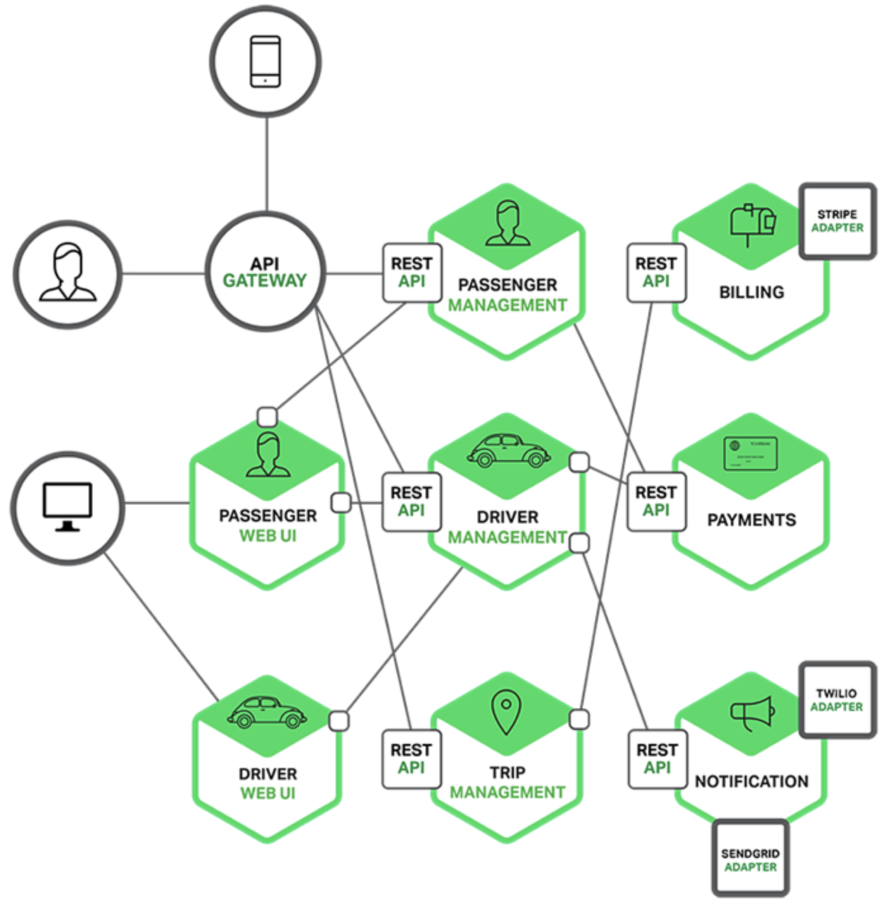
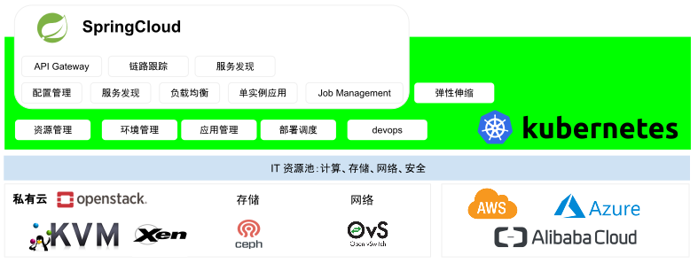
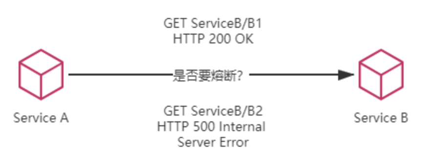

# 1.5.2 微服务

微服务概念被提出之后，由于技术不成熟，所以在很长的一段时间内并没有被普及。

直到 2014 年，由 Martin Fowler（《MicroServices》作者）、Adrian Cockcroft（Netflix 架构师）、Neal ford（《卓有成效的程序员》作者）等人持续介绍、完善、演进、实践之后，微服务才算是一种真正丰满、独立的架构风格。

对于微服务的定义，援引 Netflix[^1] 云架构师 Adrian Cockcroft 的观点。
:::tip <i></i>
A microservices architecture as a service‑oriented architecture composed of loosely coupled elements that have bounded contexts.

微服务架构是一种面向服务的架构，由松耦合的具有有限上下文的元素组成。

:::

Adrian Cockcroft 的观点中有两个核心概念：
1. Loosely Coupled（松耦合）：意味着每个服务可以独立的更新，更新一个服务无需要求改变其他服务。
2. Bounded Contexts（限界上下文）：意味着每个服务要有明确的边界性，你可以只关注自身软件的发布，而无需考虑谁在依赖你的发布版本。微服务和它的消费者严格通过 API 进行交互，不共享数据结构、数据库等。基于契约的微服务规范要求服务接口是稳定的，而且向下兼容。

综合上述，也就说微服务架构要实现独立部署，拥有独立的技术栈、界定上下文，明确所有权等。如图 1-18 所示，巨石应用（Monolith Application）与微服务（Microservices）的形象对比：
- 巨石应用就是把所有的东西放在一个大盒子里，这个大盒子里面什么都有。
- 而微服务更像是集装箱，每个箱子里面包含特定的功能模块，所有的东西可以很灵活的拆分和组装。

	
	
图 1-18 巨石应用和微服务的对比

或许你看过这张在互联网流传颇广微服务架构图（图 1-19）。在 Uber 的微服务架构中，打车软件系统被分解多个子服务（图中的六边形），并每个子服务都围绕整体系统的某个局部功能进行构建，例如 PASSENGER 子服务只处理乘客相关的功能，PAYMENTS 子服务只处理订单的功能。子服务具有松耦合以及明确的功能边界特性，因此可以独立的进行部署和扩展。它们之间协作的话通过一些轻量级的机制（例如 REST API）进行通信，

:::center
   
  图 1-19 来自 Uber 打车软件的微服务架构示例
:::

## 1.微服务带来的技术挑战

微服务架构首先是一个分布式的架构，分布式意味着复杂性的挑战。

软件架构从巨石应用向微服务架构转型的过程中带来了一系列的非功能性需求，例如：

- 服务发现（Service Discovery）问题：解决“我想调用你，如何找到你”的问题。
- 服务熔断（Circuit Breaker）问题：缓解服务之间依赖的不可靠问题。
- 负载均衡（Load Balancing）问题：通过均匀分配流量，让请求处理更加及时。
- 安全通讯问题：包括协议加密（TLS）、身份认证（证书/签名）、访问鉴权（RBAC）等。

解决这些问题需要编写和维护⼤量非功能性代码，这些代码与业务代码逻辑混在一起，动不动还会遇到点匪夷所思的分布式 bug。

如果没有做好基础设施，实现微服务会很痛苦，服务越多越悲剧。

## 2.后微服务时代

:::tip 后微服务时代
从软件层面独力应对微服务架构问题，发展到软、硬一体，合力应对架构问题的时代，此即为“后微服务时代”。

:::right
——  by《凤凰架构》作者 周志明
:::

微服务架构中，有一些必须解决的问题，例如负载均衡、伸缩扩容、传输通讯等，这些问题可以说只要是分布式架构的系统就无法完全避免。

先不考虑 Apache Dubbo、SpringCloud 或者别的解决方案，换个思路想一下“这些问题一定要由分布式系统自己来解决吗？”。

直接来看待这些问题与它们最常见的解决方法：

- 如果某个系统需要解决负载均衡问题，通常会布置负载均衡器，选择恰当的均衡算法来分流；
- 如果某个系统需要伸缩扩容，通常会购买新的服务器，多部署几套副本实例；
- 如果要解决安全的传输通讯，通常要布置 TLS 链路，设置 CA 证书，保证中间不被窃听，等等。

计算机科学的多年发展已经产生了专业化的基础设施去解决各种问题。微服务时代，之所以选择在应用服务层面，而非基础设施层面去解决这些分布式问题，主要是**因为硬件构建的基础设施无法追赶上软件构成的应用服务的灵活性**。

我们在 1.1 节讨论的云计算的演化中，看到应用的工作负载最终从物理机进化到容器，部署方式越来越灵活。不过，早期的容器技术主要被视为一种能够快速启动服务的环境，主要用于简化程序的分发和部署。在这一阶段，容器主要作为单个应用的封装工具，并未深入参与解决分布式架构的问题。

被业界广泛认可、普遍采用的通过虚拟化基础设施去解决分布式架构问题的开端，应该要从 2017 年 Kubernetes 赢得容器战争的胜利开始算起。直接来看 Kubernetes 在基础设施层面，解决分布式系统问题的方案：
- Kubernetes 用 CoreDNS 替代 Spring Cloud 服务发现组件 Eureka。
- Kubernetes 用 Service/Load Balancer 替代 Spring Cloud 中的负载均衡组件 Ribbon。
- Kubernetes 用 ConfigMap 替代 Spring Cloud 的配置中心 Config。
- Kubernetes 用 Ingress 代替 Spring Cloud 的网关组件 Zuul。
- ...

如图 1-20 所示，传统微服务框架解决的问题，已完全可以用基础设施 Kubernetes 的方案替代。虽然由于出发点不同，导致它们解决问题的方式和效果存在差异，但无疑为我们提供了一种全新且更具前景的解决问题的思路。

:::center
   
  图 1-20 传统 Springboot 解决的问题，逐渐下沉到基础设施 Kubernetes 中解决
:::

当虚拟化的基础设施从单个服务的容器扩展至由多个容器构成的服务集群，并开始解决分布式的问题。那么，软件与硬件的界限便开始模糊。一旦虚拟化的硬件能够跟上软件的灵活性，那些与业务无关的技术性问题便有可能从软件层面剥离，并悄无声息地解决于硬件基础设施之内。

此即为“后微服务时代”。

## 3.后微服务时代的二次进化

Kubernetes 的崛起标志着微服务时代的新篇章，但它并未能完全解决所有的分布式问题。就功能的灵活性和强大性而言，Kubernetes 还比不上之前的 Spring Cloud 方案，原因在于某些问题位于应用系统与基础设施的交界处，而微观的服务管理（例如单个请求的治理）并不能完全在基础设施层面得到解决。

举个例子，如图 1-21 所示，假设微服务 A 调用了微服务 B 的两个服务，即 B1 和 B2。若 B1 正常运行，而 B2 持续出现 500 错误，那么在达到一定阈值后，就应对 B2 进行熔断，以避免引发雪崩效应。如果仅在基础设施层面处理这个问题，那就会陷入两难境地“切断 A 到 B 的网络通路会影响到 B1 的正常运作，不切断则会持续受到 B2 错误的影响”。

	
	
图 1-21 是否要进行熔断？

上述问题在使用 Spring Cloud 等方案中比较容易处理，既然是使用程序代码来解决问题，只要合乎逻辑，想要实现什么功能就实现什么功能。但对于 Kubernetes，由于基础设施粒度更粗糙，通常只能管理到容器层面，对单个远程服务的有效管理就相对困难。类似的情况不仅仅在断路器上出现，服务的监控、认证、授权、安全、负载均衡等都有可能面临细化管理的需求。

为了解决这一类问题，微服务基础设施很快进行了第二次进化，引入了今天被称为“服务网格”（Service Mesh）的模式。

[^1]: Netflix 是业界微服务和 DevOps 组织的先驱，有大规模生产级微服务的成功实践，并为 Spring Cloud Netflix 社区贡献了大量优秀的开源软件，例如 Eureka（服务注册与发现）、Zuul（服务网关）、Ribbon（负载均衡）、Hystrix（熔断限流）等等。
[^2]: 参见 https://icyfenix.cn/architecture/architect-history/post-microservices.html

