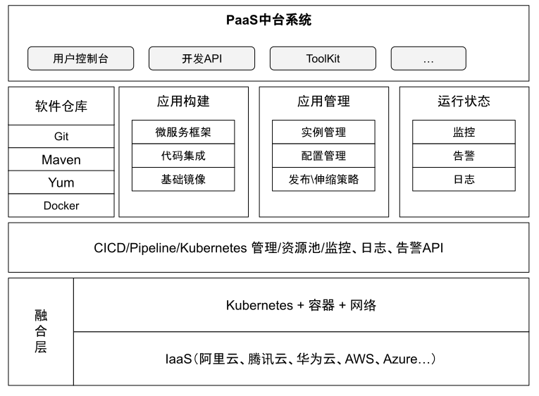
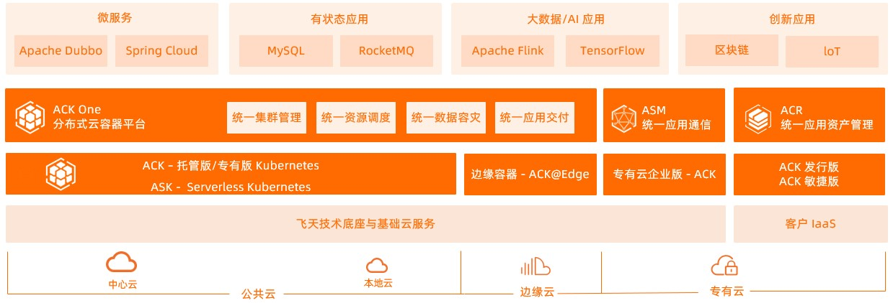
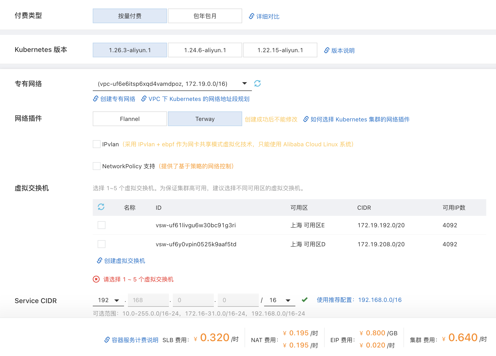
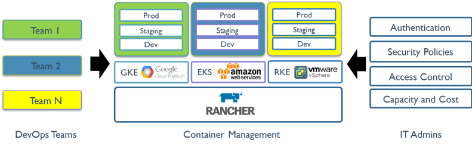

# 1.5 企业 PaaS 平台建设方案

伴随着容器技术和 Kubernetes 技术的兴起，云原生技术体系为 PaaS（Platform as a Service，平台即服务）的实现提供了一种新的方式，通过 Kubernetes 底层能力屏蔽了各 IaaS 差异，提供了混合云之上的 PaaS 层服务。新的 PaaS 层架构将对管理对象从资源升级到服务，结合自动化编译构建以及自动化运维等操作，继而构建出新型的直接面向服务、运维和管理的标准化系统平台。

	
	
图 1-9 PaaS 技术架构

企业组织内部建设 PaaS 平台明确的目标：

- 使得大规模系统（涉及大量开发人员，大量基础设施）可以持续快速发布。
- 有效利用云计算基础设施的特点，让服务可以按需快速伸缩。
- 提高系统的弹性，从而获得高的可用性。

## 1.5.1 使用公有云服务

目前，各大云厂商也都推出了自己的商业化容器编排托管服务。例如 Amazon 的 ECS（Amazon Elastic Container Service）、Azure 的 AKS（Azure Kubernetes Service）、阿里云的 ACK（Alibaba Cloud Container Service for Kubernetes)。

此类的容器平台基本都整合了各自云虚拟化、存储、网络和安全能力，与自建 Kubernetes 相比，有较强的弹性的资源扩缩、可靠的集群管理等明显优势，另外商业化服务也能提供 SLA 保证。

云商托管容器服务基础功能包括集群管理、应用管理、存储、网络、运维安全等整个服务生命周期的支持，可以帮助企业实现从代码提交到应用部署的 DevOps 完整流程。

	
	
图 1-10 阿里云容器服务 ACK 产品线整体架构

对于中小型规模（300 节点以下）的集群建议优先使用云商托管的服务。使用完全托管的服务会有例如 NAT 转发、SLB 等额外费用，对于大型规模的集群（1000 节点以上）需要注意这部分费用。另外大规模的应用一旦与云商绑定，再进行迁移会耗费很大的成本。

	
	
图 1-11 ACK 按量计费示例

## 1.5.2 使用 Rancher 等开源方案

如果集群规模较大的情况，企业也可以选择使用一些开源方案进行自建集群。开源的方案包括但不限于 Kubeshpere、Rancher 等，我们这里以 Rancher 为例进行讲解。

Rancher 是一家容器产品及解决方案服务商，Rancher 最初目标就是为了支持多种容器编排引擎而构建。随着 Kubernetes 的兴起， Rancher 2.x 也开始彻底转向了 Kubernetes。使用 Rancher 可以选择使用 RKE（Rancher Kubernetes Engine）创建 Kubernetes 集群，也可以使用 TKE、ACK、AKS 等云厂商的 Kubernetes 服务。由于 Rancher 仅需要主机有 CPU、内存、本地磁盘和网络资源，因此可以使用任何公有云或者本地主机资源。

Rancher 提供了一个简单直接的用户界面给 DevOps 工程师管理他们的应用程序，用户不需要对 Kubernetes 有深入的了解，即可使用 Rancher。如图 Rancher 在 IT 管理团队和 DevOps 开发团队示意图。

	
	
图 1-12 rancher

总结 Rancher 方案的特点：

- 基础设施编排：Rancher 为容器化的应用提供了灵活的基础设施服务，包括网络、存储、负载均衡、DNS 模块。
- 容器编排和调度：Rancher 包含 Docker Swarm、Kubernetes、Mesos 等主要的编排调度引擎，用户可以基于需要创建多种集群。
- 企业级权限管理：支持 Active Directory、LDAP、RBAC 的权限管理。
- CI/CD：提供简易的 CD/CD 流水线，同时支持与企业已有的流线线对接。

## 1.5.3 方案对比

了解完 Rancher 等开源方案及公有云托管方案后，可能有些读者感觉并没有一个方案可以完全满足自己的业务场景，这时候也可以选择自研 Kubernetes 集群。自研方案可以完全从业务需求场景作为出发点，同时选择容器方案大都涉及从传统虚拟机向容器化转型，因为自研方案可以更好地兼容现在系统，实现平滑过渡。

选择何种方案，更多取决于当前团队所处的环境，包括是否有影响的资源投入（人力、时间），是否能忍受自研方案初期的可靠性阵痛问题等。表 1-2 整理了各个方案的对比，供读者参考。

表 1-2 PaaS 平台建设方案对比

|对比项| 开源方案| 公有云服务|自研方案|
|:--|:--|:--|:--|
| 接入适配度| 中| 低| 高：根据自身需求定制开发|
|运行成本| 低| 高，如和已有数据中心打通，则成本相对较高 | 低 |
|可运维性| 中| 高|高：可完全融入自有运维体系|
|可靠性| 中：开源方案质量参差不齐| 高：方案成熟|低：自研系统早期必经历阵痛期|
|人力成本| 低：开箱即用| 低：开通即用| 高|

