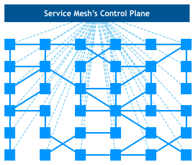

# 1.6.3 服务网格

服务网格（Service Mesh）的概念最早由 Buoyant CEO William Morgan 在2016年首次提出，2017年4月该公司发布了第一个 Service Mesh 产品 Linkerd。 同年发表了文章《What’s a service mesh？And why do I need one?》，被公认是 Service Mesh 的权威定义。

:::tip  文章内 William Morgan 对 ServiceMesh 的定义

“A service mesh is a dedicated infrastructure layer for handling service-to-service communication. It’s responsible for the reliable delivery of requests through the complex topology of services that comprise a modern, cloud native application. In practice, the service mesh is typically implemented as an array of lightweight network proxies that are deployed alongside application code, without the application needing to be aware.”

翻译：Service Mesh 是一个处理服务通讯的专门的基础设施层。它的职责是在由云原生应用组成服务的复杂拓扑结构下进行可靠的请求传送。在实践中，它是一组和应用服务部署在一起的轻量级的网络代理，对应用服务透明。

:::

## 1. 服务网格出现的背景

Service Mesh 诞生的背景主要有两点：

- 微服务架构模式逐渐流行，开发者将多个服务组合在一起来构建应用程序
- 企业已经使用了云原生平台技术，例如容器（Docker）、编排器（Kubernetes）和网关等

当微服务数量越来越多时，开始逐渐暴露一些问题。

- 下游服务不可用时，如何快速熔断避免形成雪崩故障？
- 如何调整权重和路由上下线微服务？
- 微服务的负载均衡如何治理？
- 如何管理复杂的上下游微服务依赖，当出现问题时，能快速定位问题。

工程师除了关注业务功能外，还有聚焦以上服务治理问题，这类问题的解决方案通常的做法是把共有的能力抽象出通用的 SDK，通过 SDK 通用能力的抽象，实现服务治理功能的复用。但这种方式缺点也很明显，SDK 和业务功能耦合在一起，业务人员需要关注各类 common 包的更新、维护，还要关心各个服务治理调用逻辑等。

Service Mesh 模式试图解决的问题包括：

- 无需将特定语言的通信库编译到单个服务中来处理服务发现、路由和 application-level (Layer 7) 非功能性通信需求。
- 外部化服务通信配置，包括外部服务的网络位置、安全凭证和服务质量目标。
- 为其他服务提供被动和主动监控。
- 在整个分布式系统中，执行分散策略。
- 提供可观察性默认值并标准化相关数据的收集，如启用请求日志记录、配置分布式跟踪、收集指标等。

## 2. 什么是服务网格

ServiceMesh 又称服务网格。之所以称为服务网格，是因为每台节点同时运行着业务逻辑和代理。这个代理被形象地称为 Sidecar （业务逻辑相当于主驾驶，共享一个代理相当于边车），服务之间通过 Sidecar 发现和调用目标服务，从而在服务之间形成一种网络状依赖关系。然后通过一种独立部署称为 “控制平面”（Control Plane）的组件来集中管理这种依赖关系，以进行路由、流量调拨等操作。

如果我们把节点和业务逻辑从视图剥离，就会出现一种网络状的架构。服务网络由此得名。

	

服务网格本质是一种代理，请求在微服务之间调用的过程中增加了一层代理来进行路由，为了降低对微服务的侵入性，代理通过 Sidecar 形式运行，类似 Spring 的 AOP 概念，只不过切面增强不是在某段代码里，而是在统一的服务外。

## 3. 为什么要使用服务网格

服务网格并没有给我们带来新功能，它是用于解决其他工具已经解决过的问题，只不过这次是在云原生环境下的实现。

在 Service Mesh 之前，微服务架构所带来的问题都采用框架思维解决，将服务发现、熔断、限流、可观测性等能力以SDK的形式提供给开发人员。

随着业务发展和微服务规模不断增大，框架思维的架构瓶颈逐渐凸显。

- 单一的编程语言无法实现所有的业务需求，针对异构环境的服务治理框架实现往往存在差异，缺少共性问题的统一解决方案，各个编程语言的SDK维护和迭代困难。
- SDK 和 应用在同一个进程内紧密耦合，这种强绑定关系使他们无法独立快速演进，从而陷入基础支撑技术和业务演进发展相互制约的困境。

Service Mesh 的出现使解决问题的思路从框架思维变成了平台思维，将之前SDK中非常固定的内容仍保留在SDK中，其他内容则剥离至完全独立的 Proxy（Sidecar）中。 Proxy 的热升级技术将平台功能变更对应用完全无感，实现了应用逻辑和服务治理能力解耦，从而最大程度解决了框架SDK和业务耦合无法独立演进的问题。
