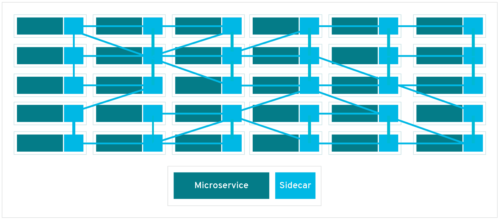
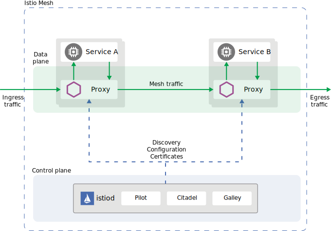
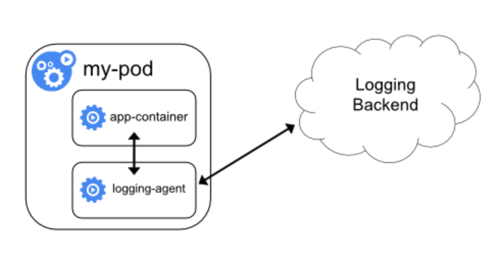
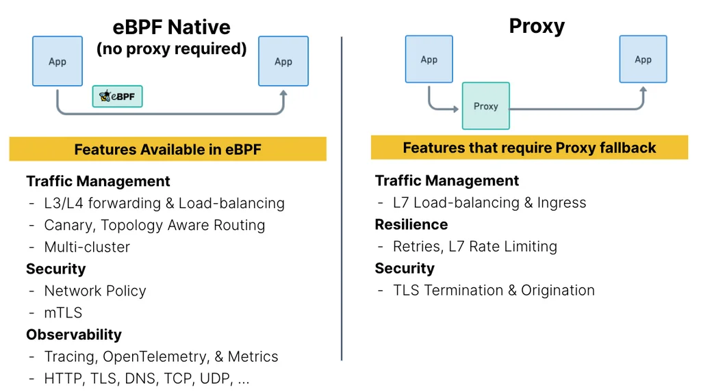
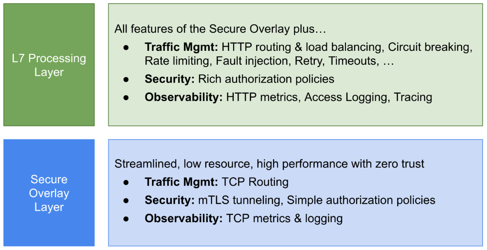
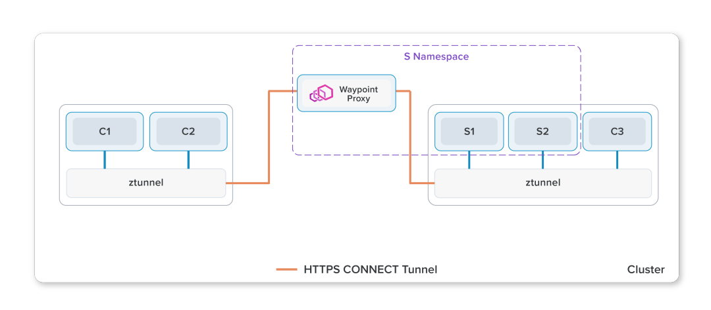

# 1.5.3 服务网格

CNCF 最新云原生定义中，服务网格的概念和微服务并列，这表明服务网格已经超越了其原初的角色 —— 仅作为一种实现微服务的新方法，现在已经发展为云原生的又一个关键领域。

## 1.服务网格的定义

服务网格（Service Mesh）的概念最早由 Buoyant CEO William Morgan 在 2016 年首次提出，2017 年 4 月该公司发布了第一个 Service Mesh 产品 Linkerd。 同年发表了文章《What’s a service mesh？And why do I need one?》，被公认是 Service Mesh 的权威定义。

:::tip  文章内 William Morgan 对 ServiceMesh 的定义

“A service mesh is a dedicated infrastructure layer for handling service-to-service communication. It’s responsible for the reliable delivery of requests through the complex topology of services that comprise a modern, cloud native application. In practice, the service mesh is typically implemented as an array of lightweight network proxies that are deployed alongside application code, without the application needing to be aware.”

Service Mesh 是一个处理服务通讯的专门的基础设施层。它的职责是在由云原生应用组成服务的复杂拓扑结构下进行可靠的请求传送。在实践中，它是一组和应用服务部署在一起的轻量级的网络代理，对应用服务透明。
:::

ServiceMesh 之所以称为服务网格，是因为每台节点同时运行着业务逻辑和代理。这个代理被形象地称为 Sidecar （业务逻辑相当于主驾驶，共享一个代理相当于边车），服务之间通过 Sidecar 发现和调用目标服务，从而在服务之间形成一种网络状依赖关系。如果我们把节点和业务逻辑从视图剥离，就会出现一种网络状的架构，如图 1-12 所示，服务网络由此得名。

	
	
图1-23 服务网格形象示例

服务网格的实现通常由两部分组成，数据平面和控制平面，以服务网格的代表实现 Istio 架构为例，如图 1-24 所示：

	
	
图1-24 Istio 架构

- 数据平面（Data plane）通常采用轻量级的代理（例如 Envoy）作为 Sidecar，这些代理负责协调和控制服务之间的通信和流量处理。
- 控制平面（Control plane）负责配置和管理数据平面，并提供服务发现、智能路由、流量控制、安全控制等功能。

## 1.Sidecar

服务网格的关键在于 Sidecar 模式，服务网格将具有流控能力的代理以 Sidecar 部署，从而组成了网格数据平面的基本形态。

一般来说，典型的服务网格都在使用 Sidecar 作为数据平面，但 Sidecar 模式并不是服务网格所特有的，Sidecar 本来就是一种常见的容器设计模式，Kubernetes 的 Pod 提供的多容器支持，所有伴随应用容器部署的其他容器都可以被称为 Sidecar，如日志收集、追踪代理等，如图 1-24 所示。

	
	
图1-24 Kubernetes Pod中Sidecar容器运行一个日志收集客户端，主动去收集应用日志

Sidecar 本质上是一个服务代理，通过劫持发送到应用容器的流量从而实现对流量的控制，随着服务网格落地实践，Sidecar 的缺点也逐渐被暴露：

- 延迟问题：尽管从一些产品的 benchmark 结果来看，Sidecar 的引入只会增加毫秒级（个位数）延迟，但对性能有极高要求的业务场景，来说，延迟损耗成为了放弃服务网格的最主要原因。
- 资源占用问题：Sidecar 作为一个独立的容器必然会占用一定的系统资源，对于超大规模集群（如数万个 Pod）来说，巨大的基数也使得资源总量变成了不小的数目，同时，这类集群的网络通信拓扑也更加复杂，配置下发的规模也会让 Sidecar 的内存出现剧烈的增长。

考虑解决以上的问题，社区的开发者开始重新思考是否应该将服务网格和 Sidecar 划上等号，同时继续探索产品形态其他的可能性。

## 2.Proxyless 模式

既然问题是代理，那就把代理去掉，这就是 Proxyless（无代理）模式。

Proxyless 理念是服务间总是要选择一种协议进行通信，就必然要依赖于该协议的类库（SDK）进行编解码工作。既然如此，那么将协议的类库扩展，使其具有流量控制的能力，不就能代替 Sidecar 代理了吗？且 SDK 和应用同属于同一进程，必然有更优秀的性能表现，Sidecar 最为诟病的延迟问题也会迎刃而解。

2021 年 Istio 官方博客发表了一篇基于 gRPC 实现 Proxyless 的文章[^1]，详细阐述了其工作原理以及如何在 Istio 中使用它。在这种模式中，核心的流控能力被集成在 gRPC 库中，不再使用代理进行数据面通信。但它仍然需要一个 Agent 进行初始化并与控制平面交互，负责告知 gRPC 库如何连接到 istiod，如何获取证书，并作为 xDS 代理，代表应用与 istiod 进行连接和认证。

	
	
图1-25 Proxyless 模式

相比通过进程外通信的 Sidecar 代理来说，Proxyless 模式具有性能、稳定性、资源消耗低等明显的优势：

- 性能：Proxyless 模式是进程内、点对点的直接通信，网络延迟比代理要小得多。
- 稳定性：SDK 类库与应用共享单一进程，拓扑结构简单，调试方便，消除了跨进程的调用，稳定性更高。
- 框架集成：对于传统的基于 SDK 实现的服务治理框架，如果集成了 Proxyless 模式，即能够复用框架现有的能力。
- 资源消耗低：无独立的 Sidecar 容器，内置类库资源消耗低。

从官方博客给出的数据来看，gRPC Proxyless 模式下的延迟情况接近基准测试，资源消耗也相对较低。

读者可能已经发现，所谓 Proxyless 其实和传统的 SDK 并无二致，只是将流控能力内嵌到负责通信协议的类库中，因此它具有和传统 SDK 服务框架相同的缺点，也正因为如此，业内很多人认为 Proxyless 本质上是一种倒退，是回归到传统的方式去解决服务通信的问题。

## 3.Sidecarless 模式

既然有了去代理模式，那又何妨多个去边车模式，这就是所谓的 Sidecarless 模式。

2022 年 Cilium 基于 eBPF 技术发布了具有服务网格能力的产品。Cilium 的服务网格产品提供了两种模式，对于 L3/L4 层的能力直接由 eBPF 支持，L7 层能力由一个公共的代理负责，以 DaemonSet 方式部署，如图 1-26 所示。

	
	
图1-26 Sidecarless 模式

Cilium 认为，内核加上共享型代理的引入可以极大的减少代理的数量，从而降低资源消耗和维护成本，而在内核层面进行通信管理也提高了性能。

基于 eBPF 的服务网格在设计思路上其实和 Proxyless 如出一辙，即找到一个非 Sidecar 的地方去实现流量控制能力，它们一个是基于通信协议类库，一个是基于内核的扩展性。eBPF 通过内核层面提供的可扩展能力，在流量经过内核时实现了控制、安全和观察的能力，从而构建出一种新形态的服务网格。

	
	
图1-27 Sidecarless 在内核实现流量观察、控制能力

但同样，软件领域没有银弹，Sidecarless 也是取舍后的结果。eBPF 并不是万能钥匙，也存在内核版本要求、编写难度大、安全等方面的问题。

## 4.Ambient Mesh 模式

2022 年 9 月 Istio 发布了一个名为 “Ambient Mesh” 的无边车数据平面模型，宣称用户可以弃用 Sidecar，以 Ambient Mesh 模式使用 Istio 的特性[^2]。

相比 Sidecar，Ambient Mesh 提供一种侵入性更低，升级管理更简单的选择，Ambient 将 Istio 的功能分成两个不同的层次，安全覆盖层（四层治理）和七层处理层（七层治理），如图 1-28 所示。

	
	
图1-28 Ambient Mesh 模式

- 安全覆盖层：处理 TCP 路由、监控指标、访问日志，mTLS 隧道，简单的授权
- 七层处理层：除安全覆盖层的功能外，提供 HTTP 协议的路由、监控、访问日志、调用链、负载均衡、熔断、限流、重试等流量管理功能以及丰富的七层授权策略

如图 1-29 所示，ztunnel 即为安全覆盖层，以 DaemonSet 部署，本质上是一个处理 L4 层场景的共享代理。如图 1-29 中的 Waypoint 代理以 Pod 形态部署于集群中，可使用 Istio 处理 L7 网络的完整能力。

	
	
图1-29 Ambient Mesh 安全覆盖层

Ambient Mesh 可以被理解为一种无 Sidecar 模式，但笔者认为将其描述为“中心化代理模式”更为准确，这是因为这种模式侧重于通过共享和中心化的代理进行流量管理，以替代位于应用容器旁边的 Sidecar 代理。

从官方的博客来看，Istio 在过去的半年中一直在推进 Ambient Mesh 的开发，并于 2023 年 2 月将其合并到了 Istio 的主代码分支。这也从一定程度上说明 Istio 未来的发展方向之一就是持续的对 Ambient Mesh 改进并探索多种数据平面的可能性。

## 5.未来

随着新技术和创新观念的推动，服务网关的架构逐渐从最初的 Sidecar 模式发展至多元化。现阶段，谁将最终胜出仍难以预测，因为每种模式都具备其独特的优势和劣势，以及适用于不同的应用场景。正如编程语言一样，服务网格在未来可能不会走向标准化，而是各具特色，并在不断的自我完善过程中为用户提供更多的选择。

[^1]: 参见 https://istio.io/v1.15/blog/2021/proxyless-grpc/
[^2]: 参见 https://istio.io/latest/zh/blog/2023/ambient-merged-istio-main/
 
