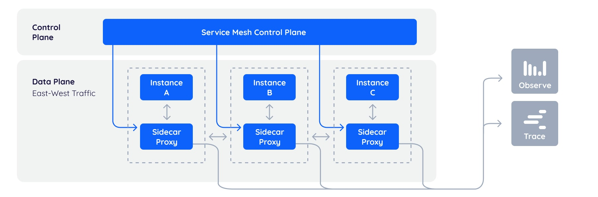

# 1.3.4 服务治理网格化

当微服务数量越来越多时，开始逐渐暴露一些问题。

- 下游服务不可用时，如何快速熔断避免形成雪崩故障？
- 如何调整权重和路由上下线微服务？
- 微服务的负载均衡如何治理？
- 如何管理复杂的上下游微服务依赖，当出现问题时，能快速定位问题。

工程师除了关注业务功能外，还有聚焦以上服务治理问题，这类问题的解决方案通常的做法是把共有的能力抽象出通用的 SDK，通过 SDK 通用能力的抽象，实现服务治理功能的复用。但这种方式缺点也很明显，SDK 和业务功能耦合在一起，业务人员需要关注各类 common 包的更新、维护，还要关心各个服务治理调用逻辑等。

## 1. 什么是服务网格？

服务网格本质是一种代理，请求在微服务之间调用的过程中增加了一层代理来进行路由，为了降低对微服务的侵入性，代理通过 Sidecar 形式运行，类似 Spring 的 AOP 概念，只不过切面增强不是在某段代码里，而是在统一的服务外。

这样众多的 Sidecar 之间形式一个庞大的切面网络，被形象地称之为服务网格。服务网格涉及两个概念：数据平面和控制面。数据平面接收控制面发送的路由与控制信息来定向转发或处理处理。如 下图所示。

	
	
图 1-6 服务网格示意图

## 2. 服务网格的优点

服务网格最大的优势就是实现了微服务业务架构和服务控制的解耦，业务不需要再为了接入各类微服务框架而在代码里配置繁琐的依赖、配置项，可以专注于价值更高的业务逻辑。

另外每个微服务的开发者能力参差不齐，从而业务的稳定、性能也受影响，而服务网格把这些共性能力抽象出来，作为统一的实现层由统一的基础架构团队实现，对全局的流量进行控制、统计、trace埋点等，从而实现组织效率的大幅提升。