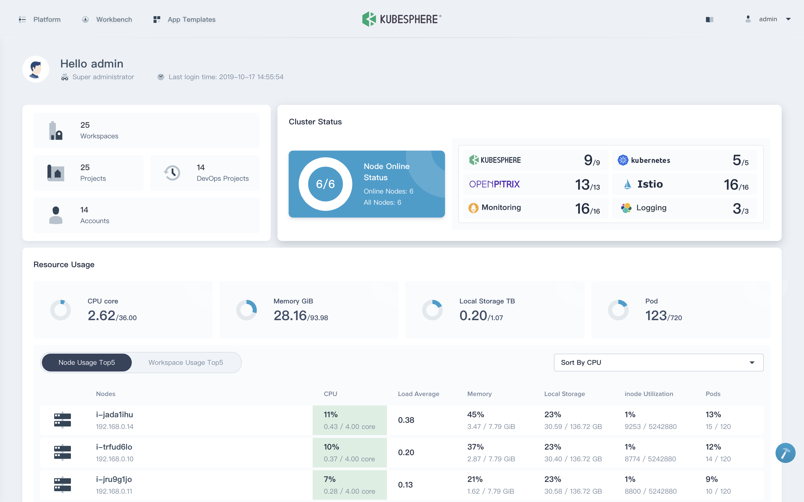

# 1.4 云原生架构落地指南

云原生化是对历史应用架构和组织架构重塑的过程，在实施中必然会对固有的开发观念等存在强烈的冲击性，如果仅凭一腔热血去落地新技术，极有可能无法顺利推进导致半途而废。

## 1.4.1 自定向下的推进

实施前提的第一点是获取企业组织内部技术一号位 CTO 的信任和支持，自上向下的推进会无形消除很多阻力。例如推进 ServiceMesh，业务线的工程师就会疑问： 这些 Sentinel 都能做到，为什么要用 Istio？技术栈为什么换来换去？这些反对的声音都会阻碍云原生化的落地。切换到 Istio，并不是因为它技术多么新颖，而是以提升组织内部效率、降低人力资源成本为目的。对于这些执行上的阻碍，而自上向下的推进则简单很多。

如果没有类似 CTO 有强力决策的领导支持，直白说，云原生架构的推进可以先缓一缓。

## 1.4.2 技术中台产品化

落地的第二点是技术中台产品化理念，用开发 toC 类型产品的理念打磨技术平台。

容器技术、Kubernetes、Mesh 有一定的技术壁垒，对业务研发人员而言也存在一定的技术门槛。虽然都说云原生好、CI/CD 好，但如果突破开发人员固有的习惯，内部的云原生技术中台让开发人员写 yaml、dockerfile，这就使提升效率这件事本末倒置，研发人员也会因为成本过高而拒绝使用。

	
	
图 kubesphere dashboard 示例

## 1.4.3 架构师要有`货`

面对这庞杂的技术领域和技术工具，即便掌握了云原生核心技术 Docker 和 Kubernetes，在工程实践中还远远不够，总结来说，如果要推进云原生架构落地，需要聚焦在下面几个领域：

- 容器和镜像：Docker、containerd、CRI-O、Nydus
- 持续集成：Gitlab、Tekton
- 镜像仓库：Harbor
- 应用定义：Kustomize、Helm
- 持续部署：FluxCD、argoCD
- 容器编排：Kubernetes
- 网关：Ingress-Nginx、APISIX、Kong
- 监控：Grafana
- 告警：Prometheus
- 日志：Fluentd
- 应用开发：Nocalhost

	
	
图：云原生代表技术栈

