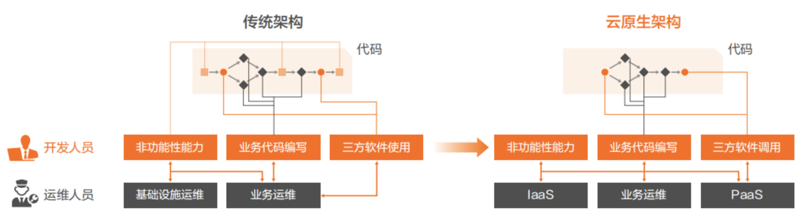

# 1.3 云原生架构的定义和技术特点

引用 Mark Andreessen 在《Software is Eating The World》中的观点，软件正在改变世界，无论是行业巨头还是中小微企业都面临着数字化转型带来的未知机遇和挑战。机遇是商业模式的创新，挑战来自对整体技术架构的变革。新一代的技术架构是什么？如何变革？是很多互联网企业面临的问题。而云原生架构则是这个问题最好的答案。

从技术的角度来讲，云原生架构是基于云原生技术的一组架构原则和设计模式的集合，旨在将云应用中的非业务代码部分进行最大化的剥离，从而让云设施接管应用中原有的大量非功能特性（如弹性、韧性、安全、 可观测性、灰度等），使业务不再受非功能性业务中断困扰的同时，具备轻量、敏捷、高度自动化的特点。简单的说，就是帮助企业的业务功能迭代更快、系统能承受住各种量级的流量冲击的同时，构建系统的成本更低。

	
	
图 1-4 传统架构与云原生架构对比

如图 1-4 展示了在代码中通常包括的三部分内容，即业务代码、第三方软件、处理非功能特性的代码。其中“业务代码”指实现业务逻辑的代码。“三方软件”是业务代码中依赖的所有三方库，包括业务库和基础库。“处理非功能性的代码”指实现高可用、安全、可观测性等非功能性能力的代码。

这三部分中只有业务代码是对业务真正带来价值的，另外两个部分都只算附属物，但随着软件规模的增大、业务模块规模变大、部署环境增多、分布式复杂性增强，使得今天的软件构建变得越来越复杂，对开发人员的技能要求也越来越高。

云原生架构相比较传统架构前进了一大步，即从业务代码中剥离了大量非功能性特性到 IaaS 和 PaaS 中，从而减少业务代码开发人员的技术关注范围，通过云服务的专业性提升应用的非功能性能力。

这便是云原生架构的核心思路。

表 1-2 现代化应用特点
|特点|描述|
|:--|:--|
|弹性| 应用可以随着业务峰值自动扩展，具备应对弹性流量的水平扩缩容能力|
|可观测和度量|应用具备很强的可观测性，具备服务调用、服务提供的细颗粒度 SL 度量|
|高可用和容灾|任何主机的故障（包括数据中心在内），都不会对业务的可用心带来影响|
|灰度发布|应用可以根据机器、分组、用户、地理位置等多个属性进行灰度升级|
|可管理|具备版本机制，通过标准API集成，符合配置管理的最佳实践|
|API优先|所有的应用都基于API生态，任何组件都提供了API和SLA|
|基于容器技术|容器是现代化应用的优等生，生产线流水和应用本身都应基于容器构建|

综合来讲，云原生架构有以下技术特点：

- 微服务化。
- 容器化。
- 服务治理网格化。
- 基础设施不可变化。
- 系统采用声明式描述。
- CI/CD 流程标准化。