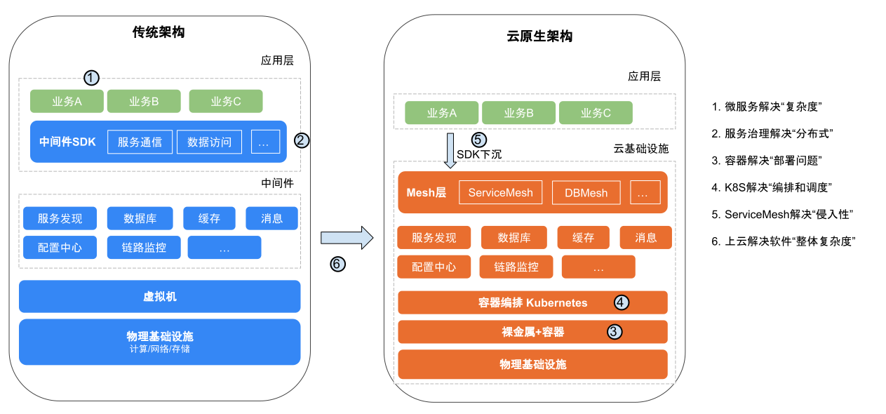

# 1.6 云原生架构设计概论

理解云原生的代表技术之后，这一节，我们再谈谈如何利用这些技术切入到架构设计中。

没有完美的能够应对所有变化的架构，技术架构很多时候是依据当时的技术条件来设计的，当制约因素改变的时候，技术架构也要相应变化。所以说好的架构是演进而来的，不是设计出来的，架构演进的目的一定是解决某一类问题，我们不妨从“解决问题”的角度出发，来聊一下云原生架构如何设计，如图 1-38 所示，传统架构向云原生架构的演进。

	
	
图1-38 传统架构与云原生架构对比

- 为了解决单体架构 “复杂度问题”，使用微服务架构。
- 为了解决微服务间 “通讯异常问题”，使用治理框架 + 监控。
- 为了解决微服务架构下大量应用 “部署问题”，使用容器。
- 为了解决容器的 “编排和调度问题”，使用 Kubernetes。
- 为了解决微服务框架的 “侵入性问题”，使用 Service Mesh。
- 为了让 Service Mesh 有 “更好的底层支撑”，将 Service Mesh 运行在 Kubernetes 上。

从单个微服务应用的角度看，自身的复杂度降低了，在“强大底层系统”支撑的情况下监控、治理、部署、调度功能齐全，已经符合云原生架构。但站在整个系统的角度看，复杂度并没有减少和消失，要实现“强大底层系统”付出的成本是非常昂贵（很强的架构和运维能力）。

为了解决项目整体复杂度，选择上云托管，将底层系统的复杂度交给云基础设施，让云提供保姆式服务，最终演变为无基础架构设计，通过 YAML 声明式代码、编排底层基础设施、中间件等资源，即应用要什么，云给我什么，企业最终会走向开放、标准的“云”技术体系。
