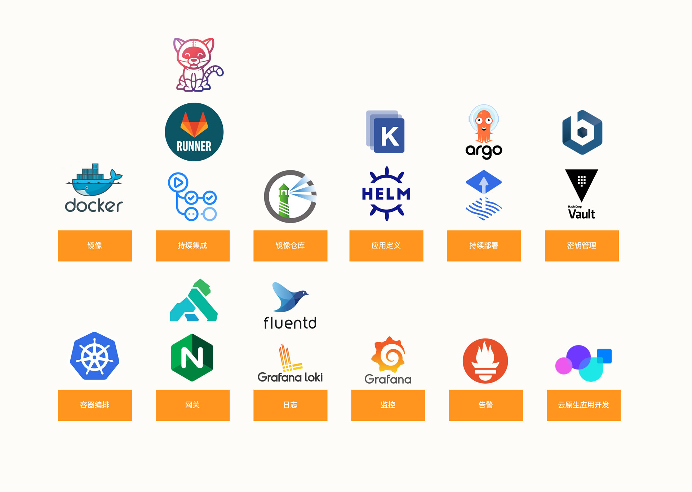

# 1.7 云原生时代对架构师的要求

当布道者在大力推广云原生技术之时，总是毫不吝啬赞誉，称其云原生架构是”优雅的、灵活的、弹性的...“。但公开的宣讲似乎很少提及一个反面，那就是云原生技术过于抽象和复杂。

在云原生架构中，复杂只是被转移到云基础设施中，并没有无故消失。作为架构师，如果有志构建一个高可用的云原生架构，对能力要求已提升到史无前例的程度。总结来说，在云原生工程实践中除掌握 Docker 和 Kubernetes，还需要聚焦在下面几个领域：

1. 容器和镜像：Docker、containerd、CRI-O、Nydus
2. 持续集成：Gitlab、Tekton
3. 镜像仓库：Harbor
4. 应用定义：Kustomize、Helm
5. 持续部署：FluxCD、argoCD
6. 容器编排：Kubernetes
6. 网关：Ingress-Nginx、APISIX、Kong
7. 监控：Grafana
8. 告警：Prometheus
9. 日志：Fluentd
10. 应用开发：Nocalhost

	
	
图 1-39 云原生代表技术栈

行文至此，细心的读者会注意到一个小问题。本小节的标题是”构建高可用架构...“而不是“构建高可用云原生架构”，包括本书的命名也是如此。虽然云原生是一个足够宏观、广泛的课题，但对于构建高品质的软件产品而言，其影响服务质量还包括前端、网络、后端等等，云原生并不能涵盖所有环节（约束理论也是要求优化整体而不是单个的“孤岛）。

:::tip 约束理论
在一条业务链中，瓶颈节点的节拍决定了整条链的节拍，即任何一个多阶段生产系统，如果其中一个阶段的产出取决于前面一个或几个阶段的产出，那么产出率最低的阶段决定着整个系统的生产能力。约束即阻碍企业有效扩大产出能力、降低库存和运行成本的环节。
:::

此外，对于那些链路极长、逻辑极复杂的系统来说，"高可用"架构往往是一个伪命题，只要是人开发的系统，代码就总会携有缺陷。看似”稳定“的系统，它可能在随机某个时刻出现突发的问题。

高可用没有银弹，架构师唯有具备深厚的基础和广泛的知识面，此后面对突发的故障，虽可能无法立即解决，但至少可以准确地看出源头，从而找到解决问题的正确路径。

”足够的广度和一定范围内的深度“也是本书试图想表达的内容。