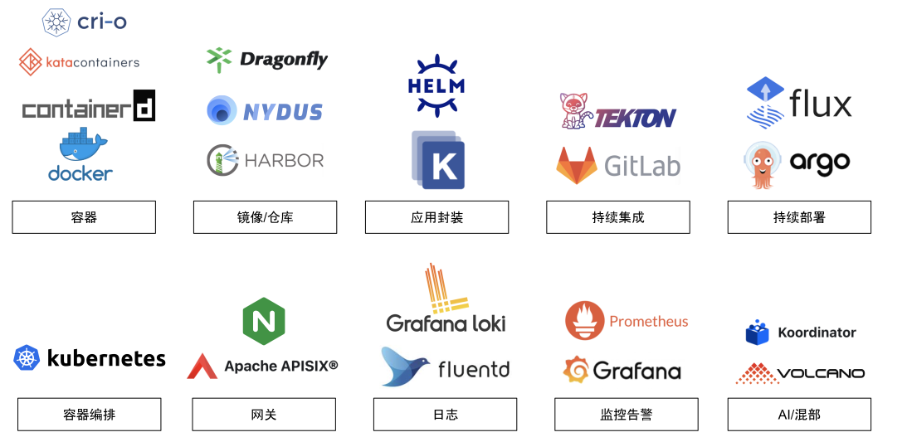

# 1.7 云原生时代对架构师的要求

云原生架构是”优雅的、灵活的、弹性的...“，但云原生技术也过于抽象和复杂。云原生架构中，复杂只是被转移到云基础设施中，并没有无故消失。作为架构师，如果有志构建一个高可用的云原生架构，对能力要求已提升到史无前例的程度。总结来说，在云原生工程实践中除掌握 Docker 和 Kubernetes，还需要知晓以下几个领域，如图 1-39 所示。

	
	
图 1-39 云原生代表技术栈

1. 容器和镜像：Docker、containerd、CRI-O、Kata Containers。
2. 镜像仓库：Harbor、Nydus。
3. 应用封装：Kustomize、Helm。
4. 持续集成：Gitlab、Tekton。
5. 持续部署：FluxCD、argoCD。
6. 容器编排：Kubernetes。
7. 网关：Ingress-Nginx、APISIX。
8. 日志：Fluentd、Grafana loki。
9. 监控：Grafana、Prometheus。
10. 应用开发：Nocalhost。

行文至此，云原生技术概论的篇章已经结束，细心的读者会注意到一个小问题，本书的命名是“深入架构原理...”，而不是“深入云原生架构...”，虽然云原生是一个足够宏观、广泛的课题，但对于构建高品质的软件产品而言，其影响服务质量还包括前端、网络、后端等等，云原生并不能涵盖所有环节，约束理论也是要求优化整体而不是单个的“孤岛[^1]。

此外，对那些链路极长、逻辑极复杂的系统来说，"高可用"架构往往是一个伪命题，只要是人开发的系统，代码就总会携有缺陷。看似”稳定“的系统，它可能在随机某个时刻出现突发的问题。作为负责系统稳定的架构师唯有具备深厚的基础和广泛的知识面，此后面对突发故障，虽可能无法立即解决，但至少可以准确地看出源头，从而找到解决问题的正确路径。

受限于笔者的功力，内容有诸多不足，但”足够的广度和一定范围内的深度“也是本书着重想要表达的内容。

[^1]: 约束理论：在一条业务链中，瓶颈节点的节拍决定了整条链的节拍，即任何一个多阶段生产系统，如果其中一个阶段的产出取决于前面一个或几个阶段的产出，那么产出率最低的阶段决定着整个系统的生产能力。约束即阻碍企业有效扩大产出能力、降低库存和运行成本的环节。