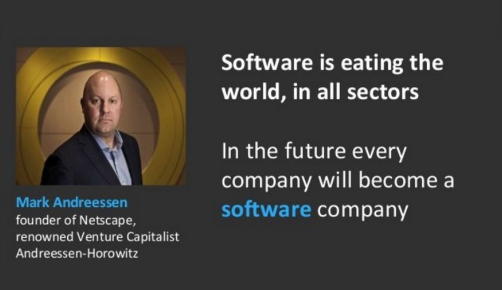

# 1.2 云原生出现的背景

## 1.2.1 软件正在改变世界

Mark Andreessen 是风险投资公司 Andreessen-Horowitz 的联合创始人和合伙人（如图 1-7 所示），该公司投资了 Facebook、Groupon、Skype、Twitter、Zynga、Foursquare 等公司。

	
	
图1-7 Software is Eating The World —— by Mark Andreessen, in 2011

2011 年 8 月 20 日华尔街日报上，Mark Andreessen 发表了名为 “Why Software Is Eating the World” 的文章，文章阐述了软件如何影响各个行业，援引原文部分内容：

:::tip <i></i>

我们处于戏剧性和广泛的技术和经济转变的中间，软件公司准备接管大量的经济。

越来越多的主要企业和行业正运行在软件上并提供在线服务 —— 从电影到农业再到国防。许多获奖者都是硅谷式的创业技术公司，他们正在入侵和推翻既有的行业结构。

为什么现在发生这种情况？

计算机革命六十年，微处理器发明四十年，现代互联网兴起二十年，通过软件转变行业所需的所有技术终于有效，并可在全球范围内广泛传播。

十年前，当我在创办的 Netscape 公司时，大概 5000 千人使用了宽带互联网，而现在有超过 20 亿人使用宽带互联网。在接下来的 10 年里，我预计全球至少有 50 亿人拥有智能手机，每个人每天都可以随时随地使用这种手机充分利用互联网。

在后端，软件编程工具和基于互联网的服务可以轻松地在许多行业中推出新的全球软件驱动的初创企业 —— 无需投资新的基础设施和培训新员工。2000 年，当我的合伙人 Ben Horowitz 担任第一家云计算公司 Loudcloud 的首席执行官时，运营基本互联网应用程序每月的成本约为 15 万美元。今天在亚马逊云中运行相同的应用程序每月花费大约 1500 美元。
:::

文中列出了被重塑的产业，具体有：最大的书店 Amazon、最多人订阅的 Video service Netflix、最大的音乐公司 iTunes、Spotify and Pandora 等、成长最快的娱乐领域 videogame、最好的电影制片厂 Pixar、最大的行销平台 Google、Groupon、Facebook 等、成长最快的电信公司 Skype 、成长最快招聘公司 LinkedIn。

文章发表于 2011 年，2023 年再来回顾，互联网冲击已经无所不在，感触更加深刻。

## 1.2.2 移动互联网在加剧变化

作者展望互联网规模时，写道：“在接下来的 10 年里，我预计全球至少有 50 亿人拥有智能手机，每个人每天都可以随时随地使用手机充分利用互联网。”

现在，我们已经可以确认 Mark Andreessen 的预测很正确，移动互联网时代的用户规模已经开始向人口基数看齐，开始出现各类亿级 DAU 规模的移动应用。而移动互联网如此巨大的用户规模会对软件开发有什么影响？援引 Netflix 的一页 PPT，如图 1-8 所示，这里按照规模和变更速度将软件企业划分为四个象限/四种类型：

- 企业 IT（Enterprise IT）：规模小，变化慢，容易处理。
- 电信（Telcos）：规模大，变化慢，主要应对硬件失败。
- 初创公司（Startups）：规模小，变化快，主要应对软件失败。
- 网络规模的互联网企业（Web-Scale）：规模大，变化快，软硬件或者说所有东西都会出问题。

	
	
图1-8 Netflix按照规模和变更速度对软件企业划分的总结

在十年前乃至二十年前的**互联网时代**，大多数软件企业都位于图 1-8 左边的两个象限：规模或许有大有小，但是变更速度相对今天都不快。当企业发展壮大时，体现的也更多是在规模上，变更速度并不会发生质的变化。

而今天的**移动互联网时代**，则都位于图 1-8 右边的两个象限：无论规模是大是小，变更速度都要求非常快。并且当企业逐步发展壮大，规模十倍百倍增长时，对变更速度的要求并不会降低，甚至会要求更快。

在移动互联网时代，能够成长并发展起来的这些公司，他们的共同点是：

- 快速变更，不断创新，随时调整
- 提供持续可用的服务，应对各种可能的错误和中断
- 弹性可扩展的系统，应对用户规模的快速增长
- 提供新的用户体验，以移动为中心

这样的背景下，对软件开发有了更高的要求，软件开发的方式也不得不跟随时代而变化，首当其冲的就是如何解决规模越来越大同时变更越来越快的难题。

## 1.2.3 软件上云是大势所趋

将软件迁移到云上是应对这一挑战的自然演化方式，在过去二十年，从物理机到虚拟机到容器，从 IaaS 诞生到 PaaS、CaaS、SaaS、FaaS 一路演进，应用的构建和部署变的越来越轻、越来越快，而底层基础设施和平台则越来越强大，以不同形态的云对上层应用提供强力支撑。

2006 年 AWS 通过提供 EC2 服务开创了 IaaS 市场。通过按时计费的方式租借服务器，客户不承担资本支出，仅在使用服务时付费。将资本支出转变为运营支出，这是云计算时代的真正开始，而之后 PaaS、SaaS 等的演进只是朝云这个方向一步一步继续前行。

## 1.2.4 总结

前面谈到了软件对各行各业的渗透和对世界的改变，以及移动互联网时代巨大的用户基数下快速变更和不断创新的需求对软件开发方式带来的巨大推动力，1.1 节描述的过去二十年间云计算的发展演进和软件上云的趋势，我们可以清晰的看到这样一个波澜壮阔的技术浪潮：

- 软件正在改变世界。
- 移动互联网让这个变革影响到每一个人。
- 传统软件开发方式受到巨大挑战。
- 云计算普及，软件上云成为趋势。
- 云的形态持续在演进。

援引 InfoQ 主编徐川老师对云计算的总结[^1]：
- 云计算的技术逐渐发展成为它本来该有的模样，以及与这样的云所匹配的软件架构，还有以及与这样的架构所匹配的开发流程与方法论。

云原生由此诞生！

[^1]: 2018 年终盘点：我们处在一个什么样的技术浪潮当中？-InfoQ https://www.infoq.cn/article/h1vz6dh1djh5jugo3*pd

