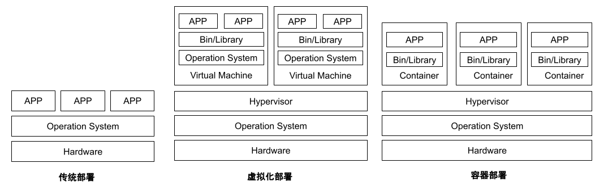

# 1.4.1 将服务容器化

实现云原生架构的前置条件是服务容器化，没有容器化技术，云原生下的弹性、服务韧性、资源成本节省将不具备任何优势。

容器技术基于操作系统虚拟化技术，共享操作系统内核，轻量、没有额外的资源消耗、秒级启动，极大提升了系统应用部署的密度和服务弹性能力。更重要的是，Docker 提出了创新的应用交付规范 - Docker 镜像，镜像将应用以及依赖整体打包，使应用不再受到环境限制，简化应用构建、测试、部署流程，实现 一次编译，随处运行的目标。

综合所述，借助容器技术实现了让开发所需的灵活性、开放性和运维所关注的标准化、自动化达成相对平衡。

	
	
图 传统部署、虚拟化部署和容器部署的比较

在过去几年，容器技术已经被广泛应用到生产环境中，除以上的概述性优势外，容器技术落地后的几个明显收益如下。

## 1. 提高资源利用率，降低资源成本

以前一台 32 Core 128 GB 的物理机，最多可以创建 20 台 4Core8 GB 的虚拟机，每台虚拟机部署一个应用实例，由于服务负载并不均衡，机器使用率不到 10%，并不饱和，造成很大的资源浪费。改为容器运行应用后，由于容器共享操作系统内核，之前配置的物理机，在生产环境实践中，可以稳定运行 100+ 个应用。笔者对某一业务线资源核算之后，如果全部改成容器运行，财务成本理论最高可降低 60%。

## 2. 提升运维效率

传统的虚拟机部署流程是：开发、编译、打包、上传到目标虚拟机重启，过程中如果遇到问题需要回滚，就会比较麻烦，需要找到历史 Jar 包进行覆盖进行回退操作。容器化之后，结合 CI/CD 系统之后的流程变成了：开发、编译、打包、生成镜像、自动构建、服务器自动下载镜像、运行容器。整个流程人为介入程序大大降低，不论是故障恢复还是灰度发布等，全为平台化的操作，进而大幅提升交付效率。

## 3. 无状态理念促进混合架构建设

容器化之后，结合 Kubernetes 平台能力, 应用可以在不同机房、不同环境随意调度，弹性能力大大加强，符合云原生下对无状态的改造要求，能够更原生地支持企业混合云、异构架构融合的建设。
