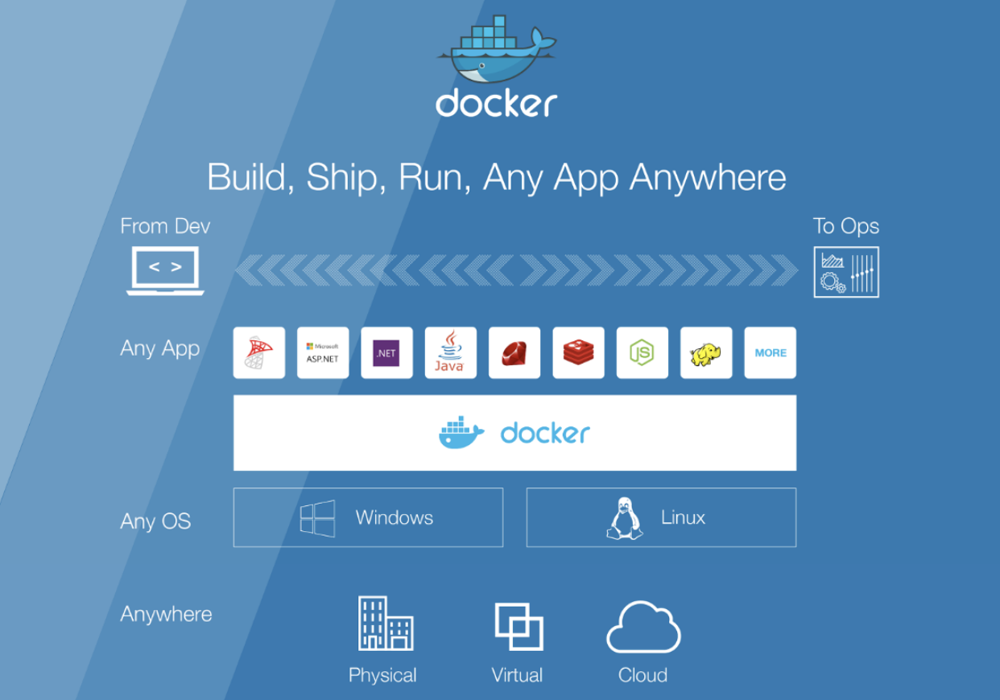
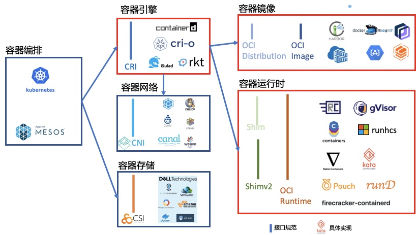
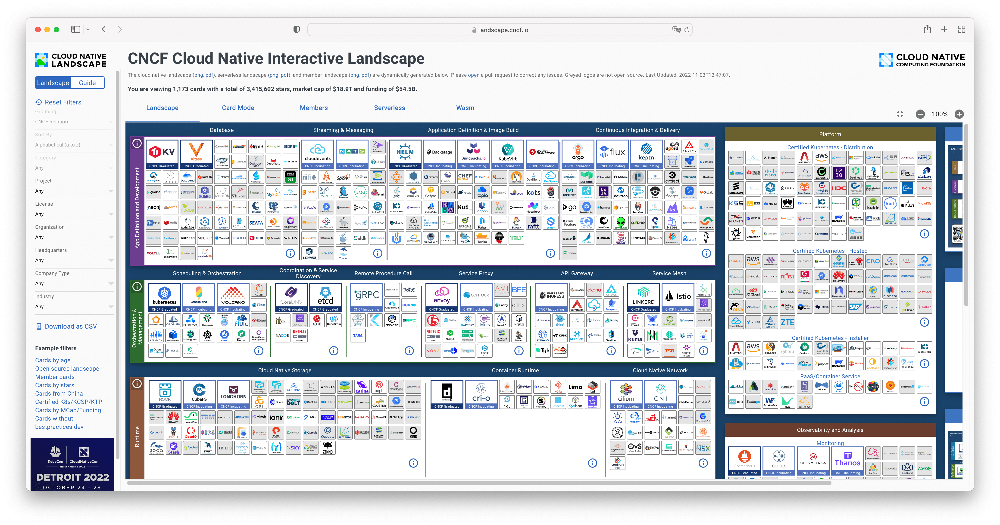

# 1.5.1 容器技术

虽然容器概念是在 Docker 出现以后才开始在全球范围内火起来的，但容器却不是从 Docker 诞生的。事实上，容器连新技术都算不上，在 Docker 之前，就已经有无数先驱在探索这一极具前瞻性的虚拟化技术。

本节内容我们概览容器技术演进历程以及各个阶段所试图解决的问题，以便更全面地了解容器技术。

## 1.早期容器阶段：隔离

早在 1979 年，贝尔实验室在 Unix V7 的开发过程中，发现当一个系统软件编译和安装完成后，整个测试环境的变量就会发生改变，如果要进行下一次构建、安装和测试，就必须重新搭建和配置测试环境。要知道在那个年代，一块 64K 的内存条就要卖 419 美元，“快速销毁和重建基础设施”的成本实在是太高了。

开发者们开始思考，能否在现有的操作系统环境下，隔离出一个用来重构和测试软件的独立环境？于是，一个叫做 chroot（Change Root）的系统调用功能就此诞生。

chroot 被认为是最早的容器化技术之一，chroot 可以重定向进程及其子进程的 root 目录到文件系统上的新位置，也就是说使用它可以分离每个进程的文件访问权限，使得该进程无法接触到外面的文件，因此这个被隔离出来的新环境也得到了一个非常形象的命名，叫做 Chroot Jail（监狱）。

这便是容器最重要的特性 -- 进程隔离。

## 2.Linux 容器阶段：封装系统 

2006 年，Google 推出 Process Container（进程容器），Process Container 的目的非常直白，它希望能够像虚拟化技术那样给进程提供操作系统级别的资源限制、优先级控制、资源审计能力和进程控制能力。带着这样的设计思路，Process Container 推出不久就进入了 Linux 内核主干。不过由于 container 这一命名在内核中具有许多不同的含义，为了避免代码命名的混乱，后来就将 Process Container 更名为了 Control Groups，简称：cgroups。

2008 年 Linux 内核 2.6.24 刚刚开始提供 cgroups 的同一时间，社区开发者将 cgroups 的资源管理能力和 Linux namespace（命名空间）的资源隔离能力组合在一起，形成了完整的容器技术 LXC（Linux Container，Linux 容器），这就是如今被广泛应用的容器技术的实现基础。

至 2013 年，Linux 虚拟化技术已基本成型，通过 cgroups、namespace 以及安全防护机制，大体上解决了容器核心技术“运行环境隔离”。虽然容器运行环境隔离基础已经基本就位，但仍需等待另一项关键技术的出现，才能迎来容器技术的全面繁荣。

## 3.Docker 阶段：封装应用 

2013 年之前，云计算行业一直在为云原生发展方向而探索。2008 年 Google 推出 GAE（Google App Engine），GAE 基于 LXC 技术，属于早期 PaaS 平台的探索，但是这些早期探索技术并没有形成大的行业趋势，局限在一些的特定的领域。直到 Docker 的出现，大家才如梦方醒，原来不是方向不对，而是应用分发和交付的手段不行。

再来看 Docker 的核心创新“容器镜像（container image)”：

- 容器镜像打包了整个容器运行依赖的环境，以避免依赖运行容器的服务器的操作系统，从而实现“build once，run anywhere”。
- 容器镜像一但构建完成，就变成 read only，成为不可变基础设施的一份子。
- 操作系统发行版无关，核心解决的是容器进程对操作系统包含的库、工具、配置的依赖，但是容器镜像无法解决容器进程对内核特性的特殊依赖。

容器镜像将应用运行环境，包括代码、依赖库、工具、资源文件和元信息等，打包成一种操作系统发行版无关的不可变更软件包，从而实现一种新型的应用打包、分发和运行机制。

如图 1-15 所示，Docker 的宣传口号是“Build，Ship and Run Any App，Anywhere”，开发者基于镜像可以打包任何容器进程所依赖的环境，而不用改造应用来适配 PaaS 定义的运行环境，“Run Any App”一举打破了 PaaS 行业面临的困境，创造出了无限的可能性。所以说，促使 Docker 一问世就惊艳世间的，并不是什么黑科技式的秘密武器，而是它符合历史潮流的创意和设计理念，还有充分开放的生态运营。

	
	
图1-15 Docker 的愿景：Build, Ship, and Run Any App, Anywhere

至此，容器技术体系已经解决了最核心的两个问题 “如何运行软件和如何发布软件”，云计算开始进入容器阶段。

## 3.标准化 OCI 阶段

当容器技术的前景显现后，众多公司纷纷投入该领域进行探索。Docker 推出不久之后，CoreOS 就推出了自己的容器引擎 Rocket（简称 rkt），试图与 Docker 分庭抗礼，相互竞争的结果就是大家坐下来谈接口标准，避免出现“碎片化”的容器技术。

2015 年 6 月，Docker 带头成立 OCI（Open Container Initiative，开放容器标准），OCI 组织着力解决容器的构建、分发和运行问题，其宗旨是制定并维护容器镜像格式和容器运行时的正式规范（OCI Specifications）。

OCI 其核心产出是：

- OCI Runtime Spec（容器运行时规范）
- OCI Image Spec（镜像格式规范）
- OCI Distribution Spec（镜像分发规范）。

OCI 项目启动后，为了符合 OCI 标准，Docker 推动自身的架构持续向前演进。

首先它将 libcontainer 独立出来，封装重构成 runC 项目，并捐赠给 Linux 基金会管理。runC 是 OCI Runtime 的首个参考实现，它提出了“让标准容器无处不在”（Make Standard Containers Available Everywhere）的口号。

而为了能够兼容所有符合标准的 OCI Runtime 实现，Docker 进一步重构了 Docker Daemon 子系统，把其中与运行时交互的部分抽象为了 containerd 项目。这是一个负责管理容器执行、分发、监控、网络、构建、日志等功能的核心模块，其内部会为每个容器运行时创建一个 containerd-shim 适配进程，默认与 runC 搭配工作，但也可以切换到其他 OCI Runtime 实现上（然而实际并没做到，最后 containerd 仍是紧密绑定于 runC）。

后来到了 2016 年，Docker 把 containerd 捐献给了 CNCF 管理。此后 Docker 运行就不是简单通过 Docker Daemon 来启动了，现阶段的 Docker 通过集成 containerd、containerd-shim、runC 等多个组件共同完成，架构如图 1-16 所示。

	
	
图1-16 Docker 架构

## 4.容器编排阶段

如果说以 Docker 为代表的容器引擎，是把软件的发布流程从分发二进制安装包，转变为了直接分发虚拟化后的整个运行环境，让应用得以实现跨机器的绿色部署。那以 Kubernetes 为代表的容器编排框架，就是把大型软件系统运行所依赖的集群环境也进行了虚拟化，让集群得以实现跨数据中心的绿色部署，并能够根据实际情况自动扩缩。

尽管早在 2013 年，Pivotal 就提出了“云原生”的概念，但是要实现服务化、具备韧性（Resilience）、弹性（Elasticity）、可观测性（Observability）的软件系统依旧十分困难，在当时基本只能依靠架构师和程序员高超的个人能力，云计算本身还帮不上什么忙。直到 Kubernetes 横空出世，大家才终于等到了破局的希望，**认准了这就是云原生时代的操作系统，是让复杂软件在云计算下获得韧性、弹性、可观测性的最佳路径，也是为厂商们推动云计算时代加速到来的关键引擎之一**。

Kubernetes 发布之后，作为回应，Docker 公司在 2015 年发布的 Docker 1.12 版本中也加入了一个容器集群管理系统 Docker swarm，力图构建完善的容器编排系统，和 Kubernetes 展开正面竞争，随后市场上又出现了 Apache Mesos，容器编排系统开始出现 Kubernetes、Docker Swarm 和 Apache Mesos 三国并立。

与 Docker Swarm 和 Mesos 等容器编排框架相比，虽然 Kubernetes 出道晚，但后发优势明显，Kubernetes 脱胎于已经在 Google 内部运行了多年的 Borg 项目，但并没有直接延用 Borg，而是在这些宝贵经验的基础上从零开始设计，使得其能采用最先进的设计理念而没有任何历史包袱。Kubernetes 设计了一套稳定可扩展的 API 接口、预置服务发现、容器网络、及可扩展等关键特性，其概念抽象非常符合理想的分布式调度系统。

实际上，Kubernetes 的一个成功之处就是提供了一个规范，可以让你描述集群的架构、定义服务的最终状态，由它来帮助你的系统达到和维持在这个状态。其开放的架构从 API 到容器运行的每一层，为开发者暴露出可以拓展的插件机制，鼓励用户通过代码的方式接入到 Kubernetes 项目。这个机制催生出了大量基于 Kubernetes API 的创新，壮大了生态。

最终，Kubernetes 成为容器编排事实上的标准。

## 5.云原生阶段

2015 年 7 月 21 日，Google 带头成立了 Cloud Native Computing Foundation（CNCF，云原生基金会）。CNCF 组织解决的是应用管理及容器编排问题。CNCF 宗旨为构建云原生计算 —— 一种围绕着微服务、容器和应用动态调度的、以基础设施为中心的架构，并促进其广泛使用。

OCI 和 CNCF 这两个围绕容器的基金会对云原生生态的发展发挥了非常重要的作用，二者不是竞争而是相辅相成（竞争的都已经淹没在历史的长河中），共同制定了一系列行业事实标准。
其中与容器相关的最为重要的几个规范包括：CRI、CNI、CSI、OCI Distribution Spec、OCI Image Spec、OCI Runtime Spec 和 Shimv2，如图 1-17 所示。这些行业事实标准的确立，为软件相关的各行业注入了无限活力，基于接口的标准的具体实现不断涌现，呈现出一片百花齐放的景象。

	
	
图1-17 容器编排生态

在容器编排大战期间，以 kubernetes 为核心的 CNCF 生态系统也得以迅猛发展，云原生成为云计算市场的技术新热点。迄今为止，CNCF 在其公布的云原生全景图中，如图 1-5 所示，显示了目前近 30 个领域、数百个项目的繁荣发展，从数据存储、消息传递，到持续集成、服务编排，乃至网络管理，如稼轩先生有言，“溪边照影行，天在清溪底。天上有行云，人在行云里”。

	
	
图1-18 CNCF 云原生项目 Landscape 

现在，CNCF 早已超出了 Kubernetes 的范畴，而是旨在建立在 Kubernetes 为底层资源调度和应用生命周期管理之上的生态系统。
