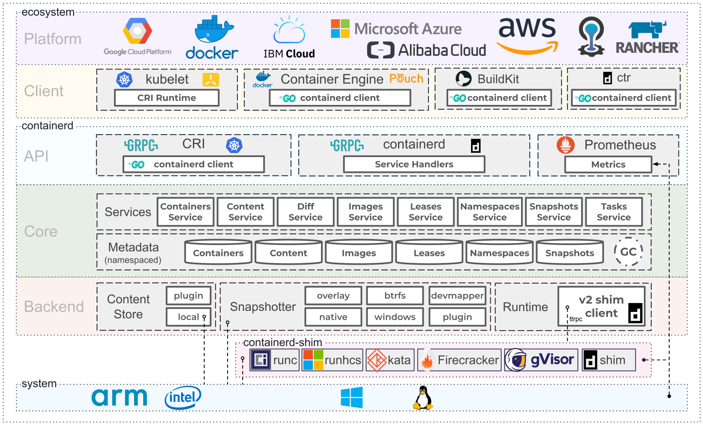

# 1.5.1 容器技术

:::tip Google Cloud 对容器的定义
容器是轻量级应用代码包，它还包含依赖项，例如编程语言运行时的特定版本和运行软件服务所需的库。
:::

来自 Google 的解释似乎也不太好理解！那么，我们延续本章 1.1 节解释云计算的方式，从容器技术出现开始，了解它发展的历史，讨论容器技术各个阶段试图解决的问题，从而深入理解容器技术。

## 1.chroot 阶段：隔离文件系统

容器技术并不是凭空出现的，而是具有非常久远的历史。

早在 1979 年，贝尔实验室在开发 Unix V7 的过程中，发现当一个系统软件编译和安装完成后，整个测试环境的变量就会发生改变，如果要进行下一次构建、安装和测试，就必须重新搭建和配置测试环境。

开发者们开始思考，能否在现有的操作系统环境下，隔离出一个用来重构和测试软件的独立环境？于是，一个叫做 chroot（Change Root）的系统调用功能就此诞生。

chroot 被认为是最早的容器化技术之一，它可以重定向进程及其子进程的 root 目录到文件系统上的新位置，也就是说使用它可以分离每个进程的文件访问权限，使得该进程无法接触到外面的文件。

通过 chroot 隔离出来的新环境得到了一个非常形象的命名 Jail（监狱），这便是容器最重要的特性 —— 隔离。

## 2.LXC 阶段：封装系统 

2006 年，Google 推出 Process Container（进程容器），Process Container 目的非常直白，它希望能够像虚拟化技术那样给进程提供操作系统级别的资源限制、优先级控制、资源审计和进程控制能力。

带着这样的设计思路，Process Container 推出不久就进入了 Linux 内核主干，不过由于 container 这一命名在内核中具有许多不同的含义，为了避免代码命名的混乱，后来就将 Process Container 更名为了 Control Groups —— 简称 cgroups。

2008 年 Linux 内核版本 2.6.24 刚开始提供 cgroups，社区开发者就将 cgroups 资源管理能力和 Linux namespace 资源隔离能力组合在一起，形成了完整的容器技术 LXC（Linux Container，Linux 容器）。

LXC 是如今被广泛应用的容器技术的实现基础，通过 LXC 可以在同一主机上运行多个相互隔离的 Linux 容器，**每个容器都有自己的完整的文件系统、网络、进程和资源隔离环境，容器内的进程如同拥有一个完整、独享的操作系统**。

至 2013 年，Linux 虚拟化技术已基本成型，通过 cgroups、namespace 以及安全防护机制，大体上解决了容器核心技术“运行环境隔离”，但此时仍需等待另一项关键技术的出现，才能迎来容器技术的全面繁荣。

## 3.Docker 阶段：封装应用 

2013 年之前，云计算行业一直在为云原生发展方向而探索。

从 2008 年 Google 推出的基于 LXC 技术的 GAE，到 2011 年开源的 Cloud Foundry，这些早期的 PaaS 平台一直在思考如何改善软件的交付方式。

就如 Cloud Foundry，它为了解决软件交付的问题，为每一种主流的语言都定义了一套打包的方式，开发者不得不为每一种语言、每一种框架、甚至是每个版本应用维护一个打好的包。除此，这种方式还有可能出现本机运行成功，打了个包上传之后就无法运行的情况。所以，早期的 PaaS 平台探索的技术并没有形成大的行业趋势，只局限在一些的特定的领域。

直到 Docker 的出现，大家才如梦方醒，原来不是方向不对，而是应用分发和交付的手段不行。

再来看 Docker 的核心创新“容器镜像（container image）”：

- **容器镜像打包了整个容器运行依赖的环境，以避免依赖运行容器的服务器的操作系统，从而实现“build once，run anywhere”**。
- **容器镜像一但构建完成，就变成只读状态，成为不可变基础设施的一份子**。
- 与操作系统发行版无关，核心解决的是容器进程对操作系统包含的库、工具、配置的依赖（注意，容器镜像无法解决容器进程对内核特性的特殊依赖）。

开发者基于镜像打包应用所依赖的环境，而不是改造应用来适配 PaaS 定义的运行环境。如图 1-14 所示，Docker 的宣传口号“Run Any App”一举打破了 PaaS 行业面临的困境，创造出了无限的可能性。

:::center
   
 图 1-14 Docker 的愿景：Build, Ship, and Run Any App, Anywhere
:::

至此，现阶段容器技术体系已经解决了**最核心的两个问题“如何运行软件和如何发布软件”**，云计算开始进入容器阶段。

## 4.OCI 阶段：容器标准化

当容器技术的前景显现后，众多公司纷纷投入该领域进行探索。

先是 CoreOS 推出了自己的容器引擎 rkt（Rocket 的缩写），Google 也推出了自己的容器引擎 lmctfy（Let Me Contain That For You 的缩写）试图与 Docker 分庭抗礼，相互竞争的结果就是大家坐下来谈容器接口标准，避免出现“碎片化”的容器技术。

2015 年 6 月，Linux 基金会联合 Docker 带头成立 OCI（Open Container Initiative，开放容器标准）项目，**OCI 组织着力解决容器的构建、分发和运行标准问题，其宗旨是制定并维护 OCI Specifications（容器镜像格式和容器运行时的标准规范）**。

OCI 的成立结束了容器技术标准之争，Docker 公司被迫放弃容器规范独家控制权。作为回报，Docker 的容器格式被 OCI 采纳为新标准的基础，并且由 Docker 起草 OCI 草案规范的初稿。

当然这个“标准起草者”也不是那么好当的，Docker 需要提交自己的容器引擎源码作为启动资源。首先是 Docker 最初使用的容器引擎 libcontainer，这是 Docker 在容器运行时方面的核心组件之一 ，用于实现容器的创建、管理和运行。Docker 将 libcontainer 捐赠给了 OCI，作为 OCI 容器运行时标准的参考实现。

经过一系列的演进发展之后，OCI 有了三个主要的标准：

- **OCI Runtime Spec**（容器运行时标准）：定义了运行一个容器，如何管理容器的状态和生命周期，如何使用操作系统的底层特性（namespace、cgroups、pivot_root 等）。
- **OCI Image Spec**（容器镜像标准）：定义了镜像的格式，配置（包括应用程序的参数、依赖的元数据格式、环境信息等），简单来说就是对镜像文件格式的描述。
- **OCI Distribution Spec**（镜像分发标准）：定义了镜像上传和下载的网络交互过程的规范。

而前面的 libcontainer，经过改造、标准化之后，成为 OCI 规范标准的第一个轻量运行时实现“runc”。

:::tip 什么是 runc
runc 是非常小的运行核，其目的在于提供一个干净简单的运行环境，他就是负责隔离 CPU、内存、网络等形成一个运行环境，可以看作一个小的操作系统。runc 的使用者都是一些 CaaS（Container as a Service，容器即服务）服务商，所以个人开发者知晓的并不是太多。
:::

OCI 项目启动后，为了符合 OCI 标准，Docker 开始推动自身的架构向前演进。

Docker 把与内部负责管理容器执行、分发、监控、网络、构建、日志等功能的模块重构为 containerd 项目 。如图 7-13 所示，containerd 的架构主要分为三个部分：生态系统（Ecosystem）、平台（Platform）和客户端（Client），每个部分在整个系统中扮演着不同的角色，协同工作以提供全面的容器管理功能。

:::center
   
  图 7-13 Containerd 架构 [图片来源](https://containerd.io/)
:::

2016 年，Docker 将 containerd 捐献给了 CNCF 管理，现在，containerd 已经成为最流行的容器运行时。

经过 runc、containerd 组件的拆分改造之后，Docker 就不再是一个简单的守护进程那么简单了，而是通过集成 containerd、containerd-shim、runc 等多个组件共同完成。

:::center
   
 图 1-15 拆分后的 Docker 架构
:::

从拆分后的 Docker 架构图来看 ，容器运行时根据功能的不同分成了两类：
- 只关注如 namespace、cgroups、镜像拆包等基础的容器运行时实现被称为**低层运行时（low-level container runtime）**， 目前应用最广泛的低层运行时是 runc；
- 支持更多高级功能，例如镜像管理、容器应用的管理等，被称为**高层运行时（high-level container runtime）**，目前应用最广泛高层运行时是 containerd。

这两类运行时按照各自的分工，在 OCI 标准规范下，共同协作完成容器整个生命周期的管理工作。

## 5.容器编排阶段：封装集群

如果说以 Docker 为代表的容器引擎，是把软件的发布流程从分发二进制安装包，转变为了直接分发虚拟化后的整个运行环境，让应用得以实现跨机器的绿色部署。

那以 Kubernetes 为代表的容器编排框架，就是把大型软件系统运行所依赖的集群环境也进行了虚拟化，让集群得以实现跨数据中心的绿色部署，并能够根据实际情况自动扩缩。

尽管早在 2013 年，Pivotal 就提出了“云原生”的概念，但是要实现服务具备韧性（Resilience）、弹性（Elasticity）、可观测性（Observability）的软件系统依旧十分困难，在当时基本只能依靠架构师和程序员高超的个人能力，云计算本身还帮不上什么忙。直到 Kubernetes 横空出世，大家才终于等到了破局的希望，认准了这就是云原生时代的操作系统，是让复杂软件在云计算下获得韧性、弹性、可观测性的最佳路径，也是为厂商们推动云计算时代加速到来的关键引擎之一。

Kubernetes 围绕容器抽象了一系列的“资源”概念能描述整个分布式集群的运行，还有可扩展的 API 接口、服务发现、容器网络及容器资源调度等关键特性，非常符合理想的分布式调度系统。

随着 Kubernetes 资源模型越来越广泛的传播，现在已经能够用一组 Kubernetes 资源来描述一整个软件定义计算环境。**就像用 docker run 可以启动单个程序一样，现在用 kubectl apply -f 就能部署和运行一个分布式集群应用，而无需关心是在私有云还是公有云或者具体哪家云厂商上**。

## 6.云原生阶段：百花齐放

2015 年 7 月 21 日，Google 带头成立了 Cloud Native Computing Foundation（CNCF，云原生基金会）。

OCI 和 CNCF 这两个围绕容器的基金会对云原生生态的发展发挥了非常重要的作用，二者不是竞争而是相辅相成，共同制定了一系列行业事实标准。

其中与容器相关的最为重要的几个规范包括：CRI（Container Runtime Interface，容器运行时接口规范）、CNI（Container Network Interface，容器网络接口规范）、CSI（Container Storage Interface，容器存储接口规范）、OCI Distribution Spec、OCI Image Spec、OCI Runtime Spec，它们之间的关系如图 1-16 所示。

:::center
   
 图 1-16 OCI 以及 CNCF 容器相关规范的关系
:::

这些行业事实标准的确立，为软件相关的各行业注入了无限活力，基于接口标准的具体实现不断涌现，呈现出一片百花齐放的景象。

如图 1-17 所示，迄今为止在其 CNCF 公布的云原生全景图中，显示了近 30 个领域、数百个项目的繁荣发展，从数据存储、消息传递，到持续集成、服务编排乃至网络管理无所不包、无所不含。

:::center
   
 图 1-17 CNCF 云原生项目全景图
:::