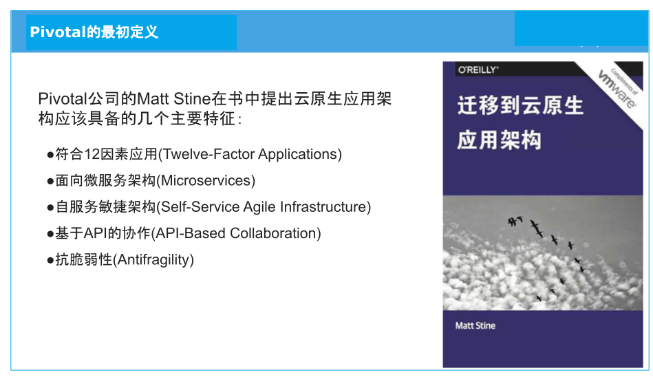
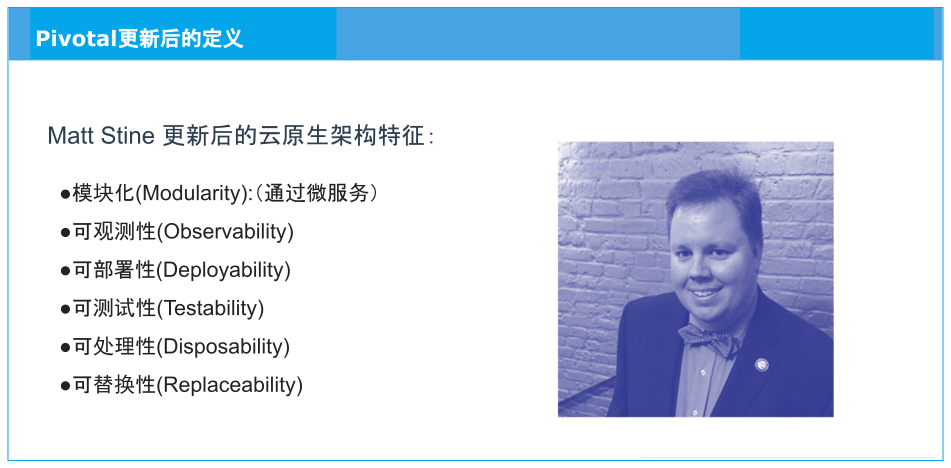
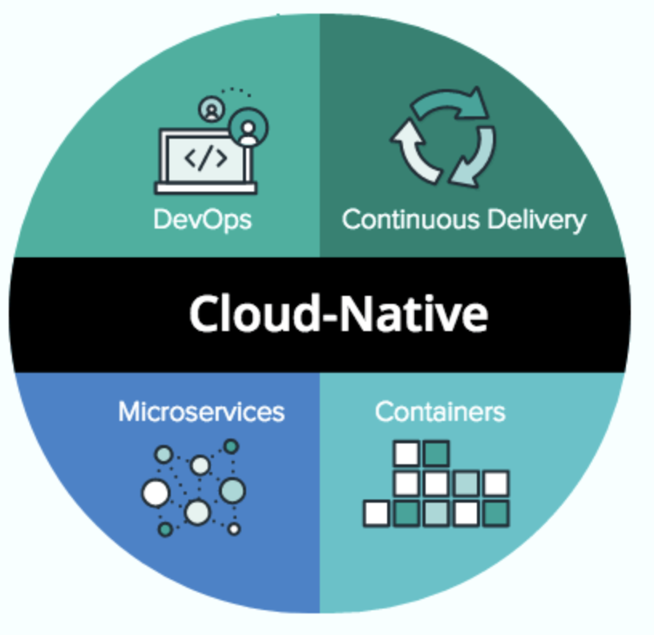
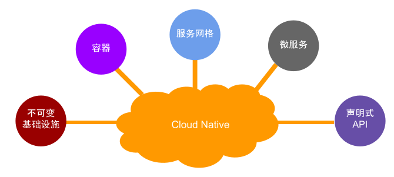

# 1.3 云原生的定义

即使在今天，当需要解释“什么是云原生？”，还是会有些困难。

过去几年间，云原生的定义一直在变化和发展演进，不同时期不同的公司对此的理解和诠释也不尽相同，因此往往带来一些疑惑和误解。本节内容，我们看看云原生定义在不同时期的变化。

## 1.3.1 Pivotal 对云原生的定义

2015 年，Pivotal[^1] 公司的技术产品经理 Matt Stine，首次提出了“云原生”（Cloud Native）的概念。

在 Matt Stine 所著的《迁移到云原生应用架构》的电子书中，他提出云原生程序应该具备的 5 个主要特征，如图 1-8 所示。

:::center
   
  图 1-8 Pivotal 对云原生定义
:::

随着时间的推移，详细解释这些早期的特征已经没有什么必要，只要知道这些内容研究的是“用更恰当的姿势上云”即可。由此可见，云原生并不是简单地使用云平台运行现有的应用程序，而是能充分利用云计算优势对应用程序进行设计、实现、部署、交付的理念。

2017 年 10 月，还是 Matt Stine，接受 InfoQ 采访时，他对云原生的定义做了小幅调整，云原生程序具有图 1-9 所示的 6 个特质。

:::center
   
 图 1-9 Matt Stine 更新后的云原生定义
:::

现在，在 Pivotal 官方网站中[^2]，对云原生的介绍则是关注如图 1-10 所示的 4 个要点：DevOps（开发运维）、Continuous Delivery（持续交付）、Microservices（微服务）、Containers（容器化），这也是大家最熟悉的版本。

:::center
   
 图 1-10 Pivotal 云原生定义
:::

可见云原生的定义在 Pivotal 内部也是不断更迭的，很多概念被放弃或者抽象，并且有新的东西加入。

## 1.3.2 CNCF 对云原生的定义

2015 年 CNCF（Cloud Native Computing Foundation，云原生计算基金会）成立，开始围绕云原生的概念打造生态体系。

:::tip CNCF 简介

CNCF 是 Linux 基金会旗下的基金会，可以理解为一个非盈利组织，成立于 2015 年 12 月 11 日。

成立这个组织的初衷或者愿景，简单说：推动云原生计算可持续发展；帮助云原生技术开发人员快速地构建出色的产品。
:::

起初，CNCF 对云原生的定义包含以下三个方面：

- **应用容器化**：容器化是云原生的基础。
- **面向微服务架构**：实施微服务是构建大规模系统的必备要素。
- **应用支持容器的编排调度**：编排调度是指能够对容器应用的部署、扩展、运行和生命周期进行自动化管理。

随着社区对云原生理念的广泛认可和云原生生态的不断扩大，还有 CNCF 项目和会员的大量增加，起初的定义已经不再适用，因此 CNCF 对云原生进行了重新定位。

2018 年 6 月，CNCF 正式对外公布云原生定义 v1.0 版本[^3]。

:::tip CNCF 云原生的定义 v1.0 版本

云原生技术有利于各组织在公有云、私有云和混合云等新型动态环境中，构建和运行可弹性扩展的应用。云原生的代表技术包括容器、服务网格、微服务、不可变基础设施和声明式 API。

这些技术能够构建容错性好、易于管理和便于观察的松耦合系统。结合可靠的自动化手段，云原生技术使工程师能够轻松地对系统作出频繁和可预测的重大变更。
:::

图 1-11 描述了新定义中的代表技术：不可变基础设施、容器、服务网格、微服务、声明式 API。
- 容器和微服务在不同时期、不同定义中都有出现；
- 而服务网格这个在 2017 年才被社区接纳的新技术被醒目的列出来。

服务网格和微服务并列，这表明服务网格已经超越了其原初的角色 —— 仅作为实现微服务的新方法，已经发展为云原生的又一个关键领域。

:::center
   
 图1-11 CNCF定义的云原生代表技术
:::

## 1.3.3 云原生定义之外

从上面可以看到，云原生的内容和具体形式随着时间的推移一直在变化，而且云原生这个词汇最近被过度使用，混有各种营销色彩，容易发生偏离。即便是 CNCF 最新推出的云原生定义也非常明确的标注为 v1.0，相信未来我们很有机会看到 v1.1、v2 版本。

最后总结，**云原生是什么并不重要，关键还是理解实施云原生有什么好处，以及实施云原生的理论指导、涉及的技术/工具等**。

了解云原生的定义之后，1.4 节继续讨论云原生技术的目标。

[^1]: Pivotal 是云原生概念提出的鼻祖，还推出了 Pivotal Cloud Foundry 和 Spring 系列开发框架，是行业先驱和探路者。2019 年，Pivotal 被 VMware 收购。
[^2]: 参见 https://pivotal.io/cloud-native
[^3]: 参见 https://github.com/cncf/toc/blob/main/DEFINITION.md
