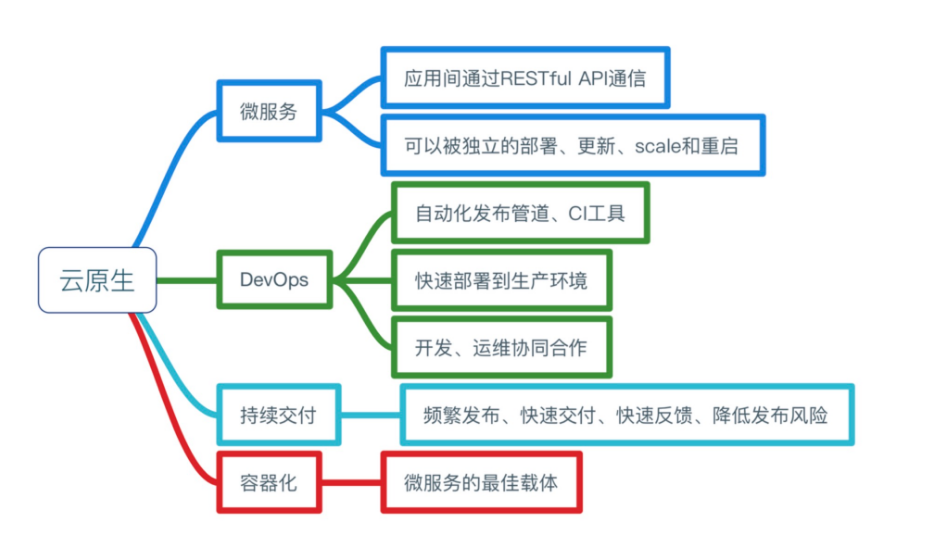

# 1.3 云原生的定义

当需要回答“什么是云原生”这个问题时，还是会有些困难。在过去几年间，云原生的定义一直在变化和发展演进，不同时期不同的公司对此的理解和诠释也不尽相同，因此往往会带来一些疑惑和误解。

我们一起来看看云原生定义在不同时期的变化。

## 1.3.1 Pivotal的定义

Pivotal 是Cloud Native/云原生应用的提出者，并推出了Pivotal Cloud Foundry和Spring系列开发框架，是云原生的先驱者和探路者。2015年，来自Pivotal公司的Matt Stine编写了一本名为《迁移到云原生应用架构》的电子书，提出云原生应用架构应该具备的几个主要特征：

- 符合12因素应用(Twelve-Factor Applications)
- 面向微服务架构(Microservices)
- 自服务敏捷架构(Self-Service Agile Infrastructure)
- 基于API的协作(API-Based Collaboration)
- 抗脆弱性(Antifragility)

在2017年10月，也是Matt Stine，在接受InfoQ采访时，则对云原生的定义做了小幅调整，将Cloud Native Architectures定义为具有以下六个特质：

- 模块化(Modularity):（通过微服务）
- 可观测性(Observability)
- 可部署性(Deployability)
- 可测试性(Testability)
- 可处理性(Disposability)
- 可替换性(Replaceability)

而在Pivotal最新的官方网站 https://pivotal.io/cloud-native 上，对cloud native的介绍则是关注如下图所示的四个要点：

	
	
图 1-2 Pivotal 云原生定义

## 1.3.2 CNCF的定义

2015年CNCF建立，开始围绕云原生的概念打造云原生生态体系，起初CNCF对云原生的定义包含以下三个方面：

- 应用容器化(software stack to be Containerized)
- 面向微服务架构(Microservices oriented)
- 应用支持容器的编排调度(Dynamically Orchestrated)

云原生包含了一组应用的模式，用于帮助企业快速，持续，可靠，规模化地交付业务软件。云原生由微服务架构，DevOps 和以容器为代表的敏捷基础架构组成。援引宋净超同学的一张图片来描述云原生所需要的能力与特征：

	
	
图 1-2 cloud-native-definition-cncf-original

在2018年，随着社区对云原生理念的广泛认可和云原生生态的不断扩大，还有CNCF项目和会员的大量增加，起初的定义已经不再适用，因此CNCF对云原生进行了重新定位。

2018年6月，CNCF正式对外公布了更新之后的云原生的定义（包含中文版本）v1.0版本 (官网地址 https://github.com/cncf/toc/blob/main/DEFINITION.md)。

:::tip <i></i>

云原生技术有利于各组织在公有云、私有云和混合云等新型动态环境中，构建和运行可弹性扩展的应用。云原生的代表技术包括容器、服务网格、微服务、不可变基础设施和声明式API。

这些技术能够构建容错性好、易于管理和便于观察的松耦合系统。结合可靠的自动化手段，云原生技术使工程师能够轻松地对系统作出频繁和可预测的重大变更。

云原生计算基金会（CNCF）致力于培育和维护一个厂商中立的开源生态系统，来推广云原生技术。我们通过将最前沿的模式民主化，让这些创新为大众所用。
:::

