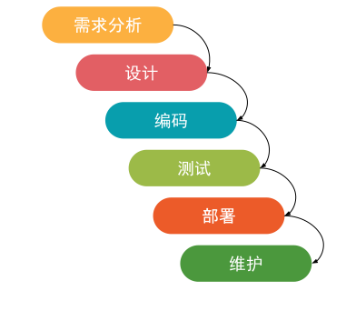
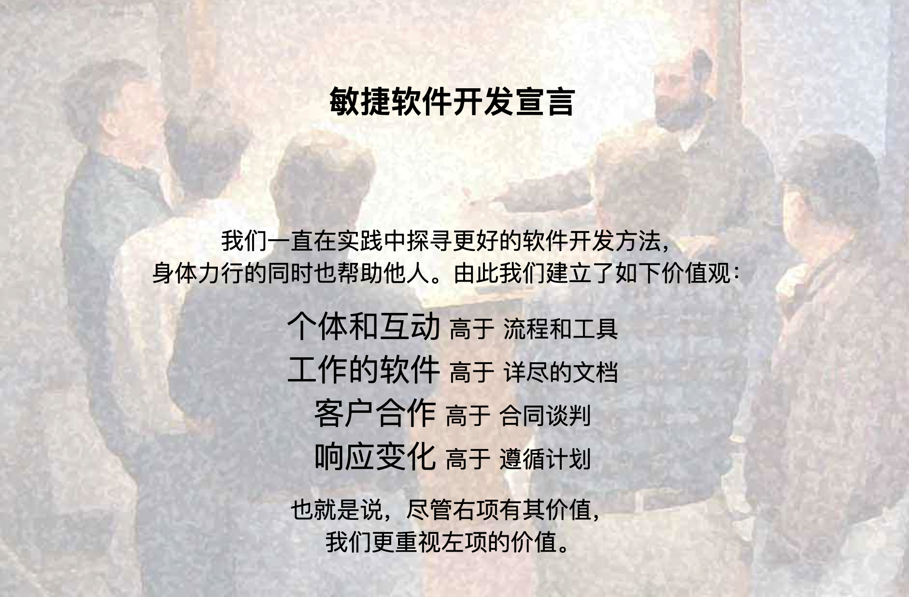
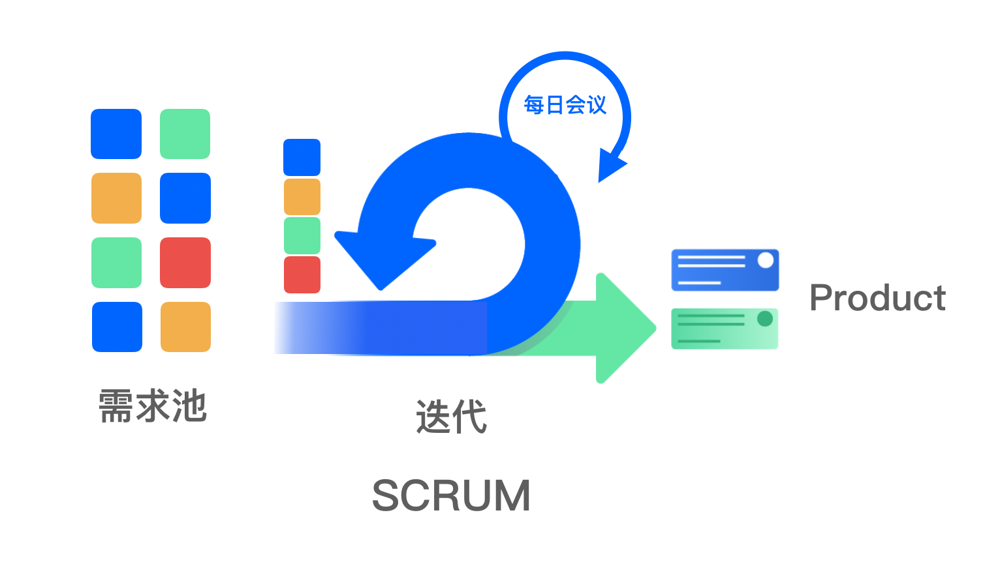
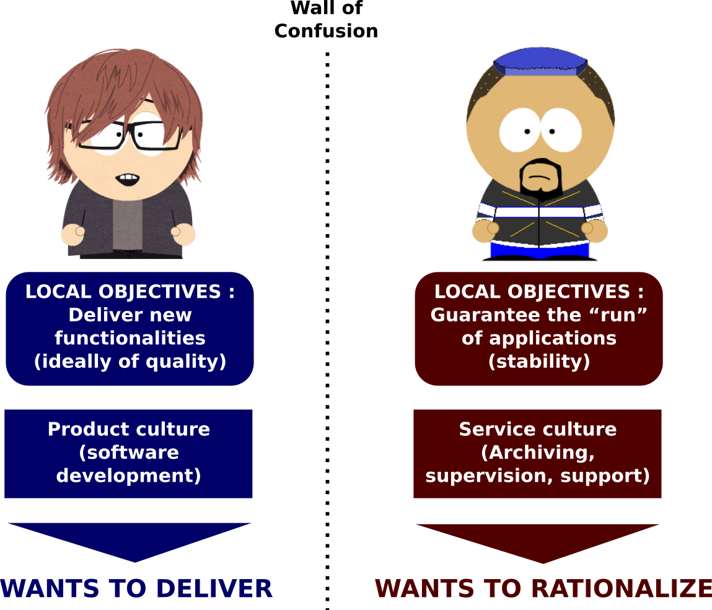
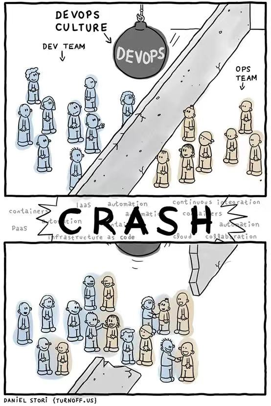
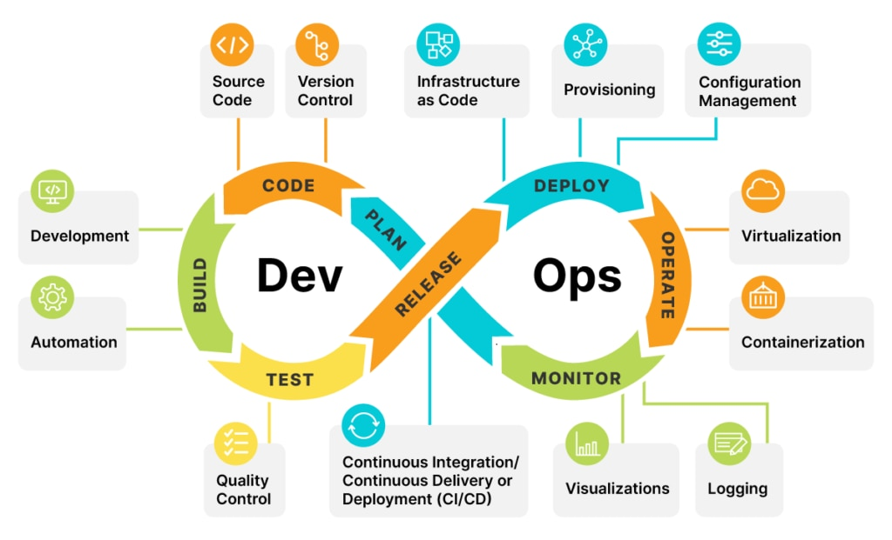

# 1.5.6 DevOps

DevOps 包含很多不同的概念，用几个简短的语句解释 DevOps 无法形成深刻印象，我们延用之前的惯例，如果要理解一个复杂的概念，就先去了解他的历史以及出现的背景。既然 DevOps 的核心目标是解决软件开发生命周期中的管理问题，那么我们就先从一种名为瀑布模型的项目管理方法说起。

## 1.瀑布开发

早在 1970 年，Winston Royce 发表《Managing the development of large software systems》文章内就提出了瀑布模型，该模型下整个软件开发流程严格遵循需求、设计、开发、测试和部署几个阶段，在这个流程中，需要等上一个阶段完成工作后，才会进行下一阶段的工作。这种开发模型下项目开发的进程是由一个阶段“流动”到下一个阶段，如同瀑布流水一般，因而被称为瀑布模型（Waterfall Model），如图 1-32 所示。

	
	
图1-32 瀑布模型

瀑布模型基于工程学的理念将整个过程分成不同的阶段，提供了软件开发的基本框架，便于人员间的分工协作。同时，也可以对不同阶段的质量和成本进行严格把控。
但这种模式存在一些缺陷，因为瀑布模型产生于硬件领域，它是从制造业的角度去看软件开发的，产品迭代的频率经常按月为单位进行，那个需求变化不多的年代，瀑布模型拥有其价值。

随着软件行业的快速爆发，针对市场的快速变化和响应成了新的目标，在这种场景下，风险就是需求无法得到快速验证，有可能花费数月开发的产品早已不符合市场需求。

我们得有一种新的模式来满足对产品生命周期的管理，于是敏捷开发（Agile）开始登上舞台。

## 2.敏捷开发

“敏捷”一词来源于 2001 年，Martin Fowler，Jim Highsmith 等 17 位著名的软件开发专家齐聚在美国犹他州雪鸟滑雪圣地，举行了一次敏捷方法发起者和实践者的聚会。在这次会议上面，他们正式提出了 Agile(敏捷开发)这个概念，并共同签署了《敏捷宣言》，如图 1-33 所示。

	
	
图1-33 敏捷宣言

敏捷意味着效率的提升，相比于传统的瀑布开发，敏捷开发一种迭代式和增量式的开发模式，开发者快速发布一个可运行但不完美的版本投入市场，在后续迭代中根据用户的反馈改进产品，新增一到多个用户可以感知的完整功能，从而逼近产品的最终形态。迭代就是整个理论的核心，坦白的说迭代开发并不是新鲜词汇，但是敏捷研发理论大大完善了迭代开发的理论，使之能够被广大的软件开发团队认可，并开发了具体的实践方法如： Scrum 等，如图 1-34 所示。

	
	
图1-34 敏捷开发模型

虽然敏捷开发提升了开发效率，但它的范围仅限于开发和测试阶段，并没有覆盖到部署端。很显然，运维部门并没有在这其中得到收益，甚至可以说“敏捷”加重了运维的负担。因为运维追求的目标是稳定，而频繁的变更往往就是出现问题的根源。这个就是我们常说的开发与运维之间固有的、根因的冲突，如图1-35 所示的混乱之墙。

	
	
图1-35 开发与运维的混乱之墙

那么如何要化解这个矛盾呢？现在，到 了 DevOps 上场的时间。

## 3.DevOps

DevOps 运动始于 2007 年左右，当时技术社区对开发与运维之间分开工作的方式以及由此引发的冲突感到担忧。随着越来越多问题的出现，大家逐渐认识到，为了按时交付软件产品和服务，开发和运维必须紧密合作。

2009 年，在比利时根特市举办了首届 DevOpsDays 大会，这届会议出乎意料的成功，并引起人们广泛的讨论，DevOps 理论由此诞生。我们先看看维基百科的定义。

:::tip DevOps 的定义
DevOps（Development 和 Operations 的混成词）是一种重视“软件开发人员（Dev）”和“IT 运维技术人员（Ops）”之间沟通合作的文化、运动或惯例。通过自动化“软件交付”和“架构变更”的流程，来使得构建、测试、发布软件能够更加地快捷、频繁和可靠。

https://zh.wikipedia.org/wiki/DevOps
:::

2009 年 DevOps 概念引入之时，基于“Development”和“Operations”合成一个新词“DevOps”，强调开发（指交付前的广义上的研发活动，包括测试等）与运维的融合，目的是实现快速交付价值且具有持续改进能力，其核心是用于打破研发和运维之间的隔阂、加快软件交付流程、提高软件质量。

可以说，DevOps 的出现正是为了打破开发和运维之间的壁垒，这两者得以更加通畅的沟通，以清除部门之间的对立，如图 1-36 所示。

	
	
图1-36 Devops 打破开发和运维的对立

从存在的意义上说，DevOps 完善了敏捷开发存在的短板，实现了真正的闭环，在 DevOps 模式下，开发和运维都不在是“孤立”的团队，两者会在软件的整个生命周期内相互协作，并在工作中得到紧密地配合。由此带来的效益，则是更加高效的服务交付和质量。

不过，话虽如此，要实现这一点却不容易，因为这并非只是一次升级，而是需要在原有的文化和流程上进行大刀阔斧的变革：

1. 首先是推行协作的文化，两者之间不再是对立的关系，而应该是互相协作、深度交流并且彼此体谅的状态。
2. 而在流程方面，以往开发和运维各搞各的模式也需要进行改变。运维会在项目开发阶段就介入，了解开发所使用的系统架构和技术路线，并制定好相关的运维方案。而开发人员也会参与到后期的系统部署和日常发布中，并提供优化建议，而不再是把代码甩给运维了事。

DevOps 的成功实践也离不开工具的支持。这其中就包括最重要的自动化 CI/CD 流水线，通过自动化的方式打通软件从构建、测试到部署发布的整个流程，还有包括实时监控、事件管理、配置管理、协作平台等一系列工具的配合，如图 1-37 所示。

	
	
图1-37 DevOps 体系

近年来，微服务架构理念、容器技术和云计算的发展，让 DevOps 的实施更加便捷。这也解释了为何虽然 DevOps 理念在十多年前就已提出，但直到近几年才开始得到企业的广泛关注和采纳。