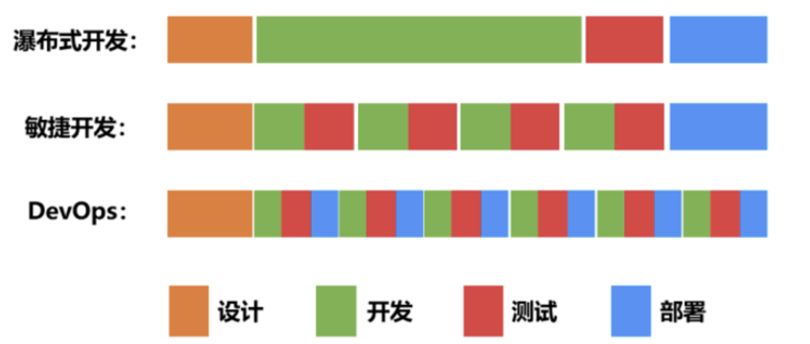

# 1.6.8 DevOps

	
	
图 1-13 Devops

## 1.瀑布开发

《MANAGING THE DEVELOPMENT OF LARGE SOFTWARE SYSTEMS》

## 2.敏捷开发

## 3.DevOps

DevOps的出现正式为了打破开发和运维之间的壁垒，这两者得以更加通畅的沟通，以清除部门之间的对立。

	
	
图 1-13 Devops

DevOps包含很多不同的概念，尝试把DevOps浓缩到一个全面简短的解释就变成了非常困难的事情。DevOps是什么，我们先看看WIKI百科的定义。

:::tip WIKI百科的定义
DevOps（Development和Operations的混成词）是一种重视“软件开发人员（Dev）”和“IT运维技术人员（Ops）”之间沟通合作的文化、运动或惯例。通过自动化“软件交付”和“架构变更”的流程，来使得构建、测试、发布软件能够更加地快捷、频繁和可靠。

https://zh.wikipedia.org/wiki/DevOps
:::

2009年DevOps概念引入之时，基于“Development”和“Operations”合成一个新词“DevOps”，强调开发（指交付前的广义上的研发活动，包括测试等）与运维的融合，要求人们把注意力放在开发和运维的合作商，促进开发、技术运维和QA部门之间的沟通、协作与整合，这属于简要版的DevOps（DevOps lite）。而现在通常意义的 DevOps是强调整个组织的协作和整合（约束理论也是要求优化整体而不是单个的“孤岛”）。超越IT和公司的边界，扩展到HR、财务、供应商和客户。

从上面的定义看，Devops是一套文化理念、实践和工具，而且文化理念更重要，它决定了人们的实践，会促进不同团队之间的沟通和协作，也促进所使用的流程和工具像持续集成/持续交付、流水线的方向改进。为了能实现快速交付、持续交付，需要自动化技术支持，包括自动构建、自动集成、自动测试、自动部署等。

DevOps的成功实践也离不开工具的支持。这其中就包括最重要的自动化CI/CD流水线，通过自动化的方式打通软件从构建、测试到部署发布的整个流程，还有包括实时监控、事件管理、配置管理、协作平台等一系列工具的配合。

- MVP
- CI/CD
- 交付流水线
- 微服务架构
- 基础设施即代码
- 自动化测试
- A/B实验
- 混沌工程
- 持续测试
- 智能监控
- 日志分析
- 可观察性等

近些年微服务架构理念、容器技术、云计算等使得DevOps实施变得更加容器，这也是为什么DevOps早在十几年前就有人提出，但直到近些年才开始受到企业重视的原因。