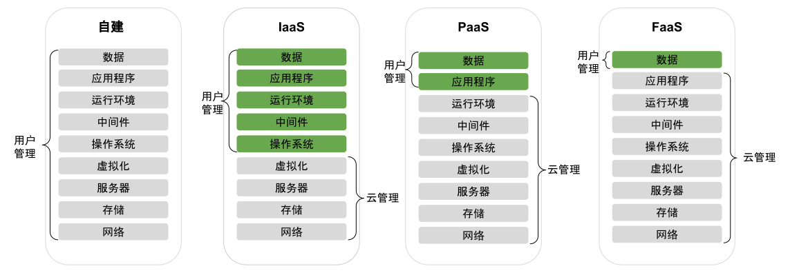

# 1.1 云计算的演进变革

想了解一个新鲜事物为什么会出现，最好的方法是先去了解它出现的背景、发展的历史。

回顾历史，重点不在于考古，而是借历史之名，理解每种技术出现的原因和淘汰的原因，更好地解决今天的现实问题，寻找出未来的技术演进之路。

那么介绍云原生之前，我们先看看过去几十年间，云计算领域的演进历程。

## 1.1.1 物理机时代

云计算历史最远可追溯到 60 多年前的计算机远古时期。

1959 年，Christopher Strachey 在国际信息处理大会上发表《Time Sharing in Large Fast Computer》论文[^1]，论文中首次提出了“虚拟化”的概念，而**虚拟化正是云计算基础架构的核心**，是云计算发展的基础。

:::tip 虚拟化技术简介
虚拟化技术是一种资源管理技术，在各种实体资源（CPU、内存、网络、存储等）之上构建一个逻辑层，从而摆脱物理限制的约束，提高物理资源的利用率。
:::

不过受限于当时技术，虚拟化始终只是一个概念和对未来的畅想，在虚拟化技术成熟之前，市场一直处于物理机时代。当时如果要启用一个新的应用，需要购买一台物理服务器，安装操作系统，配置软件运行环境，最后托管至机房，中间过程复杂且漫长。

在物理机时代，我们看到业务的工作负载是整台物理机，资源没有隔离，也完全没有服务/资源供应商一说。

## 1.1.2 虚拟化技术成熟

Intel 创始人之一 Gordon Earle Moore 曾提出非常有名的摩尔定律，简而言之“每隔18个月，芯片的性能会增加一倍”，也就是计算成本持续呈指数式下降。随着虚拟化技术的出现，我们能够更高效地利用硬件性能提升带来计算资源。这不仅优化了资源分配，还显著降低了企业的 IT 基础设施成本。

如图 1-1 所示，2000 年前后，虚拟化技术逐渐发展成熟。

:::center
  
  图 1-1 虚拟化技术走向成熟
:::

这一时期，云计算的重要里程碑之一是 2001 年 VMware 发布了第一个针对 x86 服务器的虚拟化产品 —— VMware ESX。使用 VMware ESX 之后，可以在一台物理机器上运行多个虚拟机，如果业务需要扩容，那就再开通一个虚拟机，整个过程只要几分钟。

**从虚拟化技术的发展中，我们看到业务的工作负载由物理机转向虚拟机，资源有了初级的隔离，并且分配/利用更加合理**。而且，服务部署的速度和弹性也远超物理机。

## 1.1.3 云计算技术成熟

2006 年 8 月 9 日，Google 首席执行官 Eric Schmidt 在搜索引擎大会（SES San Jose 2006）首次提出“云计算”（Cloud Computing）的概念[^2]，而 Amazon 正是那年推出了 IaaS 服务模型的平台 AWS。

事实上，尽管“云计算”概念在 2006 年已被提出，但直到 2008 年整个行业才迎来爆发式增长。国内云计算的标杆阿里云也在这一年开始筹备和起步。从那以后，云计算正式成为计算机领域最令人关注的话题之一，同时也成为互联网公司研究及发展的重要方向。

虚拟化技术的成熟，使得云计算市场开始真正形成，基于虚拟化技术诞生了众多的云计算产品，陆续出现了 IaaS、PaaS、SaaS 以及公有云、私有云、混合云等多种云服务模型。

:::center
  
  图 1-2 云计算走向成熟
:::

如图 1-2 所示，在这期间出现了云计算领域多个重要里程碑：

- IaaS（Infrastructure as a Service，基础设施即服务）的出现：通过按时计费的方式租借服务器（**卖资源**），将资本支出转变为运营支出，这使得云计算得以大规模兴起和普及。
- PaaS（Platform as a Service，平台即服务）的出现：使开发者不必费心考虑操作系统和开发工具更新或者硬件维护，云服务供应商**由 IaaS 阶段的卖资源进阶为卖服务**。
- 开源 IaaS 的出现：开源云计算平台 OpenStack 简化了云的部署过程并为其带来良好的可扩展性，这使**普通的企业也具备了自建私有云的能力**，云也发展出了多种服务模型：自建私有云、公共云、租赁私有云及混合云等。
- 开源 PaaS 的出现：开源应用平台 Cloud Foundry、OpenShift 能**在混合云、多云乃至边缘的跨平台环境中一致地加快开发和交付应用**。利用这些开源软件，企业内部原来良莠不齐的云架构系统，直接进阶为行业“先进”水准。
- FaaS（Function as a Service，功能即服务）的出现：通过 FaaS，物理硬件、虚拟机操作系统和 Web 服务器软件管理等等全部由云服务供应商自动处理。**无服务器（Serverless）的概念初现，开发者将无需再关注任何服务、资源等基础设施**。

## 1.1.4 容器技术的兴起

**容器技术无疑是过去十年间对软件开发行业影响最深远的技术之一**。

虽然容器技术早已出现，但 Docker 创新性地提出了镜像的概念，实现了一种新型的应用打包、分发和运行机制，这些机制使开发人员能够在几秒钟内进行应用程序的部署和扩展，无需担心环境不一致的问题。
:::tip Docker 的特点

Docker 的宣传口号是“Build,Ship and Run Any App,Anywhere”。

“Run Any App”一举打破了 PaaS 行业面临应用分发和交付的困境，创造出了无限的可能性，大力推动了云原生的发展。
:::

从此，云计算从仅提供计算、存储、网络资源的初级阶段，发展成为具备强大软件交付和维护能力的综合性服务平台。

从虚拟机到容器，云计算市场经历了一次重大变革，甚至可以说是一次洗牌。在基于容器技术的容器编排市场中，Mesos、Swarm 和 Kubernetes 上演了一场史诗级“大战”。凭借先进的设计理念和高度开放的架构，Kubernetes 最终脱颖而出，成为容器编排领域的事实标准。

:::center
  
  图 1-3 容器技术兴起
:::

如图 1-3 所示，这期间有 2 个重要的里程碑：

- 2013 年，Docker 发布，容器逐步替代虚拟机（Virtual Machine，VM），云计算进入容器时代。**容器最大的创新在于容器镜像，它包含了一个应用运行所需的完整环境（整个操作系统的文件系统），具有一致性、轻量级、可移植、编程语言无关等特性，实现 “一次发布，随处运行”（开发、测试、生产），使应用的构建、分发和交付完全标准化**。
- 2017 年底，Kubernetes 赢得容器编排的胜利，云计算进入 Kubernetes 时代。Kubernetes 是 Google 基于内部容器管理系统 Borg 开源的容器编排调度系统，让容器应用从“小打小闹”进入大规模工业生产。**通过采用 Kubernetes 平台，用户不必操心资源管理问题，使基础设施更加标准化，复杂度降低，资源使用率提升**。同时 Kubernetes 也简化了混合云，多云，边缘云等跨数据中心的部署成本。

## 1.1.5 云计算的演进总结

对以上云计算演进总结分析，可以发现以下规律：

- **工作负载的变化**：从早期的物理服务器，通过虚拟化技术演进为虚拟机，再通过容器化技术演进为目前的容器。
- **隔离单元**：无论是启动时间还是单元大小，物理机、虚拟机、容器一路走来，实现了从重量级到轻量级的转变。
- **供应商**：从闭源到开源，从 VMware 到 KVM，到 OpenStack，再到 Kubernetes。从单一供应商到跨越多个供应商，从公有云到自建云，再到混合云。

图 1-5 形象地概述了这二十年云计算的演进过程，从物理机到虚拟机到容器，从 IaaS 诞生到 PaaS、FaaS 一路演进，应用的构建和部署变的越来越轻、越来越快，而底层基础设施和平台则越来越强大，以不同形态对上层应用提供强力支撑。

:::center
  
  图 1-5 XaaS 演进
:::

对于 XaaS 的一路演进，可以简单归纳为：

- 有了 IaaS，客户不用关注物理机器，只需关注基础架构及应用程序。
- 有了 PaaS，客户不用关注基础架构，只需关注应用程序。
- 有了 FaaS，客户只需关注功能和数据。

在过去的二十年间，云计算几乎重新定义了整个行业的格局，越来越多的企业开始降低对 IT 基础设施的直接资本投入，不再倾向于维护自建的数据中心，而是开始通过上云的方式来获取更强大的计算、存储能力，并实现按时按需付费。

这不仅仅降低 IT 支出，同时也降低了整个行业的技术壁垒，使得更多的公司尤其是初创公司可以更快地实践业务想法并迅速推送到市场。

[^1]: 参见 https://archive.org/details/large-fast-computers
[^2]: 实际上更早的在 1961 年 ，世界公认的人工智能之父 John McCarthy 就提出过一个穿越时空的概念 Utility Computing，里面有一个“分时”系统的概念，是公共计算服务的起点，只不过因为技术发展尚不成熟，只是停留在概念阶段。直到 2006 年，技术成熟后，由 Google 提出了云计算，Utility Computing，终于变身为 Cloud Computing。
