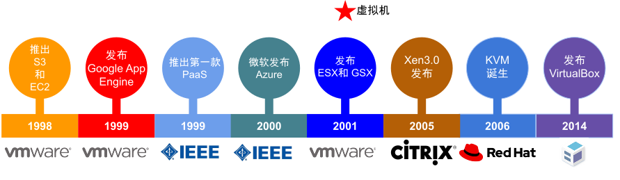
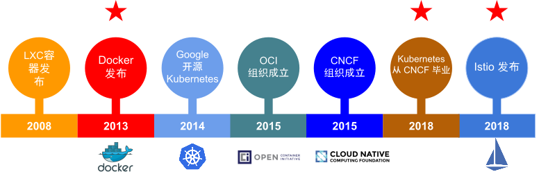
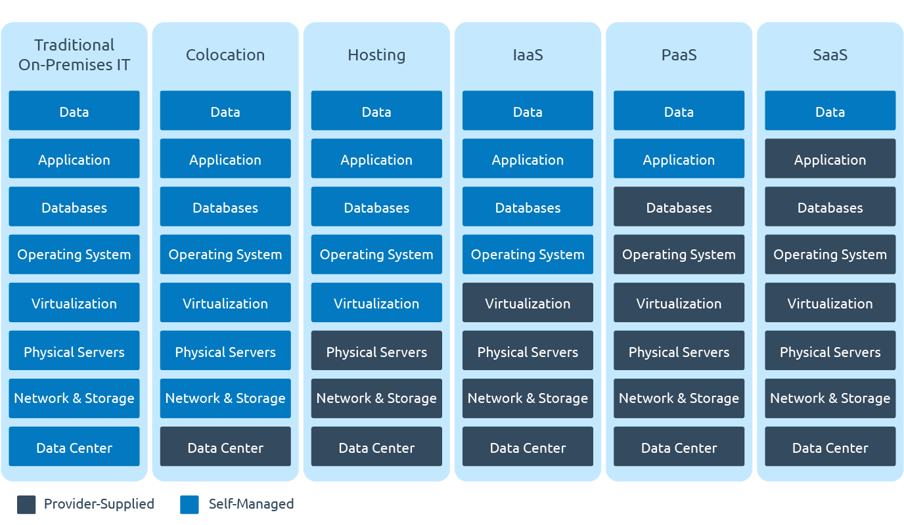

# 1.1 云计算的演进变革

想了解一个新的事物为什么会出现，比如云原生，最好的方法，就是去了解它出现的背景、发展的历史。回顾历史，重点不在于考古，而是借历史之名，理解每种技术出现的原因和淘汰的原因，为了更好地解决今天的现实问题，寻找出未来的技术/架构演进之路。

那么介绍云原生之前，我们先看看过去几十年间，云计算领域的发展演进历程。

云计算历史最远可追溯到 60 多年前的计算机远古时期。1959 年，Christopher Strachey 在国际信息处理大会上发表《Time Sharing in Large Fast Computer》论文，论文中首次提出了“**虚拟化**”的概念，而虚拟化正是云计算基础架构的核心，是云计算发展的基础。

:::tip 虚拟化技术简介
虚拟化技术是一种资源管理技术，在各种实体资源（CPU、内存、网络、存储等）之上构建一个逻辑层，从而摆脱物理限制的约束，提高物理资源的利用率。
:::

不过受限于当时技术，虚拟化始终只是一个概念和对未来的畅想，在虚拟化技术成熟之前，市场一直处于物理机时代，当时如果要启用一个新的应用，需要购买一台或者一个机架的新服务器。

## 1.1.1 虚拟化技术成熟

2000 年前后，虚拟化技术逐渐发展成熟，如图 1-2 所示。

	
	
图1-2 虚拟化技术走向成熟

这一时期，云计算的重要里程碑之一是 2001 年 VMware 发布了第一个针对 x86 服务器的虚拟化产品 -- VMware ESX。通过虚拟化技术，可以在同一台物理机器上运行多个虚拟机，这意味着可以降低服务器的数量，而且速度和弹性也远超物理机。

## 1.1.2 基于虚拟机的云计算成熟

虚拟化技术的成熟，使得云计算市场开始真正出现。

2006 年 8 月 9 日，Google 首席执行官埃里克·施密特（Eric Schmidt）在搜索引擎大会（SES San Jose 2006）首次提出“云计算“（Cloud Computing）的概念，而亚马逊正是那年推出了 IaaS 云服务平台 AWS。

事实上，2006 年虽然首次提出了“云计算“的概念，但直到 2008 年，整个行业才迎来了爆发式的发展，国内云计算标杆阿里云也是从 2008 年开始筹办和起步。从这以后开始，云计算才正式成为了计算机领域最令人关注的话题之一，同时也成为了互联网公司的发展研究的重要方向。

	
	
图1-3 云计算走向成熟

基于虚拟化技术诞生了众多的云计算产品，也陆续出现了 IaaS、PaaS 等以及公有云、私有云、混合云等多种云服务模型。如图 1-3 所示，在这期间出现了云计算领域多个重要里程碑：

- IaaS（Infrastructure as a service，基础设施即服务）的出现：通过按时计费的方式租借服务器（**卖资源**），将资本支出转变为运营支出，这使得云计算得以大规模兴起和普及。
- PaaS（Platform as a service，平台即服务）的出现：使开发者不必费心考虑操作系统和开发工具更新或者硬件维护，云服务提供商由 IaaS 阶段的卖资源进阶为**卖服务**。
- 开源 IaaS 的出现：云计算开始进入**开源时代**。
- 开源 PaaS 的出现：云计算开始推动容器技术兴起。
- FaaS（Function as a Service，功能即服务）的出现：通过 FaaS，物理硬件、虚拟机操作系统和 Web 服务器软件管理等等都由云服务提供商自动处理。无服务器（Serverless）的概念已经初现，开发者将无需再关注任何服务、资源等基础设施。

## 1.1.3 容器的兴起和编排大战

2013 年发生了一件影响深广的技术变革：Docker 降世。 

:::tip Docker 的特点

Docker 创新性地提出了镜像的概念，实现了一种新型的应用打包、分发和运行机制。

Docker 的宣传口号是“Build，Ship and Run Any App，Anywhere”。“Run Any App”一举打破了 PaaS 行业面临应用分发和交付的困境，创造出了无限的可能性，大力推动了云原生的发展。

虽然容器技术早已出现，但在云原生早期阶段，将 Docker 作为容器技术代表实至名归。

:::

**容器技术可以说是过去十年间对软件开发行业改变最大的技术**，也标志着云计算进入了下一个阶段。从虚拟机到容器，整个云计算市场发生了一次重大变革，甚至是洗牌，基于容器技术的容器编排市场，则经历了 Mesos、Swarm、kubernetes 三家的一场史诗大战，最终以 kubernetes 全面胜利而告终。

	
	
图 1-4 容器技术兴起

如图 1-4 所示，这里有三个重要的里程碑：

- 2013 年，Docker 发布，容器逐步替代 VM，云计算进入容器时代。
- 2017 年底，Kubernetes 赢得容器编排的胜利，云计算进入 Kubernetes 时代。
- 2018 年，Istio 正式发布，服务网格（ServiceMesh）从理念走向成熟。

## 1.1.4 云计算演进总结

对云计算演进总结分析，可以发现以下规律：

- 核心构建块的变化：从早期的物理服务器，通过虚拟化技术演进为虚拟机，再通过容器化技术演进为目前的 container。
- 隔离单元：无论是启动时间还是单元大小，物理机、虚拟机、容器一路走来，实现了从重量级到轻量级的转变。
- 供应商：从闭源到开源，从单一供应商到跨越多个供应商。

图 1-6 形象地概述了这二十年云计算的演进过程：从传统预制 IT、托管到云，以及云服务模型不同的形态如 IaaS、PaaS、SaaS 等。

	
	
图 1-6 XaaS 演进 

对于 XaaS 的一路演进，可以简单归纳为：

- 有了 IaaS，客户不用关注物理机器，只需关注基础架构及应用程序。
- 有了 PaaS，客户不用关注基础架构，只需关注应用程序。
- 有了 SaaS，客户只需关注功能。

在这过去的二十年间，云计算几乎重新定义了整个行业的格局，越来越多的企业开始降低对 IT 基础设施的直接资本投入，不再倾向于维护自建的数据中心，而是开始通过上云的方式来获取更强大的计算、存储能力，并实现按时按需付费。这不仅仅降低 IT 支出，同时也降低了整个行业的技术壁垒，使得更多的公司尤其是初创公司可以更快地实践业务想法并迅速推送到市场。
