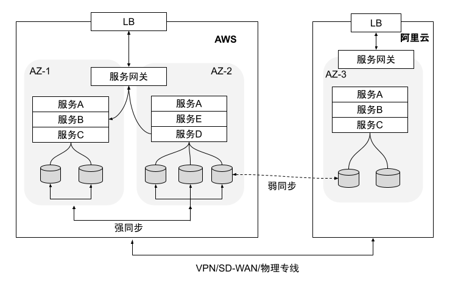
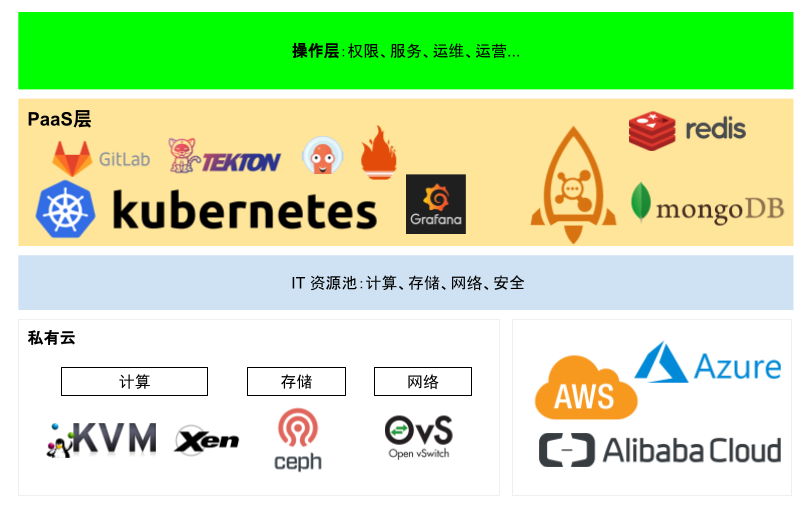

# 1.6 进阶混合云架构

在本章 1.5 节介绍 PaaS 架构时，在图 1-9 中有一个融合层，这也是我们常谈的跨云多活（混合云架构）。

	
	
图 1-13 多云下多活示例

混合云使最近几年经常被提及的新的云架构体系。混合云（hybrid cloud）是由两个或两个以上的云（私有云、公有云）组成，这些云各自独立，通过一些标准化的技术或者专有技术绑定在一起，实现了数据和服务在云之间的可移植性。

混合云可以被理解为一种融合的云架构，将不同环境的资源通过技术手段尽可能无缝地连接起来，进而实现应用在多个云之间的的移植、编排和管理。除技术性的优点外，在我看来，**使用混合云架构可以使你的业务具备云之间的迁移能力，从而大大提高和云商的议价能力**。

	
	
图 1-14 多云下的云平台架构

对于业务是否采用多云架构，取决于业务形态和规模，当业务规模比较小的时候，单云是最好的选择，这样可以保证轻装快跑，聚焦于业务。当业务规模较大，或者要求金融级的高可用，那么就需要尝试多云下的架构设计。除此之外，一个完整的全链路监控，是做好跨云多活的前提，没有一个完整的全链路监控，很难做到核心场景访问链路梳理。

还有核心的一点，多活架构下需要持续不断的故障容灾演练演练，提前发现并解决问题，并持续沉淀解决预案。

总结使用混合云架构的优点：

- 充分利用私有云的数据安全。
- 实现跨云之间的高可用
- 可以利用公有云多域特点实现跨物理地点的多地域备份，为数据安全提供更好的保障。
- 利用公有云海量算力解决私有云瞬时算力不足问题。
- 业务具备云迁移，对云商有更强的议价能力。