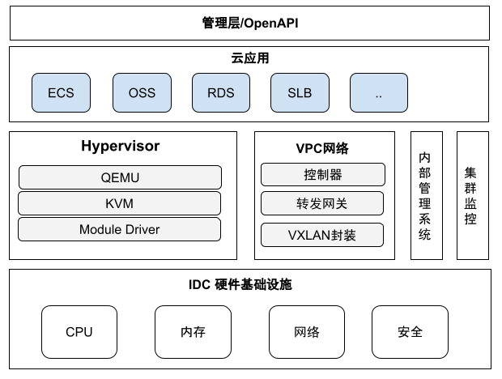
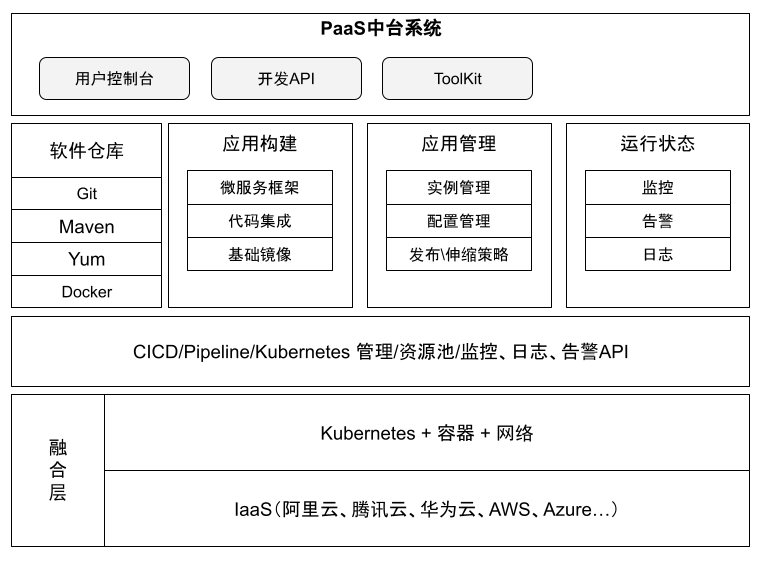

# 1.3 云架构方案选型

云计算凭借高可用、易维护、弹性、低成本的特性成为企业数字化首选的技术基础设施，企业技术架构只有和云结合，尽量符合云原生架构，才能更好、更灵活地支持业务发展。

按照云计算的服务类型（较成熟的交付方式）可分为 IaaS、PaaS。

## IaaS 层架构

从技术角度讲，IaaS（Infrastructure as a Service，基础设施即服务）是基于 KVM、Xen 等各类虚拟化软件，并抽象隔离计算、网络、存储等资源一种基础设施服务交付形式。

	
	
图 IaaS 技术架构

## PaaS 层架构

在云原生时代，应用从原来有状态的单体架构逐渐演变成微单元化的无状态微服务架构，无状态、容器化，并且结合 DevOps 技术快速迭代，在这个阶段，对云计算提供的服务形式有了新的转变。更多的是考虑平台服务，资源的束缚的摆脱以及直接面向服务、运维和管理的程序化操作。

伴随着容器技术和 Kubernetes 技术的兴起，云原生系列的技术体系
为 PaaS（Platform as a Service，平台即服务）的实现提供了一种新的途径，通过将业务代码打包到容器镜像，再通过 Kubernetes 容器调度和运行管理对外提供服务，并且可以自动伸缩、滚动升级等。

在新的平台服务方式下，PaaS 屏蔽了各 IaaS 差异，提供了混合云（公有云+公有云、公有云+私有云）之上的 PaaS 层服务 将过管理的对象从资源升级到服务，并自动化编译构建以及自动化服务运维等，更深层次的服务。

	
	
图 PaaS 技术架构

