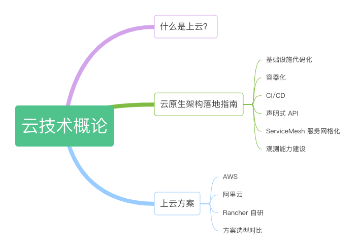

# 第一章：云原生技术概论

如果 5 年前笔者讲 Serverless（无服务器架构），读者朋友们一定会认为我是个大忽悠，又再造虚无缥缈的概念。可是，质疑阻挡不了技术推陈出新，对于脚步慢的企业/个人，新技术往往从最开始的“看不见”，到后来“看不起”，再到“看不懂”，最后终于“跟不上”。笔者并不是在危言耸听，云计算尽管有许多优势，但应用中也充满了陷阱、歧义和谬误，君不见现在网络中也充斥着下云、ServiceMesh 没用的言论？

吴军老师在 《浪潮之巅》中讲”无数企业终究会因为无法跟上时代的步伐，熬不过考验而黯然消逝或者落幕，同时又有无数企业因为踏准了新时代的节奏，立于浪潮之巅“，
笔者妄自下个定义 ”云原生就是新时代的节奏“。

云原生技术的变革，一定是思想先行，只有从解决问题的角度出发才能真正理解。在本章，我们先充分了解云原生出现的背景、目标以及云原生应用技术代表，如图 1-1 所示。了解这些内容之后，在后续章节我们逐渐开始云原生架构实践之旅。

	
	
图 1-1 本章内容导读

