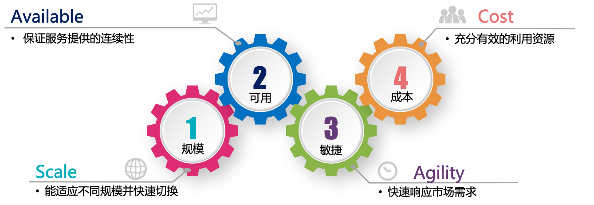
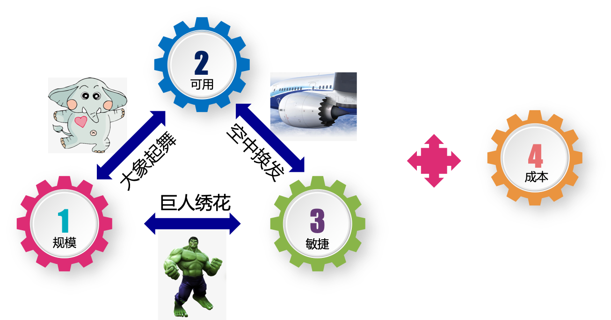

# 1.4 云原生的目标

根据前面对云计算历史的追溯，对云原生出现背景的分析，以及对不同时期云原生定义的回顾总结，这里给出云原生的几个关键目标，如图-13 所示。

	
	
图1-13 云原生技术的关键目标

- 可用（Available）：通过各种机制来实现应用的高可用，以保证服务提供的连续性。
- 规模（Scale）：要求云原生服务能够适应不同的规模（包括但不限于用户规模/部署规模/请求量），并能够在部署时动态分配资源，以便在不同的规模之间快速和平滑的伸缩。典型场景如：
	- 初创公司或新产品线快速成长，用户规模和应用部署规模在短时间内十倍百倍增长。
	- 促销、季节性、节假日带来的访问量波动。
	- 高峰时间段的突发流量等。
- 敏捷（Agility）：快速响应市场需求。
- 成本（Cost）：充分有效的利用资源。

这 4 个核心目标之间，存在彼此冲突的情况，如图-14 所示。

	
	
图1-14 云原生关键目标冲突关系

- 规模和敏捷之间的冲突：规模大而又要求敏捷，我们比喻为“巨人绣花”。
- 规模和可用性之间的冲突：规模大而要求可用性高，我们比喻为“大象起舞”。
- 敏捷和可用性之间的冲突：敏捷而要求高可用，我们比喻为“空中换发”。

而云原生架构必须要在同时满足这 3 个彼此冲突目标的前提下，还要实现成本控制。

了解云原生目标之后，下面几节开始探讨云原生的代表技术和 DevOps 方法论以实现上面 4 个核心目标。