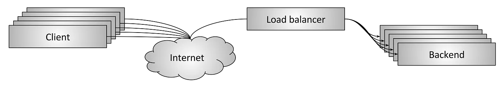
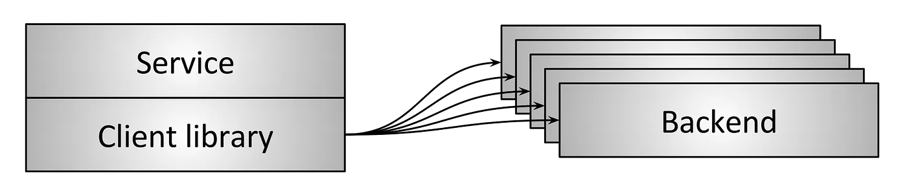
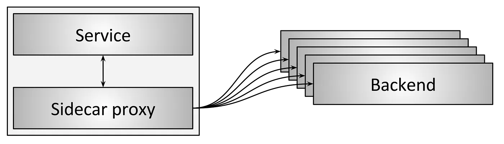

# 4.2 负载均衡拓扑类型

前面我们简单介绍了负载均衡的概览以及特点，接下来介绍它的几种分布式部署拓扑。

首先介绍的是**中间代理拓扑**，这也是大家最最熟悉的负载均衡方式，这一类型的硬件方案包括 Cisco、Juniper、F5 等公司的产品，软件方案包括 HAProxy、Nginx、Envoy 等。

中间代理模式的优点是简单，用户只需要通过 DNS 连接到负载均衡器，其他的事情就不用再关心。缺点是这种模式下负载均衡器（即使后端已经做了集群）是单点的，而且横向扩展有瓶颈。

	
	
图4-3 中间代理

第二种**边缘代理拓扑**是中间代理拓扑的一个变种，一般采用分级的方式部署。第一级部署在网络边缘部署四层均衡器，第二级部署能识别应用协议的七层代理负载均衡，一般二级的负载均衡器还要提供额外的 “API 网关”功能，例如 TLS termination、限速、鉴权，以及复杂的流量路由等等。

	
	
图4-5 边缘代理类型

边缘代理拓扑是互联网架构常用负载均衡部署方式。

3. 客户端内嵌库

	
	
图4-5 中间代理

为了解决中间代理拓扑固有的单点和扩展问题，出现了一些更复杂的方案，例如将负载均衡器已函数库的形式内嵌到客户端，如图 6 所示。这些库支持的特性差异非常大，最知名的库包括 Finagle、 Eureka/Ribbon/Hystrix、gRPC。

这种解决方案的主要优点是它完全将负载均衡器的所有功能分布到每个客户端上，从而消除了单点故障和扩展问题。主要缺点是每种使用的语言都要实现一遍。分布式架构越来越“多语言”。在这种环境下，实现一个非常复杂的网络库的成本相当大。最后在大型服务架构上部署一次升级可能非常痛苦，生产环境中可能同时运行许多不同版本的库，增加操作的心智负担。

4. sidecar 代理

	
	
图4-5 中间代理

客户端内嵌库拓扑的一个变种是 sidecar 拓扑，如图 7 所示。近年来这种拓扑非常流行， 被称为服务网格（service mesh）。sidecar 代理模式背后的思想是： 将流量导到另一个进程，牺牲一点（延迟）性能，实现客户端内嵌库模式的所有好处，而无任何语言绑定（language lock-in）。

不同拓扑类型的优缺点比较

- 中间代理拓扑是最简单的负载均衡方式，缺点是单点故障、扩展性问题、以及黑盒运维
- 边缘代理拓扑和中间代理拓扑类似，但一些场景必须得用这种模式
- 客户端内嵌库拓扑提供了最优的性能和扩展性，但必须为每种语言实现相应的库，并且升 级非常痛苦
- sidecar 代理拓扑性能不如客户端内嵌库好，但没有后者的那些缺点

总体上我认为在 service-to-service 通信中， sidecar （service mesh）正在逐渐取代 其他所有拓扑类型。另外，在流量进入 service mesh 的地方，总是需要一个边缘代理拓扑 负载均衡器。
