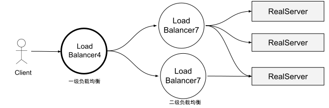
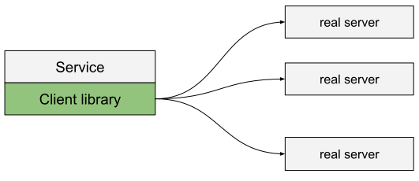
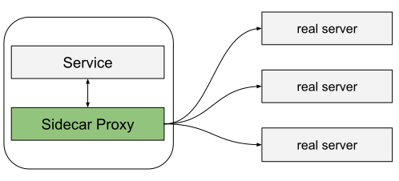

# 4.2 负载均衡拓扑类型

前面我们简单介绍了负载均衡的概览以及特点，接下来介绍它的几种分布式部署拓扑。

首先介绍的是**中间代理拓扑**，这也是大家最最熟悉的负载均衡方式，这一类型的硬件方案包括 Cisco、Juniper、F5 等公司的产品，软件方案包括 HAProxy、Nginx、Envoy 等。中间代理模式的优点是简单，用户只需要通过 DNS 连接到负载均衡器，其他的事情就不用再关心。缺点是这种模式下负载均衡器（即使后端已经做了集群）是单点的，而且横向扩展有瓶颈。

	
	
图 4-3 中间代理拓扑

第二种**边缘代理拓扑**是中间代理拓扑的一个变种，一般采用分级的方式部署，如图 4-4 所示。第一级是网络边缘部署四层均衡器，第二级是能识别应用协议的七层代理负载均衡，现代分布式的架构还要求二级的负载均衡器提供额外的 “API 网关”功能，例如 TLS termination、限速、鉴权，以及复杂的流量路由等等。现在，几乎所有的现代大型分布式系统都是在公网流量入口使用 L4/L7 两级负载均衡架构。

	
	
图 4-4 边缘分级负载均衡拓扑

第三种**客户端嵌入**的方式相信读者们也非常熟悉，这种方式将负载均衡器以函数库/SDK的形式内嵌到客户端，如图 4-5 所示，知名的库包括 Finagle、 Eureka/Ribbon/Hystrix、gRPC。这种解决方案的主要优点是它完全将负载均衡器的所有功能分布到每个客户端上，从而消除了单点故障和扩展问题。缺点是每种使用的语言都要实现一遍。分布式架构越来越“多语言”，在大型服务架构上部署一次升级可能非常痛苦，生产环境中可能同时运行许多不同版本的库，增加操作的心智负担。

	
	
图 4-5 客户端嵌入类型

客户端内嵌库拓扑的一个变种是 **Sidecar 拓扑**（没错，笔者在 1.5.3 节就提过 Sidecar 本质是一种代理），如图 4-6 所示。近年来这种拓扑非常流行，被称为服务网格（service mesh）。sidecar 代理模式背后的思想是： 将流量导到另一个进程，牺牲一点（延迟）性能，实现客户端内嵌库模式的所有好处，而无任何语言绑定。

	
	
图 4-6 Sidecar 拓扑类型

总体上中间代理类型正在逐渐升级为功能更为庞大的网关方案，而在处理东西向流量（Service-to-Service）中，随着云原生架构的流行，Sidecar（服务网格）也在逐渐取代客户端嵌入拓扑类型。
