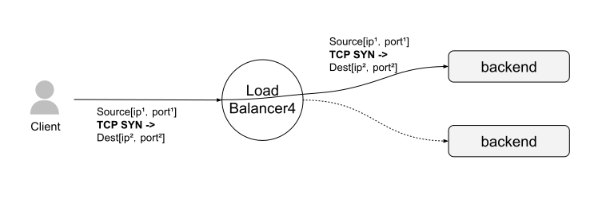
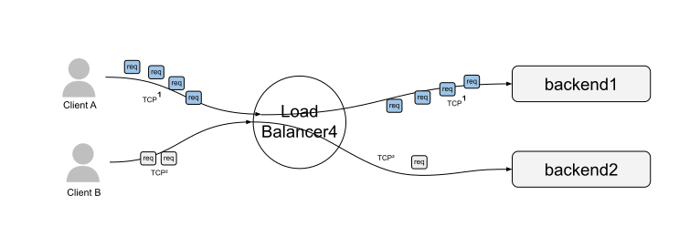

# 4.1 负载均衡与代理

在讨论负载均衡时，"负载均衡器"（Load Balancer）和"代理"（Proxy）这两个术语常被混用。严格来说，并非所有代理都属于负载均衡器，但大多数代理的核心功能都涵盖负载均衡。为方便表述，本文对这两个术语不作严格区分，将其视为大致等同的概念。

图 4-1 展示了负载均衡的高层架构，其中客户端（Client）的请求通过负载均衡器（Load Balancer）转发到某个后端服务器（Backend）。从整体架构来看，负载均衡器作为核心组件，主要承担以下职责：

- **服务发现**：识别系统中可用的后端服务器，并获取它们的地址，以便与后端进行通信。
- **健康检查**：监测后端服务器的状态，确保只有健康的服务器能够接收请求。
- **负载均衡**：根据适合的分配算法，将请求均匀分配到健康的后端服务器上，提高系统的整体性能与可靠性。

:::center
   
 图 4-1 负载均衡高层架构图
:::

合理使用负载均衡能为分布式系统带来多方面的好处：

- **命名抽象**：客户端通过统一的访问机制（如 DNS 或内置库）连接到负载均衡器，无需关心后端服务器的拓扑结构或配置细节。
- **容错能力**：通过健康检查和负载均衡算法，将请求分配至正常运行的后端服务器。故障服务器会被自动移出负载均衡池，为运维人员提供足够的修复窗口。
- **成本和性能收益**：后端服务器通常分布在多个网络区域（Zone/Region），负载均衡器根据策略将请求保持在同一网络区域内，从而提高服务性能（减少延迟）并降低资源成本（减少跨区域带宽费用）。

笔者无法详述各类负载均衡系统的原理与区别，但从处理请求的网络层次角度看，所有的负载均衡器可归纳为两大类：四层负载均衡和七层负载均衡，分别对应 OSI 模型的第四层（传输层）和第七层（应用层）。

## 4.1.1 四层负载均衡

需要注意的是，“四层负载均衡”并非严格限定于 OSI 模型的第四层（传输层）。实际上，它的工作模式涉及多个网络层次：
- 第二层（数据链路层）：通过修改 MAC 地址完成请求的转发。
- 第三层（网络层）：通过修改 IP 地址实现请求的路由和转发。
- 第四层（传输层）：通过修改 UDP 或 TCP 的端口和连接地址，以网络地址转换（NAT）的方式实现请求分发。

四层负载均衡的共同特点是维持传输层协议（如 TCP、UDP）的连接特性。如果读者在其他资料中遇到“二层负载均衡”或“三层负载均衡”的说法，应理解为指负载均衡器在不同网络层次上工作的方式

图 4-2 展示了四层负载均衡器的工作模型，客户端首先建立一个 TCP 连接，负载均衡器根据策略选择合适的后端服务器，并将客户端的 TCP 连接转发至该服务器。

:::center
   
 图 4-2 四层负载均衡器“转发”客户端的 TCP 连接
:::

典型情况下，四层负载均衡器处理的是 TCP、UDP 等连接协议，它并不关心传输字节所代表的具体应用内容，这些字节可能来自 Web 应用、数据库服务或其他网络服务。因此，四层负载均衡器具有广泛的应用范围，能够适应各种不同类型的网络服务。

由于建立连接的开销较大（例如 TCP 三次握手，尤其在启用 TLS 加密时），许多网络协议（如 TCP、HTTP/2、QUIC 和 WebSockets）在演进过程中逐步引入了“多路复用”（multiplexing）和“连接保持”（connection keep-alive）等特性，以减少连接开销。为了实现“连接保持”，四层负载均衡器确保同一连接或会话的流量始终转发到相同的后端服务器，从而避免频繁的连接建立过程。

仔细思考，“连接保持”机制存在一个潜在问题，以下是一个示例场景：

- Client A 和 Client B 两个 HTTP/2 客户端通过四层负载均衡器和后端服务器建立持久连接。。
- Client A 的 TCP 连接每分钟发送 40 个 HTTP 请求，而 Client B 的 TCP 连接每秒发送 1 个 HTTP 请求。

四层负载均衡器通过哈希算法（如 IP 源地址哈希）将 Client A 的所有 TCP 请求定向到同一台服务器，导致该服务器过载，而其他服务器则处于闲置状态。这种资源利用不均的问题在电气工程和信号传输领域被称为“阻抗不匹配”现象。

:::center
   
  图 4-3 四层负载均衡器下的“连接保持”问题
:::

随着用户规模扩大，四层负载均衡器面临的“阻抗不匹配”问题将变得更加明显。不过也不要担心，引用一句计算机领域内流传颇广的俚语：

:::tip <a/> 
计算机科学中的所有问题都可以通过增加一个间接层来解决。如果不够，那就再加一层。
:::

引入七层负载均衡器作为四层负载均衡器的二级分发器，可以有效缓解这一问题：

- 四层负载均衡器在传输层，根据连接特性完成初步的请求转发；
- 七层负载均衡器在应用层，根据请求内容进一步优化请求转发。

## 4.1.2 七层负载均衡

七层负载均衡器工作在应用层，这意味着它需要通过建立新的传输层连接，将请求代理至后端服务器。如图 4-4 所示，七层负载均衡的代理模式如下，客户端与七层负载均衡器建立一个 HTTP/2 连接，七层负载均衡器分别与两个业务后端建立连接。当客户端发送 HTTP 请求（stream）时：

- 请求 1（stream1）被代理至第一个后端服务器；
- 请求 2（stream2）被代理至第二个后端服务器。
:::center
   
  图 4-4 七层负载均衡器新建 TCP 连接至后端服务器
:::

七层负载均衡器工作在应用层，因此能够检测和处理请求内容，包括：

- 安全层 TLS 协议：TLS 的归属层次在网络领域存在争议，本文为便于讨论假设属于应用层。
- 物理 HTTP 协议：涵盖 HTTP/1、HTTP/2、HTTP/3 等版本。
- 逻辑 HTTP 协议：包括请求的头部、主体和尾部数据。
- 消息协议：如 gRPC、RESTful API、SOAP、AMQP、MQTT 等。

与四层负载均衡器进行简单的连接转发不同，七层负载均衡器能够执行更复杂的操作。例如，它可以根据 URL、请求方法、Cookie 等应用层信息做出更精细的路由决策，并支持内容缓存、压缩、TLS/SSL 卸载等高级功能。
