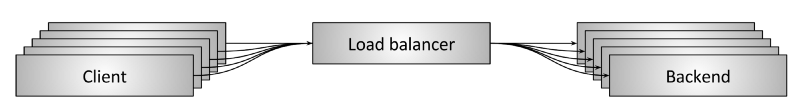

# 4.1 负载均衡概述

业内讨论网络负载均衡器的时候，负载均衡器（load balancer）和代理（proxy）两个术语经常无差别混用。本文继续沿用这种惯例，认为二者整体上是对等的。

:::tip 注意

严格来讲，不是所有代理都是负载均衡器， 但绝大部分代理的核心功能都包括负载均衡。
:::

图 4-1 展示了负载均衡的高层架构，客户端（Client）通过负载均衡器（Load Balancer）访问后端服务器（RealServer）。从整体架构来看，中间的负载均衡器承担下述职责：

- **服务发现**：识别系统中可用的后端服务器，并获取它们的地址，以便负载均衡器与后端通信。
- **健康检查**：确定哪些后端服务器处于健康状态并能够接收请求。
- **负载均衡**：基于适当的算法将请求均匀分配到健康的后端服务器上。

:::center
   
 图 4-1 负载均衡高层架构图
:::

合理使用负载均衡能为分布式系统带来诸多好处：

- **命名抽象**：客户端通过预设机制（如 DNS 或内置库）访问负载均衡器，而无需了解后端服务器的拓扑结构或配置。
- **容错**：通过健康检查和多种负载均衡算法，将请求均匀转发至正常的后端服务器，故障服务器则会被移出负载均衡池，便于运维人员从容修复。
- **成本和性能收益**：分布式系统通常是异构的，后端服务器分布在多个网络区域（Zone/Region）。负载均衡器通过策略优先将请求保持在同一网络区域内，从而提高服务性能（减少延迟）并降低资源成本（减少跨区域带宽费用）。

## 四层负载均衡

若从网络层处理请求的层面看，所有的负载均衡可总结为两类：4 层负载均衡和 7 层负载均衡，这两者分别对应 OSI 模型的 4 层和 7 层。

四层负载均衡器工作在传输层，处理的是 TCP、UDP 这样的连接协议。

创建连接的开销很大（如 TCP 的三次握手，特别是在启用 TLS 加密时），大多数网络协议（如 TCP、HTTP/2、QUIC 和 WebSockets）在演进过程中支持多路复用（multiplexing）和连接保持（connection keep-alive）特性，以减少连接开销。四层负载均衡器为了实现“会话保持”，会将同一连接（connection）或会话（session）的字节流量始终转发至同一后端服务器。

仔细思考，上述的机制存在一个缺陷。以下是一个示例场景：

- 两个 HTTP2 客户端 A 和 B 通过四层负载均衡器和后端服务器建立连接。
- 四层负载均衡器为每个来自客户端的连接建立一个到后端服务器的连接，因此存在多个进来的连接和多个出去的连接。
- 客户端 A 的连接每分钟发送 40 个请求，而客户端 B 的连接每秒发送 1 个请求。

:::center
   
  图 四层负载均衡器“阻抗不匹配”问题
:::

上述的现象称为“阻抗不匹配”问题。

**四层均衡器为了实现“会话保持”，会根据哈希算法（如 IP 源地址哈希）将 A 客户端同一个 TCP 会话内的请求集中到某一台服务器上（图中的 RealServer1），这台服务器可能会异常繁忙，而其他服务器则处于闲置状态**。因此，随着用户规模的扩大，四层负载均衡器所面临的“阻抗不匹配”问题将变得愈发明显。

不过也不要担心，如计算机专家 David Wheeler 所言：

:::tip <a/> 

计算机科学中的所有问题都可以通过增加一个间接层来解决。如果不够，那就再加一层。

:::

在四层负载均衡器之后添加一个二级七层负载均衡器。首先，四层负载均衡器在传输层进行初步流量分发；随后，七层负载均衡器在应用层对请求进行更细化的分发，从而有效解决“阻抗不匹配”的问题。

## 七层负载均衡

因为数据已经被送至应用层，七层负载均衡的工作模式**只能通过建立新连接的方式将请求代理至**后端业务服务器。七层负载均衡的工作模式如图 4-13 所示。客户端与七层负载均衡器建立一个 HTTP/2 TCP 连接，七层负载均衡器和两个业务后端建立了两条独立的连接。

:::center
   
  图 4-13 七层负载均衡器在客户端和后端服务器之间充当代理角色
:::

当七层负载均衡器发送两个 HTTP/2 请求（stream）时：
- 请求1（stream1）被代理至 RealServer1；
- 请求1（stream2） 被代理至 RealServer2。

七层负载均衡模式下，负载均衡器解析应用层内容，根据 URL、请求方法、Cookie 等应用层信息进行更精细的路由决策。因此，即使不同客户端的请求数量差异巨大，这些请求也可以被平衡代理至各个业务后端。之前提到的四层负载均衡“阻抗不匹配”问题，在七层代理模式下被妥善的解决了。

