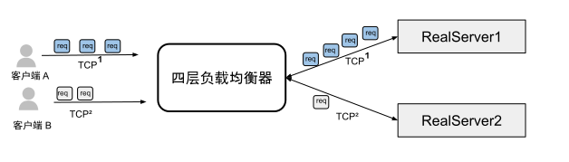

# 4.3.3 四层负载均衡小结

四层负载均衡器不会感知转发字节所属于的具体应用。这些字节可能来自于 Web 应用、数据库服务或其他网络服务。因此，四层负载均衡器“支持”所有的网络协议，具有广泛的应用范围。

由于创建连接的开销较大（如 TCP 的三次握手，特别是在启用 TLS 加密时），大多数网络协议（如 TCP、HTTP/2、QUIC 和 WebSockets）在演进过程中支持多路复用（multiplexing）和连接保持（connection keep-alive）特性，以减少连接开销。四层负载均衡器为了实现“会话保持”，会将同一连接（connection）或会话（session）的字节流量始终转发至同一后端服务器。

仔细思考，上述的机制存在一个缺陷。以下是一个示例场景：

- 两个 HTTP2 客户端 A 和 B 通过四层负载均衡器和后端服务器建立连接。
- 四层负载均衡器为每个来自客户端的连接建立一个到后端服务器的连接，因此存在多个进来的连接和多个出去的连接。
- 客户端 A 的连接每分钟发送 40 个请求，而客户端 B 的连接每秒发送 1 个请求。

:::center
   
  图 四层负载均衡器“阻抗不匹配”问题
:::

上述的现象称为“阻抗不匹配”问题。

**四层均衡器为了实现“会话保持”，会根据哈希算法（如 IP 源地址哈希）将 A 客户端同一个 TCP 会话内的请求集中到某一台服务器上（图中的 RealServer1），这台服务器可能会异常繁忙，而其他服务器则处于闲置状态**。因此，随着用户规模的扩大，四层负载均衡器所面临的“阻抗不匹配”问题将变得愈发明显。

不过也不要担心，如计算机专家 David Wheeler 所言：

:::tip <a/> 

计算机科学中的所有问题都可以通过增加一个间接层来解决。如果不够，那就再加一层。

:::

在四层负载均衡器之后添加一个二级七层负载均衡器。首先，四层负载均衡器在传输层进行初步流量分发；随后，七层负载均衡器在应用层对请求进行更细化的分发，从而有效解决“阻抗不匹配”的问题。

