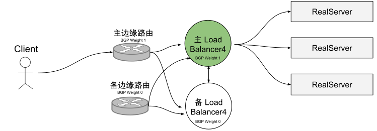
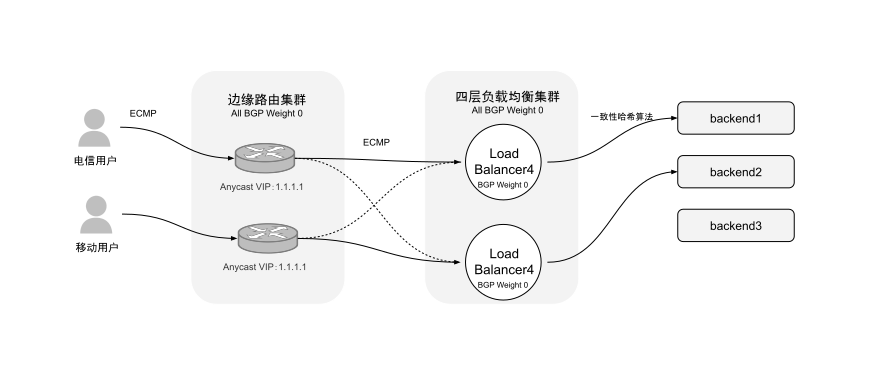

# 4.3.2 四层负载均衡高可用设计

到目前为止，我们讨论的都是单个四层负载均衡器的设计以及工作模式，假如这个负载均衡器在生产环境中宕机了呢？事实上，四层负载均衡器大都作为大型分布式系统的唯一对外入口，如果四层负载均衡器是单节点部署，一旦宕机，对于整个系统而言绝对是毁灭级别的故障。

负载均衡器高可用设计有多种方案，我们先来看目前最常见（也是逐渐被淘汰的）的**主备方式**。如图所示，这种高可用方案典型的设计是一对主备边缘路由器提供若干 VIP（virtual IP，虚拟 IP），并通过 BGP 协议通告 VIP，主边缘路由器的 BGP 权重比备边缘路由器的高，正常情况下处理所有流量；类似地，主四层负载均衡器向边缘路由器宣告它的权重比备用四层负载均衡器大，正常情况下主四层负载均衡器处理所有流量；主备四层负载均衡器之间交叉连接， 共享所有的连接跟踪状态，假如主挂了，备可以马上接管所有活动连接。

	
	
图4-11 负载均衡主备设计

主备方式的方案在现今的分布式系统中仍然有大量应用，但这种方式存在明显的缺陷。主备方式平稳状态下 50% 的容量是空闲的，备用服务器一直空转，**资源利用率不足**。其次，现代分布式系统设计**一直追求更高的容错性**。例如，理想情况下一个系统有多个实例同时挂掉仍能继续运行，而主备实例同时挂掉时，服务就彻底挂了。

接下来我们再看**基于集群的一致性哈希容错和可扩展设计方案**。它的工作原理如图所示。

	
	
图4-12 负载均衡高可用设计

- 多个边缘路由器以相同的 BGP 权重通告所有 Anycast VIP，通过 ECMP（Equal-cost, Multi-path routing）保证每个 flow 的所有包都会到达同一个边缘路由器。
- 多个四层负载均起以相同的 BGP 权重向所有的边缘路由器通告所有的 VIP 继续使用 ECMP 的方式为相同 flow 的包选择相同的四层负载均衡器。
- 每个四层负载均衡器实例会做部分连接跟踪（connection tracking）工作，然后使用一致性哈希为每个 flow 选择 一个后端。通过 GRE 封装将包从负载均衡器发送到后端。
- 然后使用 DSR 将应答包从后端直接发送到边缘路由器，最后到客户端。

我们可以看到以上的设计如何避免主备方式的不足：边缘路由器和负载均衡器实例可以按需添加。因为每一层都用到了 ECMP，当新实例加入的时候，能最大程度地减少受影响的 flow 数量；在预留足够的突发量和容错的前提下，系统的资源利用率想达到多高就可以到多高。

各类云厂商中的 SLB，以及绝大部分的现代四层负载均衡系统都在朝着这种设计演进。
