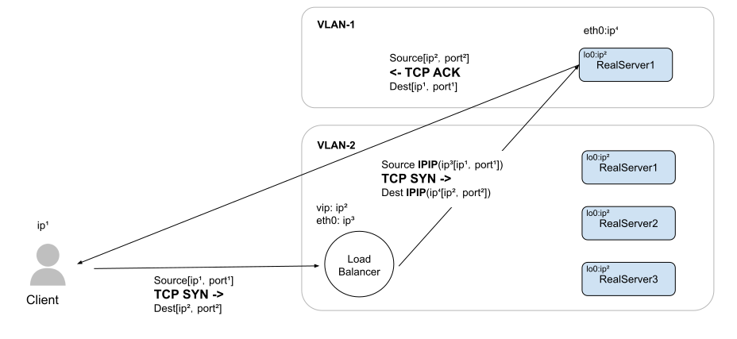
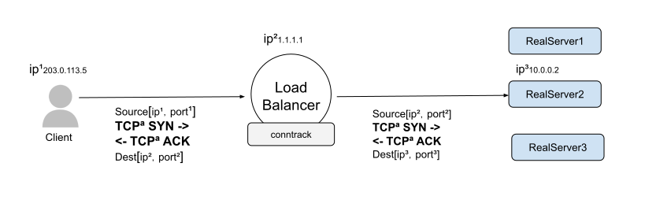

# 4.3.1 四层负载均衡工作模式

LVS（Linux Virtual Server，Linux 虚拟服务器）是四层负载的典型实现。LVS 通过虚拟化的方式将多台物理服务器（也称为 RealServer 真实服务器）组合成一个对外表现为单一虚拟服务器。现在 LVS 已经是Linux 内核的一部分，它完全在内核空间处理负载均衡和转发逻辑，一台普通配置的服务器可支持上百万个并发连接请求，具有很高的处理性能。

LVS 通过修改报文中的 IP 地址和端口来实现网络流量的分发。区别报文修改的方式，LVS 将工作模式分为 NAT（网络地址转换）模式、DR（Direct Routing，直接路由）模式 和 TUN（IP 隧道）模式。

## 1. 链路层负载均衡

LVS 的 DR（Direct Routing，直接路由）模式是一种链路层（L2）负载均衡技术。

链路层负载均衡的原理是，**修改请求数据帧中的目标 MAC 地址，让原本发送给负载均衡器请求的数据帧，再被二层交换机转发至服务器集群中对应的真实服务器（Real Server）**，这样真实服务器就获得了一个原本目标并不是发送给它的数据帧。

- 由于只修改了链路层数据帧的 MAC 地址，IP 层的数据没有任何变化。所以，被真实服务器正常接收。
- 由于 IP 数据包中包含了源（客户端）和目的地（负载均衡器）IP 地址。所以，真实服务器需保证自己的 IP 与 数据包中的目的地 IP 地址一致，数据包才能继续被处理。

综上所述，使用 DR 负载均衡模式时，需要把真实服务器的 VIP（Vritual IP，虚拟 IP）配置成和负载均衡器的 VIP 一样，LVS 配置真实服务器的原因也是如此，如下代码示例。

```bash
// 真实服务器配置
$ ifconfig lo:0 1.1.1.1 netmask 255.255.255.255 up // 绑定 VIP 地址在 lo 接口上才能收到目标地址为 VIP 的包。
$ route add -host 1.1.1.1 dev lo  // 目标地址是 VIP 的数据包从本机 lo 接口发送出去
```

DR 模式只有请求经过负载均衡器，而真实服务器的响应无需从负载均衡器原路返回。整个工作模式中，请求、转发、响应的链路形成一个“三角关系”。因此，DR 模式也被形象地称为“三角传输模式”，如图 4-7 所示。

:::center
  <br/>
 图 4-7 链路层 DSR 模式负载均衡
:::

DR 模式的主要优势是，一些场景中响应的流量要远远大于请求的流量。如典型的 HTTP request/response 模式。假设请求占 10% 的流量，响应占 90%，使用三角传输模式，只需 1/10 的带宽就可以满足系统需求，这种模式极大节省了带宽成本，还提高了负载均衡器的可靠性（流量越低肯定越好）。

DR 模式效率很高，但它的缺陷也很明显：
- **因为响应不再经过负载均衡器，负载均衡器就无法知道 TCP 连接的完整状态，防火墙策略会受到影响**（TCP 连接只有 SYN，没有 ACK）。
- 其次，由于是数据链路层通信，负载均衡器和真实服务器必须在同一个子网内，受到网络侧的约束很大。

总结 DR 模式的优势（效率高）和劣势（不能跨子网）共同决定了该模式最适合作为数据中心的第一层均衡设备，用来连接其他的下级负载均衡器。

## 2. 网络层负载均衡

网络层负载均衡操作的是 IP 数据包，我们先对 IP 数据包有个简单的了解。

以 IP 协议为例，一个 IP 数据包由头部（Header）和载荷（Payload）组成，Header 内部包含版本、源地址、目的地地址等信息，结构如图 4-8 所示。

本文，我们无需太关注 Header 头部信息，只要知道 Header 内有源地址（Source address）和目的地地址（Destination address）即可。

:::center
  <br/>
 图 4-8 ip 数据包结构
:::

**既然数据链层负载均衡可以通过改写 MAC 地址来实现数据包转发，到了网络层，我们也可以继续沿用改写 MAC 相似的思路修改网络层的 IP 数据包地址信息来实现数据转发**。

LVS 的 Tunnel（隧道）、NAT 模式都属于网络层负载均衡，只不过因为对 IP 数据包的不同形式修改而分成两种，我们先来看第一种修改方式。

### 2.1 隧道模式

第一种保持源数据包不变，新建一个 IP 数据包，将原来的 IP 数据包整体放进新 IP 数据包的 Payload 内，再通过三层交换机发送出去，真实服务器收到包之后，有一个对应拆包的机制，把负载均衡器自动添加的那层 Header 删掉，解析出 Payload 内部的 IP 数据包再进行正常处理。

**把一个数据包封装在另一个数据包内，其实就是一种隧道技术，譬如 Linux 中的隧道技术 ipip 就是字面 IP in IP 的意思。由于 IP 隧道工作在网络层，因此摆脱了直接路由模式的网络约束，所以 LVS Tunnel（隧道）模式可以跨越 VLAN**。

由于没有修改源数据包的任何信息，所以 IP 隧道模式仍具有三角传输模式的特点，即负载均衡转发器转发进来的请求，真实服务器去响应请求，IP 隧道模式从请求到响应的过程如图 4-9 所示。

:::center
  <br/>
图 4-9 Tunnel 模式
:::

隧道模式相当于 DR 模式的升级（支持了跨网），不过由于使用隧道模式：
- 所以要求真实服务器支持隧道协议，真实服务器只局限在部分 Linux 系统上；
- 其次，只要是三角模式（LVS 的 DR 模式或者 Tunnel 模式）必须要保证真实服务器与负载均衡服务器有相同的虚拟 IP 地址，因为回复客户端时，必须使用这个虚拟的 IP 作为数据包的源地址，这样客户端收到数据包之后才能正常解析；
- 最后，因为真实服务器和客户端对接，所以真实服务器得能访问外网。

### 2.2 NAT 模式

IP 数据包的另外一种改写方式是直接改变 IP 数据包的 Header 内的目的地（Destination address）地址（改为真实服务器的地址），修改之后原本用户发送给负载均衡器的数据包会被三层交换机转发至真实服务器的网卡上。

这么解释似乎不太好理解，但相信每一个读者都配置过这种原理的操作，譬如在家里配置路由器，设置路由器中的端口转发（NAT）到某个局域网内的机器中。这种模式和一台路由器带着一群内网机器上网的“网络地址转换”（Network Address Translation，NAT）一个原理。因此，这种负载均衡的模式被称为 NAT 模式，此模式请求到响应的过程如图 4-10 所示。

:::center
  <br/>
图 4-10 NAT 模式负载均衡
:::

这种类型中，TCP 连接在负载均衡器建立连接跟踪和网络地址转换（NAT）之后直接转发给选中的后端。譬如，假设客户端正在和负载均衡器 1.1.1.1:80 通信，选中的后端是 10.0.0.2:8080。当客户端的 TCP 包到达负载均衡器时，负载均衡器会将包的目的 IP/port（从 1.1.1.1:80）换成 10.0.0.2:8080，以及将源 IP/port 换成负载均衡器自己的 IP/port。当应答包回来的时候，负载均衡器再做相反的转换。

**不过 NAT 模式的缺陷也显而易见，因为负载均衡器代表整个服务集群接收/应答，当流量压力比较大的时候，整个系统的瓶颈就很容易出现在负载均衡器上**。
