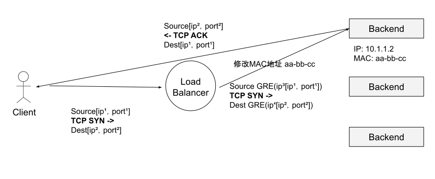

# 4.3 四层负载均衡

前面提到的“四层负载均衡”（Layer4 Balancer，简称 L4）其实是多种均衡器工作模式的统称，“四层”的意思是这些工作的模式共同特点是维持同一个 TCP 连接，而不是说它只工作在 OSI 模型的四层。

事实上，四层负载均衡器的多种模式主要工作在第二层（数据链路层，改写 MAC 地址）和第三层（网络层，改写 IP 地址），而第四层（传输层）单纯只改写一些 UDP、TCP 等协议的内容端口，做一些 NAT 之类的功能，实际上无法实现字面上的“负载均衡”。

因为 OSI 模型的下三层是媒体层（Media Layer），上四层是主机层（Host Layer），既然流量已经到了目标主机了，也谈不上什么流量转发，最多只能做代理，但出于习惯，现在所有的资料都把它们称为四层负载均衡。笔者继续沿用这种惯例，不论是 IP 层处理还是链路层处理，统称四层负载均衡。

四层负载的典型软件实现是 LVS（Linux Virtual Server，Linux 虚拟服务器），几乎所有的大型分布式系统都基于 LVS 作为第一级负载均衡系统。LVS 通过修改报文中的 IP 地址和端口来实现网络流量的分发。区别报文修改的方式，LVS 将工作模式分为 NAT（网络地址转换）模式、DR（Direct Routing，直接路由）模式 和 TUN（IP 隧道）模式。

## 直接路由模式

LVS 的 DR（Direct Routing，直接路由）模式其实是一种链路层负载均衡技术。链路层负载均衡其实就是**修改请求数据帧中的 MAC 目标地址，让原本发送给负载均衡器请求的数据帧，被二层交换机转发至服务器集群中对应的服务器**，这样真实服务器（Real Server）就获得了一个原本目标并不是发送给它的数据帧。

- 由于链路层只修改了 MAC 地址，所以在 IP 层看来数据没有任何变化，继而被正常接收。
- 由于 IP 数据包中包含了源（客户端）和目的地（负载均衡器）IP 地址，只有真实服务器保证自己的 IP 与 数据包中的目的地 IP 地址一致，这个数据包才能继续被处理。

综上所述，因此使用这种负载均衡模式时，需要把真实服务器的 VIP（Vritual IP，虚拟 IP）配置成和负载均衡器的 VIP 一样，LVS 配置真实服务器的原因也是如此，如下代码示例。

```bash
// 真实服务器配置
$ ifconfig lo:0 1.1.1.1 netmask 255.255.255.255 up // 绑定 VIP 地址在 lo 接口上才能收到目标地址为 VIP 的包。
$ route add -host 1.1.1.1 dev lo  // 目标地址是 VIP 的数据包从本机 lo 接口发送出去
```

DR 模式只有请求经过负载均衡器，而服务的响应无需从负载均衡器原路返回的工作模式中，整个请求、转发、响应的链路形成一个“三角关系”，这种模式也被形象的称为“三角传输模式”，如图 4-7 所示。

:::center
  <br/>
 图 4-7 链路层 DSR 模式负载均衡
:::

使用 DR 模式的主要优势是在一些场景中，响应的流量要远远大于请求的流量（譬如典型的 HTTP request/response 模式）。**假设请求占 10% 的流量，响应占 90%，使用三角传输模式，只需 1/10 的带宽就可以满足系统需求，这种模式极大节省了带宽成本，还提高了负载均衡器的可靠性（流量越低肯定越好）**。

虽然 DR 模式式效率很高，但它在缺陷也很明显：
- **因为响应不再经过负载均衡器，负载均衡器就无法知道 TCP 连接的完整状态，防火墙策略会受到影响**（TCP 连接只有 SYN，没有 ACK）。
- 其次因为是数据链路层通信，受到的网络侧约束也很大。

总结 DR 模式的优势（效率高）和劣势（不能跨子网）共同决定了该模式最适合作为数据中心的第一层均衡设备，用来连接其他的下级负载均衡器。