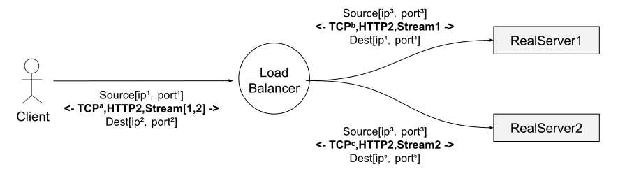

# 4.4 七层负载均衡 

前面介绍四层负载均衡的工作模式都属于“转发”，此时客户端与响应请求的真实服务器维持着同一条 TCP 通道，但七层的负载均衡模式就无法再转发了，由于需要识别应用层协议，就要把 TCP 数据传送到用户态用户程序处理，之后再用代理的方式新建一个请求到真实服务器。如图 4-4 所示，一个七层 HTTP/2 负载均衡器，此时客户端、负载均衡器、真实服务器的工作模式。

	
	
图4-13 L7负载均衡

这种情况下，客户端与七层负载均衡器建立一个 HTTP /2 TCP 连接，后续负载均衡器根据负载均衡策略和两个后端建立了连接。当客户端向负载均衡器发送两个 HTTP/2 流（streams ）时，stream 1 会被发送到 backend-1，而 stream 2 会被发送到 backend-2。因此，即使不同客户端的请求数量差异巨大，这些请求也可以被高效平衡的分发到后端。七层负载均衡具备检测应用层流量的能力，就能做出更多、更明智的决策，也能玩出更多的花样。

## 4.1.4  是否还需要 L4 负载均衡

我们前面解释了 L7 负载均衡器对现代协议的重要性，那么是否意味着 L4LB 已经没有用了？肯定不！虽然在 service-to-service 通信中 L7 负载均衡最终会完全取代 L4 负载均衡，但 L4 负载均衡在边缘仍然是非常有用的，因为几乎所有的现代大型分布式架构都是在公网流量入口使用 L4/L7 两级负载均衡架构。在边缘 L7 负载均衡器之前部署 L4 负载均衡器的原因：

- L7LB 承担的更多工作是复杂的分析、变换、以及应用流量路由，他们处理原始流量的能力（按每秒处理的包数和字节数衡量）比经过优化的 L4 负载均衡器要差。这使得 L4LB 更适合处理特定类型的攻击，例如 SYN 泛洪、通用包（generic packet）泛洪攻击等
- L7LB 部署的更多更频繁，bug 也比 L4LB 多。在 L7 之前加一层 L4LB，可以在调整 L7 部署的时候，对其做健康检查和流量排除（drain），这比（单纯使用）现代 L4LB 要简单的多，后者通常使用 BGP 和 ECMP（后面会介绍）。
- 最后，因为 L7 功能更复杂， 它们的 bug 也会比 L4 多，在前面有一层 L4LB 能及时将有问题的 L7LB 拉出。
