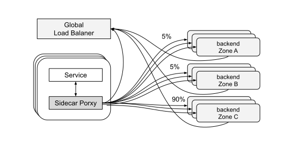

# 4.6 全局负载均衡设计

近年来，负载均衡系统的发展趋势是将单个负载均衡器视为通用的标准化组件，由一个全局控制系统统一管理。

图 4-14 展示了全局负载均衡系统设计。
- 边车代理（Sidecar Proxy）和位于三个 Zone 的后端通信。
- 边车代理、后端定期向全局负载均衡器（Global Load Balancer）汇报请求延迟、自身的负载等状态，全局负载均衡器根据状态做出最合适的配置策略。
- 全局负载均衡器向边车代理下发转发策略，可以看到 90% 的流量到了 Zone C，Zone A 和 B 各只有 5%。

:::center
   
图 4-14 全局负载均衡系统
:::

全局负载均衡器能够实现很多单个负载均衡器无法完成的功能，比如下面这些。

- 某个区域故障或负载过高时，全局负载均衡器自动将流量切换到其他可用区。
- 利用机器学习、神经网络技术检测并缓解流量异常问题。比如识别并治理 DDoS 攻击。
- 收拢边车代理配置，提供全局运维视角，帮助工程师直观理解、维护整个分布式系统。

全局负载均衡器在服务网格领域表现的形式称为“控制平面”（Control Plane），控制平面与边车代理协作的关键在于配置动态化。这部分内容，笔者将在第八章 8.3 节详细阐述。